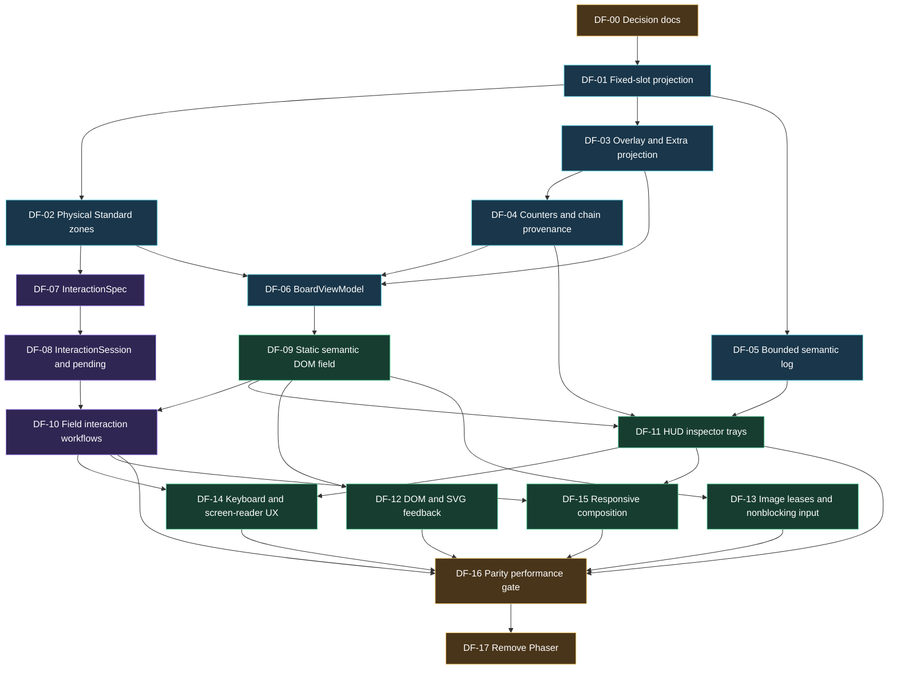

# DOM Duel-Field Implementation Plan

> Status: approved amended plan; DF-11 complete; DF-12 implementation pending
> Created: 2026-07-31
> Scope: Standard-format desktop field → rich state → accessibility/responsive parity → Phaser removal
> Architecture: [`architecture/05-presentation/duel-field-architecture.md`](../docs/architecture/05-presentation/duel-field-architecture.md)
> Decision: [`architecture/05-presentation/duel-field-rendering.md`](../docs/architecture/05-presentation/duel-field-rendering.md)
> Validation catalog: [`architecture/05-presentation/duel-field-validation-references.md`](../docs/architecture/05-presentation/duel-field-validation-references.md)

This plan supersedes no completed MVP history. [`MVP_TECHNICAL_IMPLEMENTATION_PLAN.md`](../docs/MVP_TECHNICAL_IMPLEMENTATION_PLAN.md) remains audit record for released Phaser baseline. This document is canonical plan for DOM-field migration.

## Non-negotiable constraints

- `ocgcore` remains sole authority for legality, effects, state, and result.
- Worker remains sole owner of WASM/raw protocol/response indexes.
- Offline hidden identities may cross the Worker boundary with explicit presentation visibility; they never trigger plain UI/accessibility output, image requests, or routine diagnostics.
- Standard two-player field only. No Speed, Rush, or team-duel format abstraction.
- Interactive field uses semantic DOM. No synchronized interactive canvas mirror.
- Multi-select/allocation/order uses explicit Confirm.
- Response pending survives intermediate state/events; only new prompt/result/recoverable error/runtime replacement ends it.
- Images never block legal input.
- No permanent animation loop. No spectacle/background work.
- Each ticket is one reviewable checkpoint, starts with failing test, leaves ticket-scoped aggregate gates green.
- This agent run records checkpoints only; it creates no VCS history, refs, branches, pull requests, or staged changes. Suggested change labels remain handoff labels only.
- If ticket exceeds described outputs, split it; do not absorb adjacent cleanup.

## TDD protocol for every code ticket

1. **Red:** add smallest fixture/test expressing missing behavior. Run focused command; record expected failure.
2. **Green:** add minimum implementation. Run focused test until green.
3. **Refactor:** remove only duplication introduced by ticket; retain behavior.
4. **Boundary:** run typecheck plus ticket-scoped unit/component/integration/browser layers.
5. **Checkpoint:** record ticket files, red/green evidence, ticket-scoped aggregate gates, review disposition, and suggested change label; do not stage.

Never implement behavior before reproducible failing test. Visual capture alone is not test; pair screenshots with semantic assertions.

## Dependency graph



## Start gates and serial execution order

User-approved execution is strict serial order, regardless of dependency graph parallelism:

```text
DF-00 → DF-01 → DF-02 → DF-03 → DF-04 → DF-05 → DF-06 → DF-07 → DF-08
      → DF-09 → DF-10 → DF-11 → DF-12 → DF-13 → DF-14 → DF-15 → DF-16 → DF-17
```

### Execution checklist

- [x] DF-00
- [x] DF-01
- [x] DF-02
- [x] DF-03
- [x] DF-04
- [x] DF-05
- [x] DF-06
- [x] DF-07
- [x] DF-08
- [x] DF-09
- [x] DF-10
- [x] DF-11
- [ ] DF-12
- [ ] DF-13
- [ ] DF-14
- [ ] DF-15
- [ ] DF-16
- [ ] DF-17

A ticket starts only after prior checkpoint has passing focused tests, ticket-scoped aggregate gates, completed review disposition, and recorded changed-file territory. Shared integration files are serial-only. Later tickets may amend earlier-owned files only when their own listed integration output requires it.

## Ticket summary

| ID    | Suggested change label                        | Working result                                    |
| ----- | --------------------------------------------- | ------------------------------------------------- |
| DF-00 | `docs: adopt semantic DOM duel field`         | Current ADR, architecture, plan, references       |
| DF-01 | `fix: preserve fixed field sequences`         | Projector no longer dense-resequences field slots |
| DF-02 | `fix: model shared extra monster zones`       | Correct 34-slot Standard physical layout          |
| DF-03 | `feat: project overlays and extra deck state` | Useful material/Extra public state                |
| DF-04 | `feat: project counters and chain provenance` | Useful counters plus actual chain links           |
| DF-05 | `feat: retain bounded semantic duel log`      | 2,000-entry log separate from animation queue     |
| DF-06 | `feat: derive semantic board view model`      | Renderer-neutral immutable board/nav model        |
| DF-07 | `feat: derive field interaction specs`        | Pure prompt→field action contract                 |
| DF-08 | `feat: manage prompt interaction sessions`    | Draft/pending state keyed by runtime+prompt       |
| DF-09 | `feat: render semantic DOM duel field`        | Static accessible board/cards/stacks              |
| DF-10 | `feat: connect duel field interactions`       | Complete pointer field workflows                  |
| DF-11 | `feat: add duel HUD inspector and trays`      | Rich public state around board                    |
| DF-12 | `feat: add bounded DOM field feedback`        | CSS/SVG feedback, reduced-motion safe             |
| DF-13 | `fix: lease card image object URLs`           | Mounted-image lifetime; input never blocked       |
| DF-14 | `feat: add spatial keyboard field navigation` | Keyboard/SR-complete field                        |
| DF-15 | `feat: adapt duel field across viewports`     | Narrow/portrait/zoom composition                  |
| DF-16 | `test: validate DOM field parity and budgets` | Recorded semantic/visual/perf acceptance evidence |
| DF-17 | `refactor: remove Phaser field renderer`      | No Phaser runtime/chunk/bridge/canvas tests       |

## Ticket file territory

Territory is exclusive during each serial checkpoint. Every current or proposed path is fixed below; nonexistent paths are planned new files. `src/app/App.svelte`, shared contracts, `package-lock.json`, `playwright.config.ts`, and listed generated outputs are serial-only integration surfaces.

### DF-00 territory

- Source/docs: `README.md`, `context.md`, `docs/MVP_IMPLEMENTATION_HANDOFF.md`, `docs/MVP_TECHNICAL_IMPLEMENTATION_PLAN.md`, `docs/README.md`, `docs/ADR/001_ADR_semantic_dom_duel_field_rendering.md`, `docs/DUEL_FIELD_DOM_IMPLEMENTATION_PLAN.md`, `.tmp/IMPLEMENTATION_PLAN_duel_field_dom.md`, `docs/architecture/architecture.md`, `docs/architecture/01-product/scope.md`, `docs/architecture/01-product/technology-selection.md`, `docs/architecture/02-runtime/browser-platform.md`, `docs/architecture/02-runtime/topology.md`, `docs/architecture/03-engine/ocgcore-adapter.md`, `docs/architecture/03-engine/protocol-and-state.md`, `docs/architecture/04-data/card-images.md`, `docs/architecture/05-presentation/svelte-phaser-boundary.md`, `docs/architecture/05-presentation/duel-field-architecture.md`, `docs/architecture/05-presentation/duel-field-rendering.md`, `docs/architecture/05-presentation/duel-field-validation-references.md`, `docs/architecture/05-presentation/references/standard-field-wireframe.svg`, `docs/architecture/06-quality/testing.md`, `docs/architecture/07-governance/extension-path.md`, `docs/architecture/07-governance/security.md`, `docs/archive/svelte-phaser-boundary.md`.
- Tests/evidence: no test file; validation commands read the source/docs paths above.
- Generated/lock: `docs/duel-field-architecture.html`, `docs/duel-field-validation-references.html`.

### DF-01 territory

- Source/docs: `src/worker/projection/DuelStateProjector.ts`.
- Tests/evidence: `tests/unit/duel-state-projector.test.ts`, `tests/unit/contracts.test.ts`, `tests/integration/headless-controller.test.ts`, `tests/integration/programmed-duel.test.ts`.
- Generated/lock: none.

### DF-02 territory

- Source/docs: `src/field/duel-field-layout.ts`, `src/field/card-mapping.ts`.
- Tests/evidence: `tests/unit/duel-field.test.ts`.
- Generated/lock: none.

### DF-03 territory

- Source/docs: `src/duel/contracts/public-duel-state.ts`, `src/duel/contracts/duel-worker-event.ts`, `src/duel/presets/mvp-preset.ts`, `src/worker/engine/OcgCoreAdapter.ts`, `src/worker/engine/DuelSession.ts`, `src/worker/HeadlessDuelController.ts`, `src/worker/projection/DuelStateProjector.ts`, `src/worker/opponent/OpponentPolicy.ts`, `docs/architecture/03-engine/protocol-and-state.md`.
- Tests/evidence: `tests/unit/contracts.test.ts`, `tests/unit/duel-state-projector.test.ts`, `tests/unit/headless-reconciliation.test.ts`, `tests/unit/ocgcore-adapter.test.ts`, `tests/unit/opponent-policy.test.ts`, `tests/integration/duel-session.test.ts`, `tests/integration/headless-controller.test.ts`, `tests/integration/programmed-duel.test.ts`, `tests/integration/real-wasm-smoke.test.ts`, `tests/fixtures/programmed-scenarios.ts`.
- Generated/lock: none.

### DF-04 territory

- Source/docs: `src/duel/contracts/public-duel-state.ts`, `src/duel/contracts/duel-worker-event.ts`, `src/duel/contracts/duel-presentation-event.ts`, `src/worker/engine/OcgCoreAdapter.ts`, `src/worker/engine/DuelSession.ts`, `src/worker/engine/engine-constants.ts`, `src/worker/HeadlessDuelController.ts`, `src/worker/projection/DuelStateProjector.ts`, `src/worker/opponent/OpponentPolicy.ts`, `src/worker/protocol/message-classification.ts`, `src/worker/assets/active-duel-dependencies.ts`, `docs/architecture/03-engine/protocol-and-state.md`.
- Tests/evidence: `tests/unit/contracts.test.ts`, `tests/unit/duel-state-projector.test.ts`, `tests/unit/message-classification.test.ts`, `tests/unit/ocgcore-adapter.test.ts`, `tests/unit/opponent-policy.test.ts`, `tests/integration/duel-session.test.ts`, `tests/integration/headless-controller.test.ts`, `tests/integration/programmed-duel.test.ts`, `tests/fixtures/programmed-scenarios.ts`, `tests/fixtures/counter-chain-query-batch.bin`.
- Generated/lock: none.

### DF-05 territory

- Source/docs: `src/app/stores/duel-store.ts`, `src/app/presentation/format-duel-presentation-event.ts`, `src/duel/contracts/duel-presentation-event.ts`.
- Tests/evidence: `tests/unit/duel-store.test.ts`, `tests/unit/format-duel-presentation-event.test.ts`.
- Generated/lock: none.

### DF-06 territory

- Source/docs: `src/field/card-mapping.ts`, `src/field/board-view-model.ts`.
- Tests/evidence: `tests/unit/duel-field.test.ts`, `tests/fixtures/board-view-model.ts`.
- Generated/lock: none.

### DF-07 territory

- Source/docs: `src/app/prompts/prompt-control-family.ts`, `src/app/prompts/prompt-selection.ts`, `src/app/prompts/interaction-spec.ts`, `src/duel/contracts/ids.ts`, `src/duel/contracts/player-prompt.ts`, `src/duel/contracts/public-duel-state.ts`.
- Tests/evidence: `tests/unit/prompt-control-family.test.ts`, `tests/unit/prompt-selection.test.ts`, `tests/unit/interaction-spec.test.ts`.
- Generated/lock: none.

### DF-08 territory

- Source/docs: `src/app/prompts/interaction-session.ts`, `src/app/stores/duel-store.ts`, `src/app/DuelWorkerClient.ts`.
- Tests/evidence: `tests/unit/interaction-session.test.ts`, `tests/unit/duel-store.test.ts`, `tests/unit/duel-worker-client.test.ts`.
- Generated/lock: none.

### DF-09 territory

- Source/docs: `src/app/components/DuelField.svelte`, `src/app/components/duel-field/FieldBoard.svelte`, `src/app/components/duel-field/ZoneControl.svelte`, `src/app/components/duel-field/CardControl.svelte`, `src/app/components/duel-field/StackControl.svelte`, `src/styles/app.css`.
- Tests/evidence: `tests/component/DuelField.test.ts`.
- Generated/lock: `test-results/df-09-static-field-captures.zip`.

### DF-10 territory

- Source/docs: `src/app/App.svelte`, `src/app/components/DuelField.svelte`, `src/app/components/duel-field/FieldBoard.svelte`, `src/app/components/duel-field/ZoneControl.svelte`, `src/app/components/duel-field/CardControl.svelte`, `src/app/components/duel-field/StackControl.svelte`, `src/app/components/duel-field/FieldActionMenu.svelte`, `src/app/components/duel-field/SelectionDock.svelte`, `src/app/components/duel-field/DuelFieldErrorBoundary.svelte`, `src/app/prompts/PromptControls.svelte`, `src/app/prompts/interaction-spec.ts`, `src/app/prompts/interaction-session.ts`, `src/app/stores/duel-store.ts`, `src/styles/app.css`.
- Tests/evidence: `tests/component/DuelField.test.ts`, `tests/component/PromptControls.test.ts`, `tests/fixtures/duel-field-component-failure.ts`, `e2e/duel-smoke.spec.ts`.
- Generated/lock: `test-results/df-10-pointer-workflows.zip`.

### DF-11 territory

- Source/docs: `src/app/App.svelte`, `src/app/components/duel-field/DuelHud.svelte`, `src/app/components/duel-field/CardInspector.svelte`, `src/app/components/duel-field/CardTray.svelte`, `src/app/components/duel-field/ChainStatus.svelte`, `src/app/components/duel-field/DuelLog.svelte`, `src/styles/app.css`.
- Tests/evidence: `tests/component/DuelHud.test.ts`, `tests/fixtures/board-public-states.ts`, `e2e/duel-smoke.spec.ts`.
- Generated/lock: `test-results/df-11-hud-privacy.zip`.

### DF-12 territory

- Source/docs: `src/app/presentation/presentation-command.ts`, `src/app/presentation/dom-feedback-controller.ts`, `src/app/components/duel-field/FieldLines.svelte`, `src/app/components/DuelField.svelte`, `src/styles/app.css`.
- Tests/evidence: `tests/unit/presentation-command.test.ts`, `tests/unit/dom-feedback-controller.test.ts`, `tests/component/DuelField.test.ts`.
- Generated/lock: none.

### DF-13 territory

- Source/docs: `src/app/images/card-image-cache.ts`, `src/app/App.svelte`, `src/app/prompts/PromptControls.svelte`, `src/app/components/DuelField.svelte`, `src/app/components/duel-field/CardControl.svelte`, `src/app/components/duel-field/CardInspector.svelte`, `src/app/components/duel-field/CardTray.svelte`, `docs/architecture/04-data/card-images.md`.
- Tests/evidence: `tests/unit/card-image-cache.test.ts`, `tests/component/DuelField.test.ts`, `tests/component/PromptControls.test.ts`, `e2e/duel-smoke.spec.ts`.
- Generated/lock: `test-results/df-13-image-lifecycle.zip`.

### DF-14 territory

- Source/docs: `src/app/prompts/field-navigation.ts`, `src/app/components/DuelField.svelte`, `src/app/components/duel-field/FieldBoard.svelte`, `src/app/components/duel-field/ZoneControl.svelte`, `src/app/components/duel-field/CardControl.svelte`, `src/app/components/duel-field/StackControl.svelte`, `src/app/components/duel-field/FieldActionMenu.svelte`, `src/app/components/duel-field/SelectionDock.svelte`, `src/app/components/duel-field/CardTray.svelte`, `src/styles/app.css`, `docs/architecture/05-presentation/duel-field-screen-reader-review.md`.
- Tests/evidence: `tests/unit/field-navigation.test.ts`, `tests/component/DuelField.test.ts`, `e2e/duel-smoke.spec.ts`.
- Generated/lock: `test-results/df-14-keyboard-screen-reader.zip`.

### DF-15 territory

- Source/docs: `src/app/components/DuelField.svelte`, `src/app/components/duel-field/FieldBoard.svelte`, `src/app/components/duel-field/DuelHud.svelte`, `src/app/components/duel-field/CardInspector.svelte`, `src/app/components/duel-field/CardTray.svelte`, `src/app/components/duel-field/FieldActionMenu.svelte`, `src/app/components/duel-field/SelectionDock.svelte`, `src/styles/app.css`.
- Tests/evidence: `tests/unit/field-navigation.test.ts`, `tests/component/DuelField.test.ts`, `e2e/duel-smoke.spec.ts`.
- Generated/lock: `test-results/df-15-responsive-captures.zip`.

### DF-16 territory

- Source/docs: `playwright.config.ts`, `docs/architecture/02-runtime/browser-platform.md`, `docs/architecture/06-quality/testing.md`, `docs/architecture/05-presentation/duel-field-performance-baseline.md`.
- Tests/evidence: `e2e/duel-smoke.spec.ts`, `tests/component/DuelField.test.ts`, `tests/fixtures/duel-field-public-events.ts`.
- Generated/lock: `playwright-report/index.html`, `test-results/df-16-private-browser-artifacts.zip`, `test-results/df-16-results.json`.

### DF-17 territory

- Source/docs: `package.json`, `scripts/verify-browser-build.ts`, `scripts/lib/vite-runtime-assets.ts`, `vite.config.ts`, `src/app/App.svelte`, `src/app/components/DuelField.svelte`, `src/styles/app.css`, `src/field/DuelScene.ts`, `src/field/create-phaser-presentation-bridge.ts`, `src/app/presentation/duel-presentation-bridge.ts`, `README.md`, `context.md`, `docs/README.md`, `docs/ADR/001_ADR_semantic_dom_duel_field_rendering.md`, `docs/architecture/architecture.md`, `docs/architecture/01-product/technology-selection.md`, `docs/architecture/02-runtime/browser-platform.md`, `docs/architecture/02-runtime/topology.md`, `docs/architecture/03-engine/protocol-and-state.md`, `docs/architecture/04-data/card-images.md`, `docs/architecture/05-presentation/duel-field-architecture.md`, `docs/architecture/05-presentation/duel-field-rendering.md`, `docs/architecture/06-quality/testing.md`.
- Tests/evidence: `tests/unit/duel-field.test.ts`, `tests/unit/presentation-command.test.ts`, `tests/component/DuelField.test.ts`, `e2e/duel-smoke.spec.ts`.
- Generated/lock: `package-lock.json`, `dist/index.html`, `dist/assets/create-phaser-presentation-bridge-CzVRJDSU.js`, `dist/licenses/phaser-MIT.txt`, `dist/licenses/idb-ISC.txt`, `dist/licenses/ocgcore-wasm-MIT.txt`, `dist/licenses/svelte-MIT.txt`, `dist/PRIVATE_DEPLOYMENT_ONLY.txt`, `dist/runtime/current/manifest.json`, `dist/runtime/engine/ocgcore.sync.wasm`, `dist/runtime/engine/vendor-manifest.json`, `dist/runtime/images/active-manifest.json`.

---

## DF-00 — Record renderer decision and delivery contract

**Suggested change label:** `docs: adopt semantic DOM duel field`

### Starting requirements and inputs

- Validated canvas-vs-DOM recommendation.
- Existing architecture governance in `docs/architecture/architecture.md`.
- Existing Svelte–Phaser decision preserved as historical context.
- No runtime source changes.

### TDD-style steps

- [x] **Red:** grep current architecture for authoritative Phaser ownership links; list stale current-source paths.
- [x] Move superseded boundary document to `docs/archive/` and mark it superseded.
- [x] Add renderer ADR, detailed architecture, this plan, validation catalog, original wireframe.
- [x] Update architecture index, docs index, context, and listed atomic decisions.
- [x] **Green:** run Markdown link/path checker or scripted local-link scan; grep current architecture for stale authoritative Phaser rules.
- [x] Review external screenshot links and copyright restrictions.

### Outputs

- Durable accepted ADR.
- One current detailed field architecture.
- Ticket/dependency plan.
- Rules/screenshot/schema reference catalog.
- No competing current presentation decision.

### Validation criteria

- [x] Every local Markdown link resolves.
- [x] `docs/architecture/` contains no current statement assigning field authority to Phaser.
- [x] Archived file points to new ADR.
- [x] `git diff --check` passes.
- [x] Architecture docs clearly distinguish accepted target from migration-pending implementation.

---

## DF-01 — Preserve sparse fixed-slot projection

**Suggested change label:** `fix: preserve fixed field sequences`

### Starting requirements and inputs

- DF-00 checkpoint accepted.
- `src/worker/projection/DuelStateProjector.ts` current dense `splice(from.sequence)`/`resequence()` behavior.
- Pinned core semantics: MZONE/SZONE fixed slots; hand/GY/banished/Extra ordered lists.
- Existing projector fixtures/privacy invariants.

### TDD-style steps

- [x] **Red:** extend `tests/unit/duel-state-projector.test.ts` with cards entering monster sequences `0`, `4`, `5`, `6` in non-dense order.
- [x] Move sequence `0` out; assert remaining sequences stay `4`, `5`, `6`.
- [x] Add simultaneous Spell/Trap sequence `0` plus Field Zone sequence `0`, Spell/Trap outer-slot, and Field Zone movement cases; assert no collision or resequencing.
- [x] Add duplicate fixed-slot destination fixtures for both same-location duplicates and cross-location equal sequences; require deterministic rejection/reconciliation, never silent alias.
- [x] Preserve ordered-zone tests proving hand/GY/banished resequence where protocol order changes.
- [x] **Green:** introduce location policy helpers: fixed-slot find/remove/insert by composite `(controller, normalized location, sequence)`; ordered list remove/insert/resequence by index.
- [x] Route `#move` and `#changePosition` through policy helpers.
- [x] Refactor only projector-local mutation helpers; retain privacy/identity rotation.
- [x] Run projector, contract, real-WASM programmed-duel tests.

### Outputs

- Fixed-slot projection retaining authoritative sequence.
- Explicit ordered-vs-fixed location policy with composite fixed-slot identity.
- Regression fixtures for `0/4/5/6`, simultaneous Field Zone/SZONE sequence `0`, and duplicate occupancy.

### Validation criteria

- [x] Focused: `npx vitest run tests/unit/duel-state-projector.test.ts`.
- [x] `npm run test:unit` and `npm run test:integration` green.
- [x] Moving/removing one field card cannot move another card's sequence or alias a different normalized location with the same sequence.
- [x] Existing hidden-information/one-instance invariants remain green.
- [x] No presentation code changed.

---

## DF-02 — Model physical Standard zones and shared EMZs

**Suggested change label:** `fix: model shared extra monster zones`

### Starting requirements and inputs

- DF-01 checkpoint accepted.
- Official Rulebook v10 game-mat schema (`RULE-01`).
- Core collision relation (`CORE-01`).
- Current `duel-field-layout.ts`, `card-mapping.ts`, field mapping tests.

### TDD-style steps

- [x] **Red:** replace 44-zone expectation with 34 physical controls: 16 per player including hand lane, plus two shared EMZs.
- [x] Add table-driven engine-address mapping tests:
   - p0 MZONE 0/4 → own main slots;
   - p0 s5/s6 → shared left/right;
   - p1 s5/s6 → shared right/left;
   - p0 s5 equals p1 s6 physical ID; p0 s6 equals p1 s5.
- [x] Add SZONE tests: `0..4` only; Pendulum reuses `0/4`; Field Zone separate.
- [x] Add invalid sequence tests; unsupported address returns typed diagnostic/result, never fallback to sequence 0.
- [x] **Green:** define `PhysicalZoneId`, `EngineFieldAddress`, Standard layout table, pure address mapper.
- [x] Replace owner-duplicated EMZ generation. Keep logical normalized coordinates renderer-neutral.
- [x] Adapt prompt place mapping to physical IDs.
- [x] Update existing Phaser mapper adapter only enough to remain green until removal.

### Outputs

- Rule-correct Standard physical layout.
- Shared EMZ identity mapper.
- Stable labels/IDs suitable for DOM and tests.

### Validation criteria

- [x] Focused: `npx vitest run tests/unit/duel-field.test.ts`.
- [x] No duplicate physical IDs.
- [x] Exactly two EMZ layout entries.
- [x] `ST-02`, `ST-03` fixture data available for later visual tests.
- [x] `npm run typecheck && npm run test:unit` green.

---

## DF-03 — Project overlay materials and useful Extra Deck state

**Suggested change label:** `feat: project overlays and extra deck state`

### Starting requirements and inputs

- DF-01 checkpoint accepted.
- Current `PublicCard.overlayMaterials` empty ID list and `extraDeckCount` only.
- Wrapper query fields `overlayCards` plus core overlay MOVE semantics.
- Active preset deck definitions and presentation-visibility rules for offline solo play.
- Approved no-core fallback: host `overlayCards` is authoritative; detailed material query is optional enrichment because the pinned core cannot resolve documented overlay addresses.

### TDD-style steps

- [x] **Red:** add parsed-message/projector fixtures for attach material, multiple materials, detach, host move, hidden/public transitions.
- [x] Assert material never appears simultaneously as top-level field card and overlay.
- [x] Add own Extra Deck count decrement/increment and ordered-collection fixtures plus opponent face-up/face-down Extra fixtures. Overlay identity may remain in clone-safe state, but presentation visibility must be explicit and hidden identity must not reach image requests or routine diagnostics.
- [x] Define overlay material as exactly `{ instanceId, sequence, code, identityVisible }`; host carries placement controller, and material owner is not guessed. Extend the one-instance invariant across top-level cards, Extra collections, and materials.
- [x] Add Worker-only query access from `OcgCoreAdapter` through `DuelSession` to `HeadlessDuelController`/projector reconciliation. Trigger reconciliation after every `MOVE` touching overlay or Extra. For overlays, use host `overlayCards` as authoritative count/order/code evidence. Use valid code-consistent detailed queries only to enrich `identityVisible`; empty, unavailable, malformed, or contradictory detail falls back to prior visibility, then own-host visible/opponent-host hidden. Invalid host material lists emit a sanitized diagnostic followed by deterministic terminal failure; publish no partial snapshot.
- [x] **Green:** classify overlay move/query records in adapter; attach/detach by stable instance identity/order, including duplicate codes by ordinal.
- [x] Seed own Extra identities only from trusted preset order; query evidence controls live collection/count. Existing Extra presentation filtering remains independent from overlay internal identity retention.
- [x] Extend `parseDuelWorkerEvent` exact-key/size/visibility validation; reject material owner/controller keys.
- [x] Adapt opponent-visible state so policy receives no hidden identities and cannot cheat.
- [x] Add a real-WASM attachment scenario proving successful host-list fallback without changing `ocgcore`.

### Outputs

- Populated visibility-tagged overlay material state with required internal code.
- Useful own/public Extra Deck collection plus count.
- Boundary validation and deterministic material ordering.

### Validation criteria

- [x] New projector/contract fixtures green.
- [x] One physical instance invariant includes top-level cards, materials, and Extra collection; Extra count decrement/increment stays atomic with collection changes.
- [x] Hidden overlay code plus `identityVisible: false` survive `structuredClone`/JSON while opponent policy and sanitized diagnostics exclude that identity.
- [x] Real-WASM overlay attachment reconciles successfully through host-list fallback.
- [x] `npm run test:unit && npm run test:integration && npm run typecheck` green.

---

## DF-04 — Project counters and actual chain provenance

**Suggested change label:** `feat: project counters and chain provenance`

### Starting requirements and inputs

- DF-03 checkpoint accepted.
- Wrapper supports `ADD_COUNTER`, `REMOVE_COUNTER`, card query `counters`, rich `CHAINING` records.
- Active strings include counter names/effect text.
- Current projector emits synthetic chain links from chain size only.

### TDD-style steps

- [x] **Red:** add adapter/projector fixtures for add/remove counters, multiple counter types, underflow/malformed removal, host card movement.
- [x] Add pinned `ADD_COUNTER`/`REMOVE_COUNTER` message constants and `COUNTERS` query flag fixtures before classification code.
- [x] Add chain fixtures: append link from `CHAINING`; transition solving/solved/negated/disabled by actual link index; clear on `CHAIN_END`.
- [x] Add privacy fixture where chain source card identity is concealed; retain safe label/status only.
- [x] Define `PublicCounter` and expanded `PublicChainLink` focused contracts.
- [x] **Green:** classify message constants/types and update projector state by composite fixed card address.
- [x] Resolve counter names from trusted `dependencies.strings.counter` data with deterministic fallback.
- [x] Replace `#chainSize` synthetic array with actual immutable chain records.
- [x] On unknown address or underflow, query-reconcile first through the Worker-only DF-03 seam and emit sanitized diagnostic. Terminate deterministically only when query result remains invalid or unavailable; never fabricate state.
- [x] Extend exact-key/recursive bounds and opponent-policy projection.
- [x] Add presentation events only when useful; do not duplicate public truth in animation event.

### Outputs

- Per-card public counter collections.
- Ordered chain links with public source/controller/description/status.
- No fabricated chain controller/card values.

### Validation criteria

- [x] Counter underflow/unknown address always attempts query reconciliation first; persistent invalid/unavailable query terminates deterministically with sanitized evidence.
- [x] Chain order/status survives clone validation.
- [x] Hidden identities absent from chain/card labels.
- [x] `npm run test:unit && npm run test:integration && npm run typecheck` green.

---

## DF-05 — Separate bounded semantic log from feedback queue

**Suggested change label:** `feat: retain bounded semantic duel log`

### Starting requirements and inputs

- DF-01 checkpoint accepted.
- Current store truncates both `events` and sequenced presentation events to 100.
- Diagnostics remain separately bounded/sensitive.

### TDD-style steps

- [x] **Red:** store reducer test feeds >100 accepted Worker presentation/domain events; assert derived semantic rows remain while presentation queue keeps last 100.
- [x] Feed >2,000 events; assert collection never exceeds 2,000 total rows including one visible truncation marker.
- [x] Assert restart/runtime replacement clears both collections.
- [x] Assert duplicate event delivery and duplicate state application do not duplicate log rows.
- [x] Define immutable `DuelLogEntry` with independent monotonic log sequence plus formatted privacy-safe text and source event type; never retain the nested source event or raw protocol.
- [x] **Green:** derive each log row once at reducer ingress from accepted Worker presentation/domain event; split 2,000-entry `duelLog` from independently sequenced `presentationEvents`; keep 100-entry queue for transient feedback.
- [x] Preserve current diagnostics bounds and sensitive-data rules.
- [x] Add exhaustive durable-log formatter decisions for every presentation event, including DF-04 `chainChanged`. DF-04 counters remain state-only and do not create log rows because no counter presentation event contract exists; arbitrary `hint` text remains transient rather than durable.

### Outputs

- Privacy-safe semantic log capped at 2,000 entries with explicit truncation marker.
- Existing 100-entry animation/feedback queue.
- Stable sequence keys plus source event types for DOM log; no retained raw source events.

### Validation criteria

- [x] Store unit tests cover >100, >2,000, restart, stale context.
- [x] No raw protocol or hidden identity in log entries.
- [x] `npm run test:unit && npm run typecheck` green.

---

## DF-06 — Derive renderer-neutral `BoardViewModel`

**Suggested change label:** `feat: derive semantic board view model`

### Starting requirements and inputs

- DF-02, DF-03, and DF-04 checkpoints accepted.
- Physical layout/address mapper.
- Expanded immutable public state.
- Current `card-mapping.ts` behavior/tests.

### TDD-style steps

- [x] **Red:** table-driven mapper tests for `ST-01` through `ST-08`: empty/occupied fixed slots, shared EMZ, positions, hidden hands, counters, materials, chains/stacks.
- [x] Assert mapping same snapshot twice is deeply equal and stable-keyed.
- [x] Assert impossible duplicate physical occupancy returns diagnostic/error instead of last-write-wins.
- [x] Assert closed collection stacks contain counts/summaries, not permanently mounted card lists.
- [x] Add initial spatial-neighbor graph tests for main rows/shared EMZ/stack controls.
- [x] **Green:** create focused board-view contracts and pure mapper; adapt/remove Phaser-specific `FieldSnapshotView` use only when consumers migrate.
- [x] Normalize coordinates to `0..1`; preserve aspect-independent physical data.
- [x] Build privacy-safe accessible labels from public card text/state.

### Outputs

- Immutable `BoardViewModel` with zones/cards/stacks/nav.
- Stable target IDs and accessible labels.
- No renderer imports.

### Validation criteria

- [x] Mapper unit tests green and contain no DOM/Phaser setup.
- [x] Every visible public card maps exactly once.
- [x] Every field prompt target can resolve to stable board target or explicit non-field fallback.
- [x] `npm run test:unit && npm run typecheck` green.

---

## DF-07 — Derive discriminated `InteractionSpec`

**Suggested change label:** `feat: derive field interaction specs`

### Starting requirements and inputs

- DF-02 checkpoint accepted.
- Current `PlayerPrompt`, `promptControlFamily`, `validatePromptSelection`, prompt registry fixtures.
- Physical zone IDs and card address resolver.

### TDD-style steps

- [x] **Red:** add one spec fixture per prompt family: action, single card, multi/tribute/sum, unselect, place/disabled field, counter, order, non-field.
- [x] Assert multiple actions on same card remain distinct opaque choices.
- [x] Assert positional prompt cards resolve to public instance/physical target; unresolved targets route to semantic prompt fallback.
- [x] Assert spec contains no selected/order/allocation mutable state.
- [x] Assert malformed/unknown choices cannot become field targets.
- [x] **Green:** implement discriminated spec mapper and `InteractionKey(workerGeneration, sessionGeneration, promptId)`.
- [x] Reuse existing control-family/validation logic; no duplicate min/max/sum legality algorithm.
- [x] Add readonly target maps for card/zone/global choices.

### Outputs

- Pure prompt-derived `InteractionSpec` union.
- Explicit field-capable versus non-field prompt behavior.
- Stable interaction key.

### Validation criteria

- [x] All current `PromptKind` values classified exhaustively.
- [x] Existing prompt selection tests unchanged/green.
- [x] Spec serialization contains only domain IDs/data; no elements/functions.
- [x] `npm run test:unit && npm run typecheck` green.

---

## DF-08 — Add `InteractionSession` reducer and authoritative pending lifecycle

**Suggested change label:** `feat: manage prompt interaction sessions`

### Starting requirements and inputs

- DF-07 checkpoint accepted.
- Current store `responsePending` logic/generation context.
- Existing stale prompt registry/client behavior.

### TDD-style steps

- [x] **Red:** pure reducer tests for new key reset, target toggle, explicit confirm, cancel, allocation max/total, order, stale action ignored, menu open/close.
- [x] Add store reducer regression: valid response → pending; intermediate `state`/presentation event leaves pending true and prompt locked.
- [x] Add completion tests: new prompt key, result, recoverable invalid/stale response, terminal error, worker/session replacement.
- [x] Add duplicate submit test across field and `PromptControls`; exactly one Worker `respond` command.
- [x] **Green:** implement pure session reducer and store/session adapter.
- [x] Keep pending authority in store; local session mirrors submitting only after store accepts response.
- [x] Ensure recoverable error restores editing draft/focus target where still valid; generation change discards all draft state.
- [x] Preserve current prompt validation before client call.

### Outputs

- Pure interaction draft reducer.
- Explicit pending state machine keyed by runtime+prompt.
- Double-submit/stale-action protection.

### Validation criteria

- [x] Snapshot alone never unlocks submitted prompt.
- [x] Old prompt actions after new key produce no state/command.
- [x] Exactly one command per accepted submit.
- [x] Focused store/session tests, `npm run test:unit`, `npm run typecheck` green.

---

## DF-09 — Render static semantic DOM field

**Suggested change label:** `feat: render semantic DOM duel field`

### Starting requirements and inputs

- DF-06 checkpoint accepted.
- Existing CSS tokens/card images.
- Local wireframe plus `ST-01..04`/`VP-01..02` references.
- DF-08 checkpoint follows later in serial order; no App wiring in this ticket.

### TDD-style steps

- [x] **Red:** add `DuelField` component test expecting named region, 34 stable physical zone nodes/labels, two shared EMZs, keyed visible/hidden cards, stack counts.
- [x] Assert no `<canvas>`, no duplicate EMZ controls, no hidden opponent card identity/alt text.
- [x] Assert defense/opponent orientation exposed by DOM class/data state plus readable accessible label.
- [x] **Green:** create `FieldBoard`, `ZoneControl`, `CardControl`, `StackControl` focused components from `BoardViewModel`.
- [x] Use native buttons only where inspect/action exists; passive empty slots remain labelled unless prompt later makes actionable.
- [x] Position via CSS custom properties/percentages; define explicit layer tokens.
- [x] Render placeholder/back immediately; avoid image readiness dependency.
- [x] Keep component isolated from Worker/store; do not replace App's Phaser host in this ticket.

### Outputs

- Testable static DOM field component tree.
- Correct physical board, cards, stack summaries.
- No runtime behavior change outside component harness.

### Validation criteria

- [x] `npm run test:component` green.
- [x] Testing Library finds card/stack/zone by role/name, not `data-testid` coordinates.
- [x] Component imports no Phaser/Worker modules.
- [x] Screenshot `ST-01..04` at VP-01/02 reviewed against wireframe/rule refs.

---

## DF-10 — Connect complete pointer field workflows

**Suggested change label:** `feat: connect duel field interactions`

### Starting requirements and inputs

- DF-08 and DF-09 checkpoints accepted.
- Existing App/store/PromptControls response path.
- `InteractionSpec`/session reducer.
- `ST-05..07`, MD-02 comparison reference.

### TDD-style steps

- [x] **Red:** component tests command-card action menus, zone selection, multi-select, sum, unselect, counter allocation, order, cancel/finish/pass.
- [x] Assert activation occurs on click/pointer-up, not `pointerdown`; movement-cancel fixture prevents accidental action.
- [x] Assert command-target cards expose anchored legal-action/Inspect menu even with one legal action; selection-family card activation toggles draft only and never hides inspection access.
- [x] Assert multi/place/counter/order workflows do not submit before explicit Confirm.
- [x] Assert Confirm disabled until `validatePromptSelection` passes; recoverable error unlocks without duplicate.
- [x] **Green:** connect DOM controls to spec/session reducer and existing store callback.
- [x] Implement `FieldActionMenu` plus `SelectionDock`; anchor from target DOMRect and update on resize/scroll.
- [x] Wire new DOM field into `App.svelte` inside a field-local Svelte error boundary. On component failure, show sanitized error plus retry/remount while preserving `PromptControls`, surrender, and diagnostics.
- [x] Add component/E2E failure injection proving fallback remains operable and submits one opaque response.
- [x] Replace canvas pointer assertions in focused E2E with role/name/state assertions; leave Phaser source/dependency present until DF-17.

### Outputs

- Complete pointer-driven field response path.
- Anchored action menu, explicit selection dock.
- App uses DOM field with field-local recovery; old Phaser files remain migration-only pending removal.

### Validation criteria

- [x] Every reachable field-capable prompt family emits expected opaque choice list once.
- [x] Pointer and prompt panel share store validation/pending lock.
- [x] `npm run test:component` plus focused Chromium E2E green.
- [x] No direct Worker import/call from field components.
- [x] `ST-05..07`, `ST-11..12` semantic assertions and injected field-failure fallback green.

---

## DF-11 — Add HUD, inspector, stacks/trays, rich state

**Suggested change label:** `feat: add duel HUD inspector and trays`

### Starting requirements and inputs

- DF-04, DF-05, and DF-09 checkpoints accepted.
- Expanded public counters/materials/chain, bounded semantic log.
- Existing App summary/inspector/log behavior.
- LE-01/02 plus MD-01 hierarchy references.

### TDD-style steps

- [x] **Red:** component tests for LP/turn/phase, chain provenance/status, counter/material badges, public inspector, stack tray open/close, log >100 entries plus truncation marker.
- [x] Add privacy tests for hidden stack/card labels and image requests.
- [x] Add tray test with 60 controls: closed tray mounts none; open tray mounts bounded/page-visible content; focus enters/returns correctly (focus details completed DF-14).
- [x] **Green:** create `DuelHud`, `CardInspector`, `CardTray`, chain/log components.
- [x] Move duplicated App field-adjacent summary into focused components only after parity tests.
- [x] Keep deck/hidden Extra as count-only; show contents only when public/owned contract permits.
- [x] Surface counters/materials without color-only meaning.
- [x] Preserve existing surrender/result/diagnostics outside field.

### Outputs

- Field-centric HUD/inspector/trays/log.
- Rich contract data visible without invented values.
- Large collections mounted on demand.

### Validation criteria

- [x] `npm run test:component && npm run typecheck` green.
- [x] No identity leaks in DOM/accessibility tree/network capture.
- [x] `ST-07..09` pass semantic assertions.
- [x] Visual hierarchy compared against MD-01 and LE-01/02, not pixel-copied.

---

## DF-12 — Add bounded CSS/DOM/SVG feedback

**Suggested change label:** `feat: add bounded DOM field feedback`

### Starting requirements and inputs

- DF-09 checkpoint accepted.
- Existing `presentation-command.ts` and sequenced bounded feedback queue.
- Adjacent snapshots/stable card IDs.

### TDD-style steps

- [ ] **Red:** unit tests map move/summon/set/position/LP/chain/attack events to bounded DOM feedback; unknown endpoints degrade to notice.
- [ ] Component tests assert final state, classes, ARIA-hidden SVG line, cancellation on new generation/restart.
- [ ] Reduced-motion test requires duration 0/no movement while final highlight/text remains.
- [ ] **Green:** adapt presentation scheduler to DOM controller; use CSS transitions/WAAPI only for bounded commands.
- [ ] Add pointer-transparent `FieldLines.svelte` for attack/target lines when both DOMRects resolve.
- [ ] No permanent RAF; use transition/animation completion plus abort/generation token.
- [ ] Ensure animation never blocks store/response path.

### Outputs

- Restrained movement/highlight/notice feedback.
- Optional SVG lines, no Canvas/Phaser dependency.
- Deterministic cancellation and reduced-motion behavior.

### Validation criteria

- [ ] Fake-timer tests leave zero active timers/animations after cancel.
- [ ] SVG receives no pointer/focus and is `aria-hidden`.
- [ ] Worker response timing unchanged.
- [ ] Unit/component reduced-motion tests green.

---

## DF-13 — Lease image URLs and remove image input gate

**Suggested change label:** `fix: lease card image object URLs`

### Starting requirements and inputs

- DF-09 checkpoint accepted.
- Existing verified blob/cache pipeline and `CardImageCache` eager object URLs.
- Architecture rule: image I/O never blocks prompt.
- `ST-09`, `ST-10`, restart lifecycle.

### TDD-style steps

- [ ] **Red:** mock `URL.createObjectURL`/`revokeObjectURL`; mount/unmount/reopen tray/restart. Assert one URL per active code lease and final revocation.
- [ ] Add slow/failed image test: field renders immediately with placeholder/back, prompt/field controls stay enabled, and accepted response reaches Worker before preload settles.
- [ ] Add privacy test: hidden opponent identities create no URL/request.
- [ ] Add generation test: old snapshot URLs revoked; late image resolution cannot mutate new generation.
- [ ] **Green:** cache verified blobs/receipts; expose mounted-code lease API and create object URLs lazily for mounted/soon-visible images.
- [ ] Reference-count/deduplicate leases by snapshot+code; release on final consumer/unmount/restart.
- [ ] Remove all image input gates: `queueFieldChoice` image check, `PromptControls` image disable condition, and `{#if imageLibrary && snapshot}` field-render condition. Provide immediate placeholder/back source independent of preload.
- [ ] Use native `` decoding/error fallback; image status remains diagnostic/UI only.

### Outputs

- Bounded mount-driven object URL lifecycle.
- Immediate legal input independent of image loading.
- No Phaser texture stage for active DOM field.

### Validation criteria

- [ ] Object URL count returns to baseline after tray close/restart/destroy.
- [ ] Slow/failing image cannot delay Worker response.
- [ ] Existing cache integrity/provider tests remain green.
- [ ] Unit/component/E2E `ST-10` green.

---

## DF-14 — Add spatial keyboard and screen-reader behavior

**Suggested change label:** `feat: add spatial keyboard field navigation`

### Starting requirements and inputs

- DF-10 and DF-11 checkpoints accepted.
- Board nav graph, all interactive components, APG grid guidance.
- Existing keyboard-complete `PromptControls`.
- A11Y-01 through A11Y-05.

### TDD-style steps

- [ ] **Red:** pure nav reducer tests for Arrow/Home/End across rows, stacks, shared EMZ, hands, empty/occupied/actionable changes.
- [ ] Component tests: one field entry tab stop; Enter/Space equals click; visible focus class; menu Escape/return; tray enter/return; prompt change moves/retains focus intentionally.
- [ ] Playwright keyboard-only tests complete full preset duel without pointer and assert one response each.
- [ ] Add accessible name/state tests including controller, zone, position, legal, selected, counter/material state; avoid hidden identity.
- [ ] **Green:** implement roving `tabindex` adapter and focus side effects around pure nav state.
- [ ] Use native focus and `:focus-visible`; do not use `role="application"`.
- [ ] Evaluate `role="grid"` manually; omit if announcements are worse than named group/buttons.
- [ ] Add persistent live announcements for prompt, submit, recoverable error, turn/phase/result.
- [ ] Record NVDA/Firefox and VoiceOver/Safari manual review using template.

### Outputs

- Keyboard-complete spatial field.
- Tested focus lifecycle and screen-reader labels.
- Manual SR decision on role structure.

### Validation criteria

- [ ] Full duel keyboard E2E green in Chromium.
- [ ] No keyboard trap; focus never lost to removed node.
- [ ] Focus visible at 200% zoom, defense rotation, overlaps.
- [ ] 44×44 targets verified by browser bounding boxes.
- [ ] Manual SR record has no blocker; defects create new tickets and block DF-16.

---

## DF-15 — Recompose field across supported viewports

**Suggested change label:** `feat: adapt duel field across viewports`

### Starting requirements and inputs

- DF-10 and DF-11 checkpoints accepted.
- VP-01 through VP-07 matrix.
- Desktop-first board/wireframe; browser platform constraints.

### TDD-style steps

- [ ] **Red:** Playwright viewport assertions for no critical clipping, contained overflow, 44 px targets, menu/tray inside viewport, 200% zoom usability.
- [ ] Add screenshot captures for ST-01/05/09 at VP-01/02/04/05/06/07.
- [ ] **Green:** use container/media queries to recompose HUD, inspector, action menu, tray, dock.
- [ ] Preserve board aspect ratio on desktop. On narrow landscape, allow contained field scroll only if target/focus stays reachable.
- [ ] Portrait may switch inspector/tray to modal sheet and stack HUD; preserve same DOM semantics/interaction reducer.
- [ ] Update nav graph selection only if physical visual adjacency changes; add reducer fixtures.
- [ ] Verify browser zoom/text expansion rather than transform-scaling entire UI.

### Outputs

- Supported desktop/narrow/portrait compositions.
- Same semantic controls/state across layouts.
- Capture set for visual review.

### Validation criteria

- [ ] VP matrix assertions green.
- [ ] No page-wide horizontal overflow.
- [ ] Focused target scrolls into view without hiding behind dock/menu.
- [ ] 200% zoom completes current prompt.
- [ ] Mobile-first polish remains out of scope; semantic usability passes.

---

## DF-16 — Prove semantic, visual, browser, resource, and performance parity

**Suggested change label:** `test: validate DOM field parity and budgets`

### Starting requirements and inputs

- DF-10 through DF-15 complete.
- Validation catalog state/viewport matrix.
- Current Phaser production build numbers retained as baseline.
- Pinned profile: Playwright bundled Chromium revision recorded in evidence, Linux headless, `1280×720`, device scale factor `1`, CDP CPU throttling rate `4`, no network throttle after fixture load, five warm-up runs, thirty measured runs per workload.

### TDD-style steps

- [ ] **Red:** add first deterministic `ST-01` browser fixture/semantic test and artifact-path assertion; run it to fail because field fixture/capture harness is absent.
- [ ] **Green:** implement privacy-safe fixture seam through `parseDuelWorkerEvent` plus store/component harness; never inject raw core values into UI. Add ST-01 through ST-14, with semantic assertions before screenshots.
- [ ] Run Chromium full flow plus explicitly named Firefox/WebKit production startup, privacy, and missing/slow-image smoke tests.
- [ ] Mark accepted public snapshot/event at store ingress and next paint after two `requestAnimationFrame` callbacks. Record p50/p95 by nearest-rank calculation for update→paint and action latency; record long tasks >50 ms plus dropped frames for normal/pathological/60-card tray/burst workloads under pinned profile.
- [ ] Record heap/object-URL/listener counts before/after repeated restart and tray cycles.
- [ ] Compare captures against RULE/CORE/local wireframe and MD/LE hierarchy refs; record pass/fail rubric.
- [ ] Run reduced motion, 200% zoom, keyboard-only, touch emulation, missing-image, recoverable error, stale generation.
- [ ] Fix only test-harness omissions in this ticket. Product failures create focused defect tickets; DF-17 remains blocked.
- [ ] Store private screenshots/traces as CI artifacts; retain reviewable metrics/rubric text without restricted card art.

### Outputs

- Reproducible browser/perf/resource harness.
- Acceptance record at `docs/architecture/05-presentation/duel-field-performance-baseline.md` with device/browser revision, throttle, warm-up/sample count, mark boundaries, nearest-rank percentiles, and workloads.
- Explicit pass/fail decision for Phaser removal.

### Validation criteria

- [ ] Newly adopted migration acceptance threshold: update→paint p95 <50 ms; input feedback <100 ms under the pinned profile and measurement method above. These thresholds are not claims about the existing Phaser baseline. Any miss creates a focused defect ticket and blocks DF-17; thresholds never change silently.
- [ ] No normal prompt update creates >50 ms long task.
- [ ] No object URL/listener growth after repeated restart.
- [ ] Every rubric item passes; no privacy/a11y blocker.
- [ ] `npm run check` green.
- [ ] Reviewer explicitly accepts removal gate.

---

## DF-17 — Remove Phaser renderer and obsolete bridge

**Suggested change label:** `refactor: remove Phaser field renderer`

### Starting requirements and inputs

- DF-16 accepted with evidence.
- DOM field is production path.
- Rollback reference: base SHA plus saved unstaged diff for the last green Phaser baseline; checkpoint-only run creates no VCS history or refs.

### TDD-style steps

- [ ] **Red:** change build/dependency tests to require no `phaser` package/import/chunk/canvas field metadata; run and observe failure.
- [ ] Delete `DuelScene.ts`, `create-phaser-presentation-bridge.ts`, obsolete `duel-presentation-bridge.ts`, renderer-specific tests/styles, and migration-only imports.
- [ ] Remove `phaser` dependency/lock entries plus Phaser license-copy logic in `scripts/lib/vite-runtime-assets.ts` atomically.
- [ ] Remove canvas `data-*` E2E assertions; keep semantic and screenshot tests.
- [ ] Update `scripts/verify-browser-build.ts` budgets/manifest guards to reject reintroduced Phaser package, import, chunk, license, or canvas field metadata.
- [ ] Mark ADR implementation complete; update topology/technology/context/tree and archive any migration-only docs notes.
- [ ] Run clean install/build reproducibility to catch stale lock/bundle artifacts.
- [ ] **Green:** full headless/browser/build gates.

### Outputs

- Svelte/DOM-only duel field.
- No Phaser runtime/dependency/chunk/scene lifecycle.
- Current docs reflect implemented state, not migration target.

### Validation criteria

- [ ] `grep -R` finds no current source import/reference requiring Phaser; historical archive/audit plans may retain history labels.
- [ ] `npm ls phaser` reports absent.
- [ ] Production manifest/license output contains no Phaser chunk or license residue and stays within revised budget.
- [ ] Fresh `npm ci`, `npm run check`, reproducible build, Chromium full flow, and explicit Firefox/WebKit smokes green.
- [ ] Clean checkout passes same gates.

## Completion definition

Migration completes only when the DF-17 checkpoint passes review and is accepted. “DOM field visible” is not completion. Required final properties:

- fixed-slot state correct;
- physical Standard board correct;
- all field/non-field prompts complete through same validator/store;
- pointer/keyboard/SR workflows complete;
- response pending authoritative;
- rich public state truthful/privacy-safe;
- images nonblocking/leak-free;
- responsive/reduced-motion behavior validated;
- perf/resource evidence recorded;
- Phaser fully removed.

## Deferred follow-up decisions

Do not attach these to migration tickets:

- Speed/Rush field formats;
- team/more-than-two-player state;
- duel clock/timer;
- avatars/profile identity;
- story/map renderer;
- decorative canvas FX.

Each needs product/domain evidence plus separate ADR after Standard DOM field gate.
