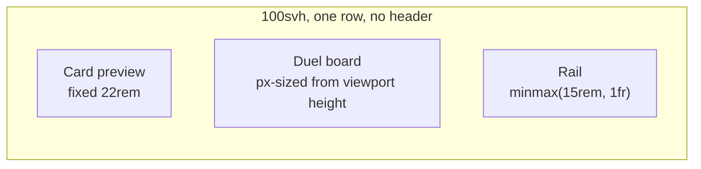

# Design — Full-height duel field, right rail, defense-capable zones

Status: **validated prototype, ready to implement**
Date: 2026-08-13
Prototype: [`ai-artifacts/PROTO_2026_08_12_full_height_field.html`](PROTO_2026_08_12_full_height_field.html) (standalone, no build, no engine)
Supersedes the field geometry in `src/field/duel-field-layout.ts` and the app chrome in `docs/ADR/003_ADR_field_first_application_chrome.md`.

The goal is a **one-to-one replication of the prototype** in the simulator. Every number in this document was measured against the prototype in Chromium, not estimated.

---

## 1. Why

The shipped field is a `16:9` box with `1280×720` virtual coordinates. `x 0–289` and `x 1061–1280` — **40% of the board's width** — hold nothing. The board is sized by its grid column, so the header bar plus the `.duel-row` split cap its height well below the viewport.

Result: cards are smaller than the viewport allows, and the wasted space is horizontal, where it cannot become card size.

Three changes fix it:

1. Delete the header; the app becomes one full-height row.
2. Size the board from **viewport height**, derive width from the grid.
3. Delete the dead bands: one uniform grid, no per-block gaps.

Plus one feature the old grid could not express: **Defense Position**, which needs a square zone footprint.

---

## 2. Shell



```css
.duel-shell {
  height: 100svh;
  display: grid;
  grid-template-columns: var(--preview-w) auto minmax(var(--rail-min), 1fr);
  align-items: stretch;
}
:root { --preview-w: 22rem; --rail-min: 15rem; }
@media (max-width: 1500px) { :root { --preview-w: 18rem; --rail-min: 12rem; } }
```

- The preview is **fixed**, not flexible. Width freed by the field goes to the rail.
- The board column is `auto`; JS gives the board explicit px width and height.
- `DuelHeaderBar.svelte` is deleted. Life points, avatars, options button and turn/phase all move into the rail.

---

## 3. Board geometry

### 3.1 The model

One uniform pitch, one scale factor, everything in **real px**.

```
GAP    = 5px                     validated; uniform between every zone, both axes
pitch  = box + GAP
box    = square, the card's full footprint in any position
card   = height: box, width: box * 72/104
slot   = card width + 6px wide, box tall — the visible card container
```

### 3.2 Invariants

| # | Invariant | Why |
|---|---|---|
| I1 | Zone box is **square** | A Defense card is the same card rotated 90°; its long side must fit across the box |
| I2 | `cardHeight === box` | So a rotated card spans the whole box and two neighbours are exactly `GAP` apart |
| I3 | Gap is **uniform** — columns, rows, and across former block boundaries | Field/Extra, the five central columns, Deck/GY and Banished all sit on one grid |
| I4 | One scale factor for both axes | Non-uniform scaling silently distorts every zone (see §11.1) |
| I5 | `GAP` is an **absolute px constant**, never scaled | It exists so adjacent Defense cards read as separate cards at any board size |

### 3.3 Rows and columns

7 rows, top to bottom: `opponent hand · opponent S/T · opponent monster · shared EMZ · monster · S/T · hand`.
Without Extra Monster Zones: 6 rows plus a `0.55 × pitch` phase band in the middle.

8 columns, left to right: `Field+Extra · 5 central · Deck+GY · Banished`.

### 3.4 Reference implementation

Replaces the fraction table in `src/field/duel-field-layout.ts`. Zone IDs, `mapEngineFieldAddress`, and `fieldZoneAccessibleName` are unchanged — only the coordinates become computed px.

```ts
// src/field/duel-field-geometry.ts
export const ZONE_GAP = 5;
export const CARD_ASPECT = 72 / 104;
const MARGIN = 0.15;   // board outer margin, in units of pitch
const BAND = 0.55;     // phase band height when there are no EMZs
const SLOT_PAD = 6;    // card container is this much wider than the card
const COLS = 8;

export interface FieldGeometry {
  readonly pitch: number;
  readonly box: number;
  readonly width: number;
  readonly height: number;
  readonly margin: number;
  readonly cardWidth: number;
  readonly cardHeight: number;
  readonly slotWidth: number;
  readonly rowY: readonly number[];
  readonly bandY: number;
  readonly columnX: readonly number[];
  readonly emzX: readonly [number, number];
}

export function computeFieldGeometry(
  extraMonsterZones: boolean,
  availableWidth: number,
  availableHeight: number,
): FieldGeometry {
  const rows = extraMonsterZones ? 7 : 6;
  // height = 2*MARGIN*pitch + rows*box + (rows-1)*GAP [+ band + GAP]
  const hP = 2 * MARGIN + rows + (extraMonsterZones ? 0 : BAND);
  const hC = extraMonsterZones ? -ZONE_GAP : 0;
  const wP = 2 * MARGIN + COLS;
  const wC = -ZONE_GAP;

  const pitch = Math.min(
    (availableHeight - hC) / hP,
    (availableWidth - wC) / wP,
  );
  const box = pitch - ZONE_GAP;
  const margin = MARGIN * pitch;
  const band = BAND * pitch;

  const rowY: number[] = [];
  let y = margin + box / 2;
  let bandY = 0;
  for (let i = 0; i < rows; i += 1) {
    if (!extraMonsterZones && i === 3) {
      bandY = y - box / 2 + band / 2;
      y += band + ZONE_GAP;
    }
    rowY.push(y);
    y += pitch;
  }
  if (extraMonsterZones) bandY = rowY[3]!;

  const columnX = Array.from(
    { length: COLS },
    (_, i) => margin + box / 2 + i * pitch,
  );

  return {
    pitch, box, margin,
    width: wP * pitch + wC,
    height: hP * pitch + hC,
    cardHeight: box,
    cardWidth: box * CARD_ASPECT,
    slotWidth: box * CARD_ASPECT + SLOT_PAD,
    rowY, bandY, columnX,
    emzX: [columnX[2]! + pitch / 2, columnX[3]! + pitch / 2],
  };
}
```

Row/column semantics:

| Index | Column | Index | Row (EMZ profile) |
|---|---|---|---|
| 0 | Field Zone (monster row) / Extra Deck (S/T row) | 0 | opponent hand |
| 1–5 | Monster 1–5 / Spell-Trap 1–5 | 1 | opponent Spell/Trap |
| 6 | GY (monster row) / Deck (S/T row) | 2 | opponent Monster |
| 7 | Banished | 3 | shared Extra Monster + phase band |
| | | 4 | your Monster |
| | | 5 | your Spell/Trap |
| | | 6 | your hand |

### 3.5 Applying it

```ts
const previewWidth = previewVisible ? previewEl.getBoundingClientRect().width : 0;
const railFloor = remToPx(railMinRem);
const geometry = computeFieldGeometry(
  extraMonsterZones,
  window.innerWidth - previewWidth - railFloor,
  document.documentElement.clientHeight,
);
board.style.width = `${geometry.width}px`;
board.style.height = `${geometry.height}px`;
board.style.setProperty("--card-w", `${geometry.cardWidth}px`);
board.style.setProperty("--card-h", `${geometry.cardHeight}px`);
board.style.setProperty("--slot-w", `${geometry.slotWidth}px`);
board.style.setProperty("--zone-gap", `${ZONE_GAP}px`);
```

Recompute on `resize` and whenever the preview panel or the EMZ profile changes. Use a `ResizeObserver` on the shell rather than only `window.resize`, so rail/preview reflows are picked up.

**Do not** express this as `aspect-ratio` + `height: 100%` + `max-width: 100%`. See §11.1.

---

## 4. Zone rendering

Three nested things per zone:

1. **Dashed square** — the zone's true footprint, `box × box`. Outline only.
2. **Slot** — the card container the player reads: upright, `cardWidth + 6` wide, `box` tall, solid hairline border. This is what looks like a "card space" in a real duel.
3. **Card** — same size in every position. Defense/Set only add `rotate(90deg)`, which deliberately overflows the slot left and right but never leaves the dashed square.

```html
<div class="duel-field-zone" data-zone-id="p0:mainMonster:2" data-position="defense">
  <div class="duel-field-zone__slot"><span class="visually-hidden">Monster Zone 3</span></div>
  <div class="duel-field-card is-defense"><!-- art --></div>
</div>
```

```css
.duel-field-zone {
  position: absolute;
  left: var(--fx); top: var(--fy);
  width: var(--fw); height: var(--fh);
  transform: translate(-50%, -50%);
  display: grid;
  place-items: center;
  border: 1px dashed rgb(183 220 207 / 0.3);
  border-radius: 0.2rem;
}
.duel-field-zone__slot {
  grid-area: 1 / 1;
  width: var(--slot-w);
  height: var(--card-h);
  border: 1px solid rgb(183 220 207 / 0.5);
  border-radius: 0.25rem;
  background: rgb(9 32 29 / 0.45);
}
.duel-field-card {
  grid-area: 1 / 1;
  width: var(--card-w);
  height: var(--card-h);
}
.duel-field-card.is-defense,
.duel-field-card.is-set { transform: rotate(90deg); }
```

Both children sit in the same `grid-area`, so they are concentric without `position: absolute` inside the zone, and the card paints over the slot border it coincides with.

Face-down Set = rotated **and** card-back art. Face-up Defense = rotated with face art. Attack = upright.

---

## 5. Hand

```html
<div class="duel-field-hand" style="--fx:…; --fy:…; --fw:…; --fh:…">
  <div class="duel-field-hand__scroll"><!-- .duel-field-card × n --></div>
  <div class="duel-field-hand__bar"><i></i></div>
  <span class="duel-field-hand__count">6</span>
</div>
```

- Spans the full board width between the margins, exactly one `box` tall.
- The **positioned box is the wrapper**, not the scroller, so the count badge and the scrollbar do not scroll with the cards.
- Native scrollbar is suppressed (`scrollbar-width: none` + `::-webkit-scrollbar { display: none }`) and replaced by an **overlay bar** at the bottom edge, `z-index: 2`, with a draggable thumb, hidden when the hand fits. A native horizontal scrollbar steals 6–15px from the content box and pushes the cards past the top edge; the overlay does not.
- **Count badge** bottom-right, `z-index: 3`, `pointer-events: none`, painted over the cards when the hand is wide enough to reach the corner.
- Card gap inside the hand uses the same `--zone-gap`.

```ts
function wireOverlayScrollbar(scroll: HTMLElement, bar: HTMLElement): void {
  const thumb = bar.firstElementChild as HTMLElement;
  const sync = (): void => {
    const ratio = scroll.clientWidth / scroll.scrollWidth;
    bar.classList.toggle("is-visible", ratio < 0.999);
    if (ratio >= 0.999) return;
    const track = bar.clientWidth;
    const width = Math.max(24, track * ratio);
    const max = scroll.scrollWidth - scroll.clientWidth;
    thumb.style.width = `${width}px`;
    thumb.style.transform = `translateX(${(scroll.scrollLeft / max) * (track - width)}px)`;
  };
  scroll.addEventListener("scroll", sync, { passive: true });
  // pointerdown on the thumb maps pointer delta → scrollLeft (see prototype)
  requestAnimationFrame(sync);
}
```

---

## 6. Phases and End turn

Both live in the free mid band (`bandY`), `pointer-events: none` on the group, `auto` on each control.

| Profile | Draw · Standby · Main 1 · Battle | Main 2 | End turn |
|---|---|---|---|
| With EMZ | right-aligned against the EMZ pair's **left** edge | left-aligned against their **right** edge | right-justified at the board's right margin |
| Without EMZ | one centred run: `Draw · Standby · Main 1 · Battle · Main 2` at board centre | — | right-justified at the board's right margin |

End turn is visually the primary control: `font-size: calc(var(--chip-size) * 1.5)`, padding `0.6em 1.3em`, `border-radius: 0.7rem`, drop shadow.

Chip and label type scale with the board: `--chip-size: max(9px, pitch * 0.1)`, `--label-size: max(7px, pitch * 0.085)`.

---

## 7. Right rail

Grid rows: `auto | auto | minmax(0,1fr) | auto`.

1. **Top row** — `Turn 3 · Main Phase 1` only (no duel title), `0.95rem`, weight 800, `align-items: center` so it sits on the options button's midline. Options button is a fixed 2.5rem square at the row end and never moves.
2. **Opponent block** — margin above it; **full-width square avatar** (`width:100%; aspect-ratio:1; max-height:26svh`), LP **below**. Accent border when it is their turn.
3. **Status block** — vertically centred. **No border, no background, no scrollbar, no overflow.** Large title (`clamp(1.05rem, 1.4cqw + 0.8rem, 1.6rem)`, `text-wrap: balance`) plus a muted subtitle. Carries `aria-live="polite"`.
4. **Your block** — LP **above**, full-width square avatar below.

Hand/deck/GY counters do **not** appear in the rail; they are on the field.

### Status states

| Title | Subtitle | Dots |
|---|---|---|
| `Chain · Link 2` | which link resolves first | no |
| `Opponent is thinking` | what they are deciding | yes |
| `Activating Mirror Force` | who, card type, trigger | yes |
| `Battle resolving` | attacker → target | yes |
| `Your move` | phase + hand size | no |

Animated three dots whenever the client is waiting on the opponent or on an animation:

```css
.dots i { display:inline-block; animation: dot 1.2s infinite; }
.dots i:nth-child(2) { animation-delay: .2s; }
.dots i:nth-child(3) { animation-delay: .4s; }
@keyframes dot { 0%,60%,100% { opacity:.2 } 30% { opacity:1 } }
@media (prefers-reduced-motion: reduce) { .dots i { animation:none; opacity:.7 } }
```

This block is **additive**. It never replaces the prompt dialogs; those keep owning every decision.

---

## 8. Card preview panel

Fixed-width column, rows `auto auto auto auto minmax(0,1fr)`:
art placeholder → name → meta chips → scrolling effect text.

```css
.card-preview__body {
  display: grid;
  grid-template-rows: auto minmax(0, 1fr);
  min-height: 0;
}
.card-preview__text {
  min-height: 0;
  overflow-y: auto;
  scrollbar-gutter: stable;   /* text never reflows when the bar appears */
  scrollbar-width: thin;
}
```

The wrapper **must** be a grid with `minmax(0,1fr)`. A block wrapper sizes to its content, so the text box never gets a bounded height and nothing scrolls — that was the shipped bug.

`scrollbar-gutter: stable` reserves 10px permanently: measured paragraph width is identical (309.00px) for a one-line card and a wall-of-text card.

---

## 9. New settings

One new pair of toggles, both defaulting to **on**, both applied as data attributes on the board so no re-render is needed.

```ts
// src/app/stores/ui-settings-store.ts
export interface UiSettingsState {
  readonly showDuelHud: boolean;
  readonly showWorkspace: boolean;
  readonly autoPlaceCards: boolean;
  readonly autoResolveTrivialPrompts: boolean;
  readonly showZoneOutlines: boolean;   // new — dashed true-zone footprints
  readonly showZoneCounts: boolean;     // new — every numeric counter at once
}

export const DEFAULT_UI_SETTINGS: UiSettingsState = Object.freeze({
  showDuelHud: false,
  showWorkspace: false,
  autoPlaceCards: true,
  autoResolveTrivialPrompts: true,
  showZoneOutlines: true,
  showZoneCounts: true,
});
```

Add `setShowZoneOutlines` / `setShowZoneCounts` following the existing setter shape, two checkboxes in `SettingsDialog.svelte` following `onshowduelhud`'s prop/handler pattern:

- **Show zone outlines** — "Draw the dashed square footprint of every zone."
- **Show card counts** — "Show the number of cards in Deck, Extra Deck, GY, Banished and both hands."

`showZoneCounts` is deliberately **one switch for all counters**, not per-zone.

```css
.duel-field-board[data-zone-outlines="false"] .duel-field-zone { border-color: transparent; }
.duel-field-board[data-zone-counts="false"] .duel-field-hand__count,
.duel-field-board[data-zone-counts="false"] .duel-field-card__count { display: none; }
```

Persistence: `UiSettingsState` is currently in-memory only. To persist, bump `PersistedUiState` to `version: 2`, add a `settings` branch, and have `readPersistedUiState` fall back to defaults for any missing or malformed key — same defensive shape as the existing `decks` branch. A v1 payload must load as "all defaults", never as an error.

Accessibility: hiding the dashed outline is presentation only. Zone `aria-label`s, `data-zone-id`, `data-field-target` and focus rings are untouched by both toggles.

---

## 10. Measured acceptance criteria

All values from the prototype in Chromium. These are the assertions the Playwright field spec should carry.

### Geometry (1920×1080, EMZ profile)

| Assertion | Expected |
|---|---|
| gap between two adjacent Defense cards | `5.00px` |
| gap between two adjacent zone boxes | `5.00px` |
| gap Field Zone → Monster 1 | `5.00px` |
| gap Monster 5 → GY | `5.00px` |
| gap monster row → Spell/Trap row | `5.00px` |
| zone box | `144px²` |
| slot width − card width | `6px` |
| rotated card bounding box | `box × cardWidth` |

### Scale across viewports

| Viewport | Profile | Board | % of viewport height | Zone | Card |
|---|---|---|---|---|---|
| 1920×1080 | EMZ | 1229×1080 | **100.0%** | 144² | 99×144 |
| 1920×1080 | no EMZ | 1304×1080 | **100.0%** | 153² | 106×153 |
| 2560×1440 | EMZ | 1638×1440 | **100.0%** | 193² | 134×193 |
| 2560×1440 | no EMZ | 1740×1440 | **100.0%** | 205² | 142×205 |
| 1366×768 | EMZ | 874×768 | **100.0%** | 101² | 70×101 |
| 1366×768 | no EMZ | 886×735 | 95.7% | 102² | 71×102 |

Board width/height ratio must equal `geometry.width / geometry.height` exactly at every viewport — that is the guard against §11.1.

### Hand

| Hand size | Card height | Offset from band top | Offset from band bottom | Overlay bar |
|---|---|---|---|---|
| 6 | 144px | 0 | 0 | hidden |
| 20 | 144px | 0 | 0 | visible, `scrollWidth > clientWidth` |

Card height must not change with hand size. Count badge is present for both players and is on top of the cards (`z-index` above `.duel-field-card`) when they reach the corner.

### Preview

| Assertion | Expected |
|---|---|
| long card text scrolls | `scrollHeight > clientHeight` |
| text bottom | inside the panel's box |
| reserved gutter | `offsetWidth − clientWidth === 10` |
| paragraph width, short card vs long card | identical |

### Touch targets

Smallest control is the phase chip. At 1366×768 the pitch is 106px and chips are ~24px tall; keep the existing `min-height: 44px` hit area via padding on `.field-phase-chip`, as today.

---

## 11. Rejected alternatives and traps

### 11.1 `aspect-ratio` + `height: 100%` + `max-width: 100%`

Looks like it preserves the ratio. It does not: `height:100%` is a definite length and wins, `max-width` clamps the width, and the aspect ratio is silently violated. Measured **8% horizontal squash at 1366×768** — every zone non-uniformly scaled, defense adjacency broken.

Always set both dimensions from one scale factor.

### 11.2 Percentage coordinates on a virtual grid

The shipped model (`x / 1280`, `y / 720`) cannot express "5px between zones at any board size". A percentage gap grows with the board and stops reading as a card separator. Coordinates are px; only `GAP` and `SLOT_PAD` are absolute constants.

### 11.3 Cropping the dead bands to grow cards

Does not work while height is the binding constraint: card size is `boardHeight / rows`. Cropping frees **width**, which goes to the rail. The card-size win comes from deleting the header and from the uniform grid, not from cropping.

### 11.4 Slot taller than the card

"Container slightly larger than the card" can only be larger in **width** (+6px). Making it taller forces the card shorter than the box, and two rotated cards stop touching at `GAP`. Cards-just-touch is the binding constraint.

### 11.5 Native scrollbar in the hand

Consumes layout height and pushes cards out of the band. Overlay bar only.

---

## 12. Implementation order

| # | Task | Verify |
|---|---|---|
| T1 | `src/field/duel-field-geometry.ts` — `computeFieldGeometry`, `ZONE_GAP`, keep `mapEngineFieldAddress`/IDs/a11y names from `duel-field-layout.ts` | unit tests on pitch/box/gap invariants for both profiles at 3 viewport sizes |
| T2 | `FieldBoard.svelte` + `ZoneControl.svelte` — px positioning, dashed zone + slot + card, defense/set rotation | component tests: rotation classes, slot/card size relation |
| T3 | Board sizing hook — `ResizeObserver`, `--card-w/--card-h/--slot-w/--zone-gap` | e2e: ratio exact, 100% height at 1920/2560 |
| T4 | Hand band — wrapper/scroller split, overlay scrollbar, count badge | e2e: card height constant at 1 and 20 cards |
| T5 | `PhaseStrip.svelte` — new anchors both profiles, End turn back on the field | e2e: no overlap with EMZ or piles at every supported viewport |
| T6 | Rail component — replaces `DuelHeaderBar.svelte`; turn/phase, avatars, LP, status block | component tests: status states, dots, reduced motion |
| T7 | `App.svelte` + `app.css` — delete header, `.duel-shell` grid, drop `.duel-row` | e2e: no page scrollbars at any supported viewport |
| T8 | `CardPreviewPanel.svelte` — grid body, `scrollbar-gutter: stable` | e2e: scrolls, no reflow, 10px gutter |
| T9 | Settings — `showZoneOutlines`, `showZoneCounts`, dialog rows, optional `PersistedUiState` v2 | unit: v1 payload loads as defaults; e2e: toggles hide outlines/counters and nothing else |

T1–T3 are one shippable slice; T4–T5 the second; T6–T9 the third.

---

## 13. Open decisions

1. **1366×768, no-EMZ** lands at 95.7% of viewport height. Options: shrink `--preview-w` further below 1500px, let the rail go under 12rem, or accept it. Recommendation: accept — 4% at the smallest supported viewport, in the rarer profile.
2. **Preview scrollbar styling.** Currently native + reserved gutter. If you want it visually identical to the hand's, reuse `wireOverlayScrollbar` on the vertical axis.
3. **Counts persistence.** `PersistedUiState` v2 is proposed, not required. Without it, both toggles reset every reload.
