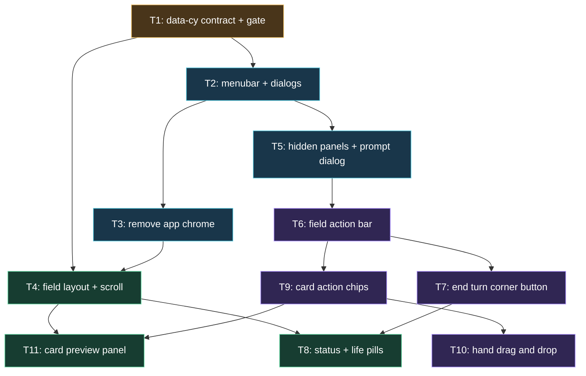

# Plan: Duel Field UX Overhaul

## Goal

Turn app from panel-stack shell into field-first duel client. Chrome panels gone, board full width, all decision affordances live on or over `duel-field` (hover chips, drag-drop, corner End turn, status pills, preview panel). Success = every one of the 18 feedback items shipped, `npm run check` green, duel completable end to end with mouse only and with keyboard only.

## Scope

- In: `src/app/**` Svelte shell + duel-field components, `src/styles/app.css`, `src/field/**` view model + new placement candidates, `src/app/stores/**`, `src/app/prompts/**`, `AGENT.md` rule, unit/component/e2e tests, ADRs, architecture HTML doc.
- Out: Worker/engine/protocol changes (`src/worker/**` untouched), card data pipeline, deck editing, settings persistence, i18n, new animation system, mobile-first redesign beyond existing breakpoints.

## Assumptions

- **A1** Artifacts land in `ai-artifacts/` (tracked dir declared in `AGENT.md`), not `ai_artefacts/`. One artifact dir, not two.
- **A2** UI settings live in memory for the session. No IndexedDB, no `localStorage`. Reload resets to defaults.
- **A3** Menubar carries only the right-justified `Settings` button. Engine version + active/fallback snapshot ids move into the Settings dialog (they lose their old home when `app-header` and `status-panel` die).
- **A4** "Remove selection-dock" = delete the panel. Affordances it alone provided (Confirm/Cancel, counter +/−, order ↑/↓, validation text, non-`endPhase` global choices) move to a compact non-modal `FieldActionBar` pinned inside the field. `endPhase` moves to the corner End turn button.
- **A5** Drag-and-drop uses pointer events, not HTML5 DnD. jsdom has no `DataTransfer`; pointer path reuses the 8px move threshold already in `CardControl.svelte`. Drop hit test is an injectable prop so component tests stay deterministic.
- **A6** Drop picks the primary action for the zone kind: monster zone → `summon` > `specialSummon` > `setMonster`; spell/trap zone → `activate` > `setSpellTrap`. Non-primary actions stay reachable on the hover chips.
- **A7** Drag halo never includes `p0:field`. `PublicCard` carries no card type, so a field-spell-only zone cannot be inferred without guessing. Field spells stay playable through hover chips.
- **A8** Orange actionable halo applies to actionable cards *and* actionable zones. Split colours would read as two different meanings.
- **A9** Action chips are deliberately below the 44px pointer-target guidance. Keyboard path is unaffected: the card target button stays 44px and Enter opens the chip row.
- **A10** Deleting the two field `aria-live` paragraphs removes those screen-reader announcements. App-level announcement region in `App.svelte` stays, so response/loading state is still announced.
- **A11** Dialogs are `div[role="dialog"][aria-modal="true"]` with manual focus move + Escape + backdrop, not native `<dialog>`. Matches existing code style and avoids jsdom `showModal` variance.
- **A12** Preview panel = fixed `22rem` column right of the field, equal height, content sticky after pointer leaves, stacks below the field under `79rem` (1264px) viewport width. *(Amended 2026-08-09: the original `64rem` was not achievable — side by side under `79rem` the field column cannot hold the board's `min-width: 52rem`, which fails the `>= 1024` no-horizontal-overflow e2e gate at VP-04. The arithmetic is in `T11_card-preview-panel.md` under "Breakpoint correction"; the shipped CSS is `@media (max-width: 79rem)`.)*
- **A13** Card name + effect text come from the existing `__ACTIVE_CARD_TEXTS__` build global (`{code, name, description}`).
- **A14** "One word" action labels keep two words where one is wrong: `Special Summon`, `Change Position`, `Main 2`, `End turn`. Everything else is one word.
- **A15** Life-point pills are added inside the field (opponent top-left, you bottom-left) because hiding `duel-hud` by default otherwise removes the only LP readout.

## Ticket flowchart

## Ticket order

Rows are in **executed** order. T8 depends on T7 and nothing depends on T8, so it ran last: T1 → T2 → T3 → T4 → T5 → T6 → T7 → T9 → T10 → T11 → T8, then the parent-directed repairs R2 → R3 → R4.

| ID  | Title | Depends | Commit outcome | File |
| --- | ----- | ------- | -------------- | ---- |
| T1  | data-cy contract and coverage gate | — | Every rendered element carries a unique `data-cy`; static gate fails the build if one is missing | `PLAN_2026_08_08_duel_field_ux_overhaul/T1_data-cy-contract.md` |
| T2  | Header menubar, menu dialog, settings dialog | T1 | Menubar with right-justified Settings opens a menu holding neutral Settings + danger Surrender; Settings dialog exposes two visibility checkboxes plus engine/snapshot info | `PLAN_2026_08_08_duel_field_ux_overhaul/T2_header-menubar-and-dialogs.md` |
| T3  | Remove app chrome panels | T2 | `app-header`, `status-panel`, `lifecycle-panel`, field `h2` and both field live-region paragraphs deleted; image preload progress becomes an in-field overlay | `PLAN_2026_08_08_duel_field_ux_overhaul/T3_remove-app-chrome.md` |
| T4  | Full-width board, free page scroll, hand fixes | T1, T3 | Board fills its column, page scroll never trapped over the field, `p1:hand` unstyled, opponent hand cards upright | `PLAN_2026_08_08_duel_field_ux_overhaul/T4_field-layout-and-scroll.md` |
| T5  | Hidden panels by default + prompt dialog | T2 | `duel-hud` and `workspace-grid` hidden until their checkbox is ticked; non-field prompts open a modal prompt dialog over the field | `PLAN_2026_08_08_duel_field_ux_overhaul/T5_hidden-panels-and-prompt-dialog.md` |
| T6  | Field action bar replaces selection dock | T5 | `SelectionDock.svelte` deleted; compact `FieldActionBar` carries Confirm/Cancel, counter, order and non-`endPhase` global choices | `PLAN_2026_08_08_duel_field_ux_overhaul/T6_field-action-bar.md` |
| T7  | End turn corner button | T6 | Persistent orange End turn button bottom-right of the field, enabled only when the engine offers `endPhase` | `PLAN_2026_08_08_duel_field_ux_overhaul/T7_end-turn-corner-button.md` |
| T9  | Hover action chips and orange halo | T6 | `FieldActionMenu.svelte` deleted; tiny fixed-size chips float above an actionable card on hover/focus; actionable halo is orange | `PLAN_2026_08_08_duel_field_ux_overhaul/T9_card-action-chips.md` |
| T10 | Drag and drop from hand | T9 | Dragging an actionable hand card halos candidate zones; dropping sends the action and auto-answers the engine's zone prompt with the dropped zone | `PLAN_2026_08_08_duel_field_ux_overhaul/T10_hand-drag-and-drop.md` |
| T11 | Card preview panel | T4, T9 | `CardInspector.svelte` deleted; a 22rem panel beside the field shows the hovered or held card's art and scrollable effect text | `PLAN_2026_08_08_duel_field_ux_overhaul/T11_card-preview-panel.md` |
| T8  | Priority, phase and life pills | T4, T7 | `prio-pill - phase-pill` top-right of the field; LP pills for both players inside the field | `PLAN_2026_08_08_duel_field_ux_overhaul/T8_status-and-life-pills.md` |
| R2  | Stabilise the chip viewport assertion | T11 | Parent-directed repair: the responsive chip-overflow assertion centres the actionable card first, so it stops being seed-dependent | `PLAN_2026_08_08_duel_field_ux_overhaul/R2_stabilise-chip-viewport-assertion.md` |
| R3  | Review code defects | R2 | Parent-directed repair after the deep reviewer fanout: extra-monster-zone drops, stranded placement intents, the preview visibility guard, the `FieldBoard` null guard and surrender feedback | `PLAN_2026_08_08_duel_field_ux_overhaul/R3_review-code-defects.md` |
| R4  | Gate hardening and documentation | R3 | Parent-directed repair: `data-cy` uniqueness enforced in a rendered document, two vacuous e2e guards made real, the chip reveal tested, and the documents this plan invalidated corrected | `PLAN_2026_08_08_duel_field_ux_overhaul/R4_gate-hardening-and-docs.md` |

## Tickets

- [T1: data-cy contract and coverage gate](PLAN_2026_08_08_duel_field_ux_overhaul/T1_data-cy-contract.md) — depends: none
- [T2: Header menubar, menu dialog, settings dialog](PLAN_2026_08_08_duel_field_ux_overhaul/T2_header-menubar-and-dialogs.md) — depends: T1
- [T3: Remove app chrome panels](PLAN_2026_08_08_duel_field_ux_overhaul/T3_remove-app-chrome.md) — depends: T2
- [T4: Full-width board, free page scroll, hand fixes](PLAN_2026_08_08_duel_field_ux_overhaul/T4_field-layout-and-scroll.md) — depends: T1, T3
- [T5: Hidden panels by default + prompt dialog](PLAN_2026_08_08_duel_field_ux_overhaul/T5_hidden-panels-and-prompt-dialog.md) — depends: T2
- [T6: Field action bar replaces selection dock](PLAN_2026_08_08_duel_field_ux_overhaul/T6_field-action-bar.md) — depends: T5
- [T7: End turn corner button](PLAN_2026_08_08_duel_field_ux_overhaul/T7_end-turn-corner-button.md) — depends: T6
- [T9: Hover action chips and orange halo](PLAN_2026_08_08_duel_field_ux_overhaul/T9_card-action-chips.md) — depends: T6
- [T10: Drag and drop from hand](PLAN_2026_08_08_duel_field_ux_overhaul/T10_hand-drag-and-drop.md) — depends: T9
- [T11: Card preview panel](PLAN_2026_08_08_duel_field_ux_overhaul/T11_card-preview-panel.md) — depends: T4, T9
- [T8: Priority, phase and life pills](PLAN_2026_08_08_duel_field_ux_overhaul/T8_status-and-life-pills.md) — depends: T4, T7
- [R2: Stabilise the chip viewport assertion](PLAN_2026_08_08_duel_field_ux_overhaul/R2_stabilise-chip-viewport-assertion.md) — depends: T11
- [R3: Review code defects](PLAN_2026_08_08_duel_field_ux_overhaul/R3_review-code-defects.md) — depends: R2
- [R4: Gate hardening and documentation](PLAN_2026_08_08_duel_field_ux_overhaul/R4_gate-hardening-and-docs.md) — depends: R3

## Decision records

- [002 — Universal data-cy selector contract](../docs/ADR/002_ADR_universal_data_cy_selector_contract.md)
- [003 — Field-first application chrome](../docs/ADR/003_ADR_field_first_application_chrome.md)
- [004 — Prompt surfaces after selection dock removal](../docs/ADR/004_ADR_prompt_surfaces_after_selection_dock.md)
- [005 — Optimistic drag placement with engine reconciliation](../docs/ADR/005_ADR_optimistic_drag_placement.md)
- [006 — Preview panel replaces modal card inspector](../docs/ADR/006_ADR_preview_panel_replaces_card_inspector.md)

## Architecture doc

- [Duel field interaction shell](../docs/duel-field-interaction-shell.html)

## Risks

- **E2E churn.** `e2e/duel-smoke.spec.ts` (1869 lines) asserts against panels this plan deletes. Every ticket that changes a selector must fix its own e2e assertions in the same commit; do not defer.
- **Screen-reader regression.** T3 removes two live regions the SR review in `docs/architecture/05-presentation/duel-field-screen-reader-review.md` credits. Recorded in ADR 003 as an accepted, user-directed loss.
- **Optimistic halo.** T10's drag halo is a local guess, not engine truth. Mismatch must degrade to the real zone prompt, never to a stuck response.
