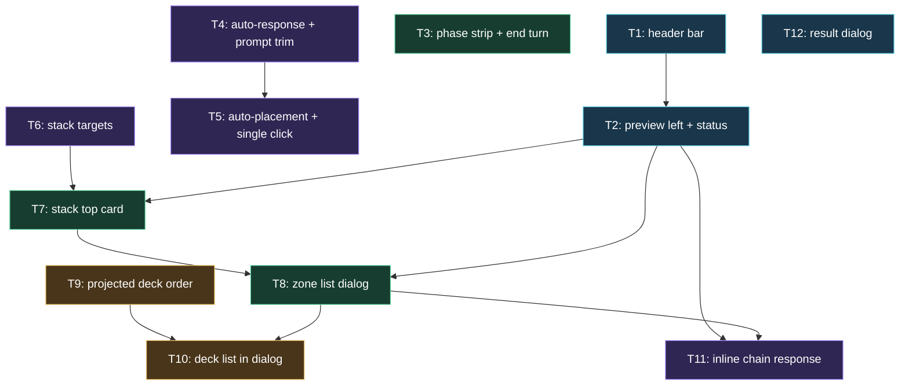

# Plan: Duel Field Feedback Round 2

## Goal

Ship the 17 duel-field feedback items: player/opponent header with avatars + LP, left-side preview that follows every hover, in-field phase navigation, automatic placement and automatic prompt resolution, public stack zones you can open and act from, projected deck order with reveal tracking, inline chain response, and a result dialog. Success = all 17 items shipped, `npm run check` green, duel completable end to end mouse-only and keyboard-only.

## Scope

- In: `src/app/**` (shell, duel-field components, stores, prompts, presentation), `src/field/**` (view model, card mapping, placement candidates), `src/duel/contracts/**` (`PublicPlayerState.deck`, worker-event validation), `src/worker/projection/DuelStateProjector.ts` (deck order + reveals), `src/worker/protocol/PromptRegistry.ts` (drop Shuffle Deck), `src/styles/app.css`, unit/component/e2e tests, ADRs 007-010, one new architecture HTML doc.
- Out: engine/WASM upgrade, `src/worker/engine/**` beyond adding message constants, card data pipeline, deck editing, story/progression systems, real avatar art assets, i18n, settings persistence across reloads, mobile-first redesign beyond existing breakpoints, opponent AI policy changes.

## Assumptions

- **A1** Artifacts land in `ai-artifacts/` (the tracked dir declared in `AGENT.md`), not `ai_artefacts/`. Carried forward from the 2026-08-08 plan.
- **A2** UI settings stay in memory for the session (no IndexedDB, no `localStorage`). Reload resets to defaults. Carried forward.
- **A3** Avatars reuse the bundled card-back image (`CardImageLibrary.cardBackUrl`) as the avatar art. *User decision.* The component takes an `avatarUrl` prop so real character art drops in later with no layout change.
- **A4** "Auto-validate all the system hints" (item 7) = auto-answer **chain prompts with no activatable option** *and* **prompts that carry no real decision** (`option` with exactly one choice, `selectPosition` with exactly one choice, `chain` with `forced` semantics and exactly one choice). *User decision.* Monster battle position with two choices stays manual.
- **A5** Deck order tracking is **in scope now** (item 13 tail). *User decision.*
- **A6** Deck reveals are stored as an offset-from-top map, never as engine deck sequences. Only `DRAW`, `CONFIRM_DECKTOP` and `DECK_TOP` write reveals; `SHUFFLE_DECK`, `SWAP_GRAVE_DECK`, `REVERSE_DECK` and any `MOVE` touching a deck clear every reveal for that player. `CONFIRM_CARDS` is ignored for deck slots. Conservative by construction: the projection may forget a reveal, it can never invent one.
- **A7** Only reveals addressed to player 0 are stored. Player 1's reveals clear the map (they still mutate the deck) but never write a code.
- **A8** A revealed deck slot is projected `position: "faceUpAttack"`, `faceUp: true`. This is what makes it identity-visible downstream and what keeps the existing `state.players[1]` face-down-implies-no-code privacy invariant intact.
- **A9** `stackChoices` do **not** make a prompt `fieldCapable` until T8 ships the zone list dialog. Otherwise T6 would hide the modal that is still the only way to answer a graveyard activation.
- **A10** Clicking a stack always opens its list dialog. The stack itself never fires a choice directly; the list is the only place an action on a stack card is taken.
- **A11** "Most central space" = fixed rank `[2, 1, 3, 0, 4]` over the offered sequence, extra monster zones ranked after every main sequence (5 before 6), player-0 places before player-1 places.
- **A12** Clicking outside every valid target cancels only when `prompt.cancelable` is true. A non-cancelable prompt keeps the outside click inert; no error, no toast.
- **A13** `FieldStatusPills` and `LifePointsPill` are deleted, not restyled. The phase strip carries the phase and the preview status line carries priority/response state.
- **A14** `ChoiceAction` keeps its `"shuffle"` member (the engine constant still exists). Only the emission in `PromptRegistry` is removed, so no prompt ever offers it again.
- **A15** The End turn button survives alongside the phase strip's End chip. Item 10 asks for both explicitly.
- **A16** Playwright needs the nix closure documented in `ai-artifacts/HANDOFF_2026_08_09_duel_field_ux_overhaul.md`. Every ticket that lists an e2e command repeats it inline; do not try to merge the chromium and firefox invocations.

## Ticket flowchart

## Ticket order

| ID  | Title | Depends | Commit outcome | File |
| --- | ----- | ------- | -------------- | ---- |
| T1  | Duel header bar with avatars and life points | — | The top row becomes a duel header carrying both avatars, both life-point readouts and a gear settings button; the in-field LP pills are gone | `PLAN_2026_08_09_duel_field_feedback_round_2/T1_header-bar-avatars-and-life-points.md` |
| T2  | Preview panel on the left, hover everywhere, status line | T1 | The preview column moves left, every hovered field surface updates it, and it gains a status line under the card text | `PLAN_2026_08_09_duel_field_feedback_round_2/T2_preview-panel-left-and-hover-status.md` |
| T3  | In-field phase strip and repositioned End turn | — | Six phase chips render in the field's free centre band split by the extra monster zones, the current phase carries a blue halo, legal transitions are clickable, End turn sits at the right edge between the banished zones, and the status pills are deleted | `PLAN_2026_08_09_duel_field_feedback_round_2/T3_phase-strip-and-end-turn-placement.md` |
| T4  | Automatic prompt resolution and prompt trimming | — | Chain prompts with nothing to activate and prompts with a single legal answer resolve themselves; the Shuffle Deck action is gone | `PLAN_2026_08_09_duel_field_feedback_round_2/T4_auto-response-and-prompt-trimming.md` |
| T5  | Automatic placement and single-click actions | T4 | With auto-place on, a card action never asks where; with it off, one click on a zone plays the card and a click outside cancels | `PLAN_2026_08_09_duel_field_feedback_round_2/T5_auto-placement-and-single-click-actions.md` |
| T6  | Stack zones as interaction targets | — | Choices sourced from deck, extra deck, graveyard and banished resolve to stack targets and give the stack an orange halo | `PLAN_2026_08_09_duel_field_feedback_round_2/T6_stack-interaction-targets.md` |
| T7  | Stack top-card face | T2, T6 | Graveyard and banished stacks render the last public card that entered them behind their name and count | `PLAN_2026_08_09_duel_field_feedback_round_2/T7_stack-top-card-face.md` |
| T8  | Zone list dialog | T2, T7 | Clicking any stack opens a centred, horizontally scrolling list of that zone with per-card action chips, orange halos and face-down entries for unknown cards | `PLAN_2026_08_09_duel_field_feedback_round_2/T8_zone-list-dialog.md` |
| T9  | Projected deck order and reveals | — | `PublicPlayerState` gains an ordered `deck`, and the projector tracks which deck positions the local player has legitimately seen | `PLAN_2026_08_09_duel_field_feedback_round_2/T9_projected-deck-order.md` |
| T10 | Deck list in the zone dialog | T8, T9 | Opening a deck shows one entry per remaining card, revealed positions face-up and everything else face-down | `PLAN_2026_08_09_duel_field_feedback_round_2/T10_deck-list-in-zone-dialog.md` |
| T11 | Inline chain response | T2, T8 | The chain modal is gone; a chain prompt haloes its activatable sources and asks "Do you respond?" with animated dots in the preview status line | `PLAN_2026_08_09_duel_field_feedback_round_2/T11_inline-chain-response.md` |
| T12 | Duel result dialog | — | The end-of-duel panel becomes a centred modal dialog with the rematch and diagnostics buttons | `PLAN_2026_08_09_duel_field_feedback_round_2/T12_result-dialog.md` |

## Tickets

- [T1: Duel header bar with avatars and life points](PLAN_2026_08_09_duel_field_feedback_round_2/T1_header-bar-avatars-and-life-points.md) — depends: none
- [T2: Preview panel on the left, hover everywhere, status line](PLAN_2026_08_09_duel_field_feedback_round_2/T2_preview-panel-left-and-hover-status.md) — depends: T1
- [T3: In-field phase strip and repositioned End turn](PLAN_2026_08_09_duel_field_feedback_round_2/T3_phase-strip-and-end-turn-placement.md) — depends: none
- [T4: Automatic prompt resolution and prompt trimming](PLAN_2026_08_09_duel_field_feedback_round_2/T4_auto-response-and-prompt-trimming.md) — depends: none
- [T5: Automatic placement and single-click actions](PLAN_2026_08_09_duel_field_feedback_round_2/T5_auto-placement-and-single-click-actions.md) — depends: T4
- [T6: Stack zones as interaction targets](PLAN_2026_08_09_duel_field_feedback_round_2/T6_stack-interaction-targets.md) — depends: none
- [T7: Stack top-card face](PLAN_2026_08_09_duel_field_feedback_round_2/T7_stack-top-card-face.md) — depends: T2, T6
- [T8: Zone list dialog](PLAN_2026_08_09_duel_field_feedback_round_2/T8_zone-list-dialog.md) — depends: T2, T7
- [T9: Projected deck order and reveals](PLAN_2026_08_09_duel_field_feedback_round_2/T9_projected-deck-order.md) — depends: none
- [T10: Deck list in the zone dialog](PLAN_2026_08_09_duel_field_feedback_round_2/T10_deck-list-in-zone-dialog.md) — depends: T8, T9
- [T11: Inline chain response](PLAN_2026_08_09_duel_field_feedback_round_2/T11_inline-chain-response.md) — depends: T2, T8
- [T12: Duel result dialog](PLAN_2026_08_09_duel_field_feedback_round_2/T12_result-dialog.md) — depends: none

## Feedback coverage

| # | Feedback | Ticket |
| --- | --- | --- |
| 1 | Header row with avatars, LP, gear icon | T1 |
| 2 | Hover anything on the field updates the preview | T2, T8 |
| 3 | Preview window moves left | T2 |
| 4 | Auto-place setting, checked by default | T5 |
| 5 | Click outside a valid zone cancels | T5 |
| 6 | One click starts the action, second click places it | T5 |
| 7 | Auto-validate system hints | T4 |
| 8 | Auto-pass when no chain response exists | T4 |
| 9 | Remove Shuffle Deck | T4 |
| 10 | Phase strip in the field centre, End turn far right | T3 |
| 11 | Public stacks show their last card | T7 |
| 12 | Orange halo on activatable stacks | T6 |
| 13 | Zone list dialog + deck reveal is public | T8, T9, T10 |
| 14 | Extra deck list, opponent lists face-down | T8 |
| 15 | Remove the centre-top phase badges | T3 |
| 16 | Inline chain response with "Do you respond?" | T11 |
| 17 | Winner section becomes a dialog | T12 |

## Related documents

- ADR `docs/ADR/007_ADR_stack_zones_as_interaction_targets.md`
- ADR `docs/ADR/008_ADR_projected_deck_order_and_reveals.md`
- ADR `docs/ADR/009_ADR_automatic_prompt_resolution.md`
- ADR `docs/ADR/010_ADR_in_field_phase_navigation.md`
- Architecture `docs/duel-field-interaction-model-v2.html`
- Prior plan `ai-artifacts/PLAN_2026_08_08_duel_field_ux_overhaul.md`
- Environment facts `ai-artifacts/HANDOFF_2026_08_09_duel_field_ux_overhaul.md`
</content>
</invoke>
