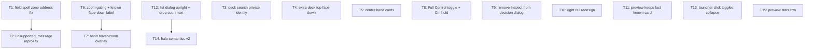

# Plan: duel_feedback_round_4

## Goal

Land feedback round 4 from `feedback-duel.md`: 2 engine-side bugs (field spell kills duel field UI; `unsupported_message` aborts duel), privacy-correct card visibility (deck search, extra deck top, face-down known cards), Full Control chain toggle, hand centering + hover-zoom overlay, right-rail redesign, list-dialog + halo polish, preview stats row. Success = every ticket lands green on `npm run check:headless`, app playable after each commit.

## Scope

- In: `src/battle/**`, `src/styles/app.css`, `src/styles/tokens.css`, tests under `tests/`, `e2e-acceptance/**`, acceptance scenarios, docs/ADR.
- Out: story shell (`src/story/**`) except none, deck editor, admin console, HUD trays (`CardTray`/`DuelHud` Inspect labels), engine vendor upgrade, portrait rotation work.

## Assumptions & grill outcomes

All judgment calls grilled + confirmed by user — full record: `ai-artifacts/GRILL_2026_08_16_duel_feedback_round_4/ANSWERS.md` (2 rounds, 12 decisions, scout facts). Highlights:

- Full Control ON = ALL auto answers off. OFF = auto-pass chain windows attributed to the player: chain tail controller 0, or (empty chain) last action-event actor since `turnStarted`, fallback turn player. Opponent action + activatable → always prompt. Session-only, default off.
- Inspect expanders deleted whole; preview panel is the card surface and gains a stats row (T15; data already in `activeCatalog()`).
- "Select between…" removed from target-list footer, all ranges.
- Zoom overlay pointer-only, **1.6× subtle** — emphasis, not information.
- Extra-deck stack hover: no preview update; own-pile list dialog stays the private viewer (already face-up — verified).
- LP plates: `LP 8000` label-left, green `>4000` / orange `2000–4000` / red `<2000`, ~600 ms count animation, reduced-motion respected.
- Red invalid halo: list entries + field cards during targeting, field = hover-only.
- Bug #7 root cause = ocgcore reports field-spell zone as `spellTrap` sequence 5; `mapEngineFieldAddress` rejects it → `unsupported_fixed_card` → "Duel field unavailable" fallback. T1 verifies with failing test before fix.
- Bug #8 likely same family (spellbook duel). T2 reproduces first, fixes what repro shows, never guesses.
- Deck-search identity fallback restricted to controller 0; opponent concealment enforced by worker-event validator.
- Existing `ai-artifacts/` + `docs/ADR/` naming conventions kept.

## Ticket flowchart

## Ticket order

| ID  | Title                                          | Depends | Commit outcome                                                | File                                                                 |
| --- | ---------------------------------------------- | ------- | ------------------------------------------------------------- | -------------------------------------------------------------------- |
| T1  | Field spell zone address fix                   | —       | Field spell activation keeps duel field mounted               | `PLAN_2026_08_16_duel_feedback_round_4/T1_field-spell-zone-address.md` |
| T2  | unsupported_message duel abort repro + fix     | T1      | Spellbook duel no longer dies with `unsupported_message`      | `PLAN_2026_08_16_duel_feedback_round_4/T2_unsupported-message-abort.md` |
| T3  | Deck search shows private identities           | —       | Searching own deck lists real card faces + names              | `PLAN_2026_08_16_duel_feedback_round_4/T3_deck-search-private-identity.md` |
| T4  | Extra deck top renders face-down               | —       | Own extra deck stack shows card back like deck                | `PLAN_2026_08_16_duel_feedback_round_4/T4_extra-deck-facedown-top.md` |
| T5  | Center hand cards                              | —       | Hand cards centered in hand band, scroll intact               | `PLAN_2026_08_16_duel_feedback_round_4/T5_center-hand-cards.md`      |
| T6  | Zoom gating + known face-down label            | —       | Unknown face-down cards never zoom; known ones keep name      | `PLAN_2026_08_16_duel_feedback_round_4/T6_zoom-gating-known-facedown.md` |
| T7  | Hand hover-zoom overlay                        | T6      | Hovered hand card zooms above all UI, chips above card        | `PLAN_2026_08_16_duel_feedback_round_4/T7_hand-hover-zoom-overlay.md` |
| T8  | Full Control toggle + Ctrl hold                | —       | Checkbox + Ctrl hold gate chain confirmation prompts          | `PLAN_2026_08_16_duel_feedback_round_4/T8_full-control-toggle.md`    |
| T9  | Remove Inspect from decision dialog            | —       | PromptControls renders no Inspect expanders                   | `PLAN_2026_08_16_duel_feedback_round_4/T9_remove-inspect-option.md`  |
| T10 | Right rail redesign                            | —       | Header rule, full-width avatars, bordered LP, centered status | `PLAN_2026_08_16_duel_feedback_round_4/T10_right-rail-redesign.md`   |
| T11 | Preview keeps last known card                  | —       | Hovering hidden card leaves preview panel untouched           | `PLAN_2026_08_16_duel_feedback_round_4/T11_preview-keeps-last-card.md` |
| T12 | List dialog upright + drop count text          | —       | Opponent list cards upright; "Select between…" gone           | `PLAN_2026_08_16_duel_feedback_round_4/T12_list-dialog-upright-no-count-text.md` |
| T13 | Launcher click toggles collapse                | —       | Zone click collapses/expands target list, never dismisses     | `PLAN_2026_08_16_duel_feedback_round_4/T13_launcher-toggles-collapse.md` |
| T14 | Halo semantics v2                              | T12     | Green legal / orange selected / red invalid (list + field hover); neutral no halo | `PLAN_2026_08_16_duel_feedback_round_4/T14_halo-semantics-v2.md`     |
| T15 | Preview panel stats row                        | —       | Stats line (attr · type · level · ATK/DEF) in preview panel   | `PLAN_2026_08_16_duel_feedback_round_4/T15_preview-stats-row.md`     |

## Tickets

- [T1: Field spell zone address fix](PLAN_2026_08_16_duel_feedback_round_4/T1_field-spell-zone-address.md) — depends: none
- [T2: unsupported_message duel abort repro + fix](PLAN_2026_08_16_duel_feedback_round_4/T2_unsupported-message-abort.md) — depends: T1
- [T3: Deck search shows private identities](PLAN_2026_08_16_duel_feedback_round_4/T3_deck-search-private-identity.md) — depends: none
- [T4: Extra deck top renders face-down](PLAN_2026_08_16_duel_feedback_round_4/T4_extra-deck-facedown-top.md) — depends: none
- [T5: Center hand cards](PLAN_2026_08_16_duel_feedback_round_4/T5_center-hand-cards.md) — depends: none
- [T6: Zoom gating + known face-down label](PLAN_2026_08_16_duel_feedback_round_4/T6_zoom-gating-known-facedown.md) — depends: none
- [T7: Hand hover-zoom overlay](PLAN_2026_08_16_duel_feedback_round_4/T7_hand-hover-zoom-overlay.md) — depends: T6
- [T8: Full Control toggle + Ctrl hold](PLAN_2026_08_16_duel_feedback_round_4/T8_full-control-toggle.md) — depends: none
- [T9: Remove Inspect from decision dialog](PLAN_2026_08_16_duel_feedback_round_4/T9_remove-inspect-option.md) — depends: none
- [T10: Right rail redesign](PLAN_2026_08_16_duel_feedback_round_4/T10_right-rail-redesign.md) — depends: none
- [T11: Preview keeps last known card](PLAN_2026_08_16_duel_feedback_round_4/T11_preview-keeps-last-card.md) — depends: none
- [T12: List dialog upright + drop count text](PLAN_2026_08_16_duel_feedback_round_4/T12_list-dialog-upright-no-count-text.md) — depends: none
- [T13: Launcher click toggles collapse](PLAN_2026_08_16_duel_feedback_round_4/T13_launcher-toggles-collapse.md) — depends: none
- [T14: Halo semantics v2](PLAN_2026_08_16_duel_feedback_round_4/T14_halo-semantics-v2.md) — depends: T12
- [T15: Preview panel stats row](PLAN_2026_08_16_duel_feedback_round_4/T15_preview-stats-row.md) — depends: none
