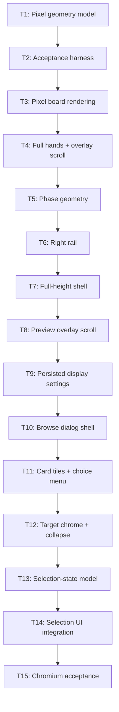

# Plan: Feedback Follow-up

## Goal

Replicate validated full-height duel-field prototype + approved card-list dialog in production Svelte UI. Success = Worker-owned legality/privacy unchanged, every slice compiles, deterministic Vitest + Chromium acceptance proves frozen geometry, interactions, responsive behavior, persistence.

## Scope

- In: px field geometry, square zones, Defense/Set rotation, full hands, overlay scrollbars, phase geometry, right rail, `100svh` shell, display-setting persistence, browse/target card-list redesign, range prompts, Hand sources, projected duplicate-choice menu, ADR + architecture records.
- Out: Worker/WASM rules, response encoding, card metadata expansion, story, deck editor, progression, multiplayer, commits/push.

## Assumptions

- Plan basename fixed by user: `PLAN_2026_08_13_feedback_follow_up`.
- `make-aron` publish policy overrides Scope Out `commits/push`: work ships only to `plan/feedback-follow-up`; no PR.
- Existing non-`.pi` dirty plan/design/docs form the approved input baseline; snapshot once before ticket work. Local `.pi/artifacts` renders stay untracked and isolated.
- 1366×768 no-EMZ board may occupy 95.7% viewport height; preview stays ≥18rem, rail ≥12rem.
- `showZoneOutlines` + `showZoneCounts` default on; persist under new `ygo.ui.v2`; v1/wrong version → complete v2 defaults.
- Real overflow elements retain wheel/keyboard semantics; custom overlay thumbs are decorative pointer controls.
- Field-local `FloatingFieldWindow` boundary overrides prototype viewport positioning. 1320×600 = cap when boundary permits.
- Variable min/max card-selection prompts use redesigned dialog. Sum/order/counter prompt families stay on existing surfaces.
- Mixed-source order: Hand → Extra Deck → Graveyard → Banished → Deck.
- One card address = one tile. Multiple projected `ChoiceId`s open one keyboard-reachable menu.
- Architecture decisions: `docs/ADR/019_ADR_full_height_duel_shell_and_pixel_geometry.md`, `020_ADR_browser_persisted_ui_state_v2.md`, `021_ADR_card_list_dialog_modes_and_selection.md`.

## Ticket flowchart

## Ticket order

| ID | Title | Depends | Commit outcome | File |
| --- | --- | --- | --- | --- |
| T1 | Pixel geometry model | — | Pure px geometry maps stable zones without viewport-coupled nav | `PLAN_2026_08_13_feedback_follow_up/T1_pixel-geometry-model.md` |
| T2 | Conditional Chromium acceptance harness | T1 | Deterministic component scenarios run outside production bundle | `PLAN_2026_08_13_feedback_follow_up/T2_conditional-chromium-acceptance-harness.md` |
| T3 | Pixel board rendering | T2 | Board renders square px zones, slots, stacks, Defense/Set cards | `PLAN_2026_08_13_feedback_follow_up/T3_pixel-board-rendering.md` |
| T4 | Full hands + overlay scrollbar | T3 | All hand cards scroll under custom horizontal thumb; paging gone | `PLAN_2026_08_13_feedback_follow_up/T4_full-hands-overlay-scrollbar.md` |
| T5 | Geometry-anchored phases | T4 | Phase chips + End turn fit EMZ/no-EMZ geometry | `PLAN_2026_08_13_feedback_follow_up/T5_geometry-anchored-phases.md` |
| T6 | Right rail replaces header | T5 | Functional rail owns options, LP, turn/phase, status | `PLAN_2026_08_13_feedback_follow_up/T6_right-rail-replaces-header.md` |
| T7 | Full-height shell | T6 | Preview, px board, rail fill one `100svh` row | `PLAN_2026_08_13_feedback_follow_up/T7_full-height-shell.md` |
| T8 | Preview overlay scrollbar | T7, T4 | Bounded effect text uses shared vertical overlay thumb | `PLAN_2026_08_13_feedback_follow_up/T8_preview-overlay-scrollbar.md` |
| T9 | Persisted display settings v2 | T8 | Outline/count toggles survive reload under `ygo.ui.v2` | `PLAN_2026_08_13_feedback_follow_up/T9_persisted-display-settings-v2.md` |
| T10 | Approved browse dialog shell | T9 | Browse list gets frozen shell, ordering, empty/responsive states | `PLAN_2026_08_13_feedback_follow_up/T10_approved-browse-dialog-shell.md` |
| T11 | Card tiles + projected choice menu | T10 | 144px physical tiles preserve actions + every duplicate `ChoiceId` | `PLAN_2026_08_13_feedback_follow_up/T11_card-tiles-projected-choice-menu.md` |
| T12 | Target chrome + collapse | T11 | Target mode gets dynamic notices, no-dismiss policy, stable collapse | `PLAN_2026_08_13_feedback_follow_up/T12_target-chrome-collapse.md` |
| T13 | Selection-state model | T12 | Pure exact/range/max/stale policy becomes exhaustive + deterministic | `PLAN_2026_08_13_feedback_follow_up/T13_selection-state-model.md` |
| T14 | Selection UI integration | T13 | Dialog/reducer use explicit Validate, hard max, safe unselection | `PLAN_2026_08_13_feedback_follow_up/T14_selection-ui-integration.md` |
| T15 | Card-list Chromium acceptance | T14 | Checks 1–36 + range/Hand/duplicate compatibility pass | `PLAN_2026_08_13_feedback_follow_up/T15_card-list-chromium-acceptance.md` |

## Tickets

- [T1: Pixel geometry model](PLAN_2026_08_13_feedback_follow_up/T1_pixel-geometry-model.md) — depends: none
- [T2: Conditional Chromium acceptance harness](PLAN_2026_08_13_feedback_follow_up/T2_conditional-chromium-acceptance-harness.md) — depends: T1
- [T3: Pixel board rendering](PLAN_2026_08_13_feedback_follow_up/T3_pixel-board-rendering.md) — depends: T2
- [T4: Full hands + overlay scrollbar](PLAN_2026_08_13_feedback_follow_up/T4_full-hands-overlay-scrollbar.md) — depends: T3
- [T5: Geometry-anchored phases](PLAN_2026_08_13_feedback_follow_up/T5_geometry-anchored-phases.md) — depends: T4
- [T6: Right rail replaces header](PLAN_2026_08_13_feedback_follow_up/T6_right-rail-replaces-header.md) — depends: T5
- [T7: Full-height shell](PLAN_2026_08_13_feedback_follow_up/T7_full-height-shell.md) — depends: T6
- [T8: Preview overlay scrollbar](PLAN_2026_08_13_feedback_follow_up/T8_preview-overlay-scrollbar.md) — depends: T7, T4
- [T9: Persisted display settings v2](PLAN_2026_08_13_feedback_follow_up/T9_persisted-display-settings-v2.md) — depends: T8
- [T10: Approved browse dialog shell](PLAN_2026_08_13_feedback_follow_up/T10_approved-browse-dialog-shell.md) — depends: T9
- [T11: Card tiles + projected choice menu](PLAN_2026_08_13_feedback_follow_up/T11_card-tiles-projected-choice-menu.md) — depends: T10
- [T12: Target chrome + collapse](PLAN_2026_08_13_feedback_follow_up/T12_target-chrome-collapse.md) — depends: T11
- [T13: Selection-state model](PLAN_2026_08_13_feedback_follow_up/T13_selection-state-model.md) — depends: T12
- [T14: Selection UI integration](PLAN_2026_08_13_feedback_follow_up/T14_selection-ui-integration.md) — depends: T13
- [T15: Card-list Chromium acceptance](PLAN_2026_08_13_feedback_follow_up/T15_card-list-chromium-acceptance.md) — depends: T14
