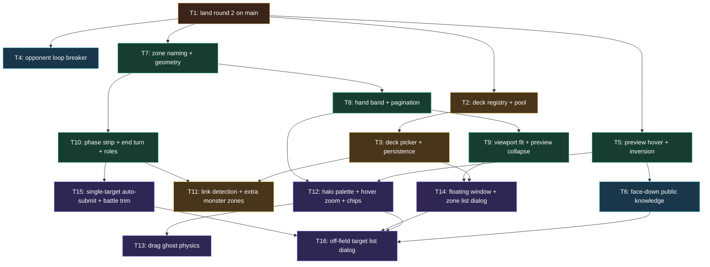

# Plan: Duel Field Feedback Round 3

## Goal

Ship the 30 items of `feedback.md`. Four archetype decks plus a pre-duel deck picker land first, so every later UI ticket is validated on a real Burning Abyss / Nekroz / Shaddoll / Spellbook board instead of 22 vanilla LOB cards. Success = 30/30 items shipped, `npm run check` green, one manual duel per deck completed without a deadlock.

## Scope

- In: `src/app/**` (shell, duel-field components, stores, prompts, presentation, persistence), `src/field/**` (layout, view model, zone list), `src/duel/presets/**` (deck registry, deck files, pool gate), `src/worker/projection/DuelStateProjector.ts` (face-down public knowledge), `src/worker/opponent/OpponentPolicy.ts` (loop breaker only), `src/worker/create-browser-runtime.ts` (deck selection), `scripts/lib/active-image-manifest.ts` + `scripts/lib/active-card-text-manifest.ts` (manifest widening), `src/styles/app.css`, `e2e/duel-smoke.spec.ts`, unit/component tests, ADRs 011-018, two architecture HTML docs.
- Out: opponent play quality beyond the loop breaker; deck editing; user deck import; persisting any UI setting other than window positions and the deck pair; engine/WASM upgrade; automated per-deck matchup simulation; story, progression, multiplayer, i18n; mobile-first redesign.

## Assumptions

- **A1** Artifacts live in `artifacts/` (the tracked dir declared in `AGENT.md`), not `artifacts/`. Carried from the 2026-08-08 and 2026-08-09 plans.
- **A2** Base is `main` **after** `feat/duel-field-round-2` (`736b374`) is merged into it. T1 performs that merge. *User decision.* `origin/main` alone has no `PhaseStrip.svelte`, `ZoneListDialog.svelte` or `DuelHeaderBar.svelte`, so basing on it would make the plan unimplementable.
- **A3** The four archetype `.ydk` files are seeded from the local catalog by T2 and may be overwritten by the user at any time with no code change. Deck files are `?raw` Vite imports — pure data. *User decision.*
- **A4** The deck registry lists **six** decks: the four archetypes plus the two existing MVP decks, which stay selectable and remain the **default** selection so the e2e walkers keep a deterministic card pool. *Planner decision.*
- **A5** Deck acceptance is **manual only** — one duel per deck, played and reported by the user. No deck-specific automated tests. Everything structural around the decks stays test-driven. *User decision.*
- **A6** `OpponentPolicy` keeps its first-legal heuristics and gains only a loop breaker, tripping at **3** consecutive identical prompt signatures with an unchanged **visible-state fingerprint**. The projector's numeric `revision` increments for prompt messages themselves, so equality on that counter could never trip; the fingerprint excludes `revision` and compares turn, phase, chain size, LP and public zone counts. *User intent preserved; implementation correction from source inspection.*
- **A7** The 44 px pointer-target floor and `.duel-field-board { min-width: 52rem }` never yield. The preview column degrades instead. *User decision.*
- **A8** The preview stays left and widens into the empty space. The full-width bottom band is a **width** fallback only. On short viewports the preview keeps a small art thumbnail plus the name, and the effect text scrolls in the remaining height. *User decision.*
- **A9** Halo palette: green = valid/legal target; orange = selected or awaiting confirmation; drop candidate = green with a filled tint; keyboard focus = neutral outline; feedback animation = teal; list-entry hover = orange. *User decision.*
- **A10** Hover zoom is `scale(1.35)` over 120 ms ease-out on hand cards, field cards and zone-list entries; hand grows upward, field cards from centre, halo scales with the card, disabled under `prefers-reduced-motion`. *User decision.*
- **A11** Drag physics are tier 2 — cursor-following ghost, velocity-proportional tilt, spring settle, lift shadow and scale — hand-rolled `requestAnimationFrame`, **no dependency added**. *User decision.*
- **A12** One selection rule: any prompt with `minimum === 1 && maximum === 1` submits on the click with no confirmation. Multi-select keeps a counter and a Confirm button inside the floating window. *User decision.*
- **A13** The zone list dialog serves targets outside the field only (graveyard, deck, banished, extra deck, hand). On-field targets keep in-place highlighting; a mixed prompt shows both at once. *User decision.*
- **A14** Both the zone list dialog and the confirm window are draggable floating windows constrained to the duel field. Clicking outside **closes the zone list** and **never closes the confirm window**. Each stores its own position under its own key. *User decision.*
- **A15** `localStorage` key `ygo.ui.v1` holds `{ windows: { zoneList, confirm }, decks: { player, opponent } }`. Unparseable or wrong-version data is discarded and defaults are used. No other UI setting becomes persistent. *User decision + planner schema.*
- **A16** Face-down public-knowledge tracking follows the exact table in `docs/ADR/014_ADR_public_knowledge_for_face_down_cards.md`: keep identity on a move from graveyard / banished / face-up field into a face-down field position, on a face-up card turned face-down, and on a card publicly revealed then set; never for an opponent set from hand or a face-down summon out of deck or hidden hand; clear on any zone change, return to deck/hand/extra, or shuffle. Conservative by construction — may forget a reveal, may never invent one. *User decision.*
- **A17** Item 23 reads active card-data bit `0x4000000` (`TYPE_LINK`). Worker chooses immutable rules/layout together: Link-free → MR3/no EMZ; any Link → MR5/two EMZs. Render-only hiding under MR5 is unsafe. *Planner safety decision implementing confirmed visual rule.*
- **A18** Item 3 = rotate opponent stack and list card art 180°, matching `.duel-field-card.is-opponent`. No new state.
- **A19** Item 4's red X close button applies to `ZoneListDialog` only. `MenuDialog`, `SettingsDialog`, `PromptDialog` and `DuelResultDialog` keep their current buttons.
- **A20** Item 27 caps the zone list dialog's preview image at `50svh`.
- **A21** Any ticket that moves or deletes a `data-cy` asserted in `e2e/duel-smoke.spec.ts` updates that spec in the same commit. Carried from round 2's process lesson.
- **A22** Playwright is chromium-only and foreground, with `PLAYWRIGHT_BROWSERS_PATH=/home/aron/projects/ascencio/.tmp/pw-browsers` and the pinned nix `-p` list. `webkit-smoke` is unrunnable on this host. Every ticket that lists an e2e command repeats it inline.
- **A23** The duel seed is random per run (`crypto.getRandomValues`). A single pass of a duel-walking test is weak evidence; re-run before diagnosing a failure.
- **A24** `make-aron` Git policy overrides T1's original branch choreography: `main` stays untouched; `feat/duel-field-round-2` merges into `plan/duel-field-feedback-round-3`; every ticket commits and pushes there. T1's equivalent feature-branch checks replace its `main`/`feat/duel-field-round-3` checks. *Autonomous safety decision.*

## Ticket flowchart

## Ticket order

| ID  | Title | Depends | Commit outcome | File |
| --- | ----- | ------- | -------------- | ---- |
| T1  | Land round 2 on main | — | `main` carries the 17 round-2 commits and every gate is green on the merge commit | `PLAN_2026_08_10_duel_field_feedback_round_3/T1_land-round-2-on-main.md` |
| T2  | Deck registry and derived card pool | T1 | Six decks parse from one registry, the reviewed pool is derived from them at build time, and the browser bundles art and text for every code they use | `PLAN_2026_08_10_duel_field_feedback_round_3/T2_deck-registry-and-derived-card-pool.md` |
| T3  | Pre-duel deck picker and persisted UI state | T2 | The app opens on a deck picker instead of auto-starting; the chosen pair and the window positions survive a reload | `PLAN_2026_08_10_duel_field_feedback_round_3/T3_pre-duel-deck-picker-and-persistence.md` |
| T4  | Opponent policy loop breaker | T1 | The opponent can no longer answer a prompt into the same prompt forever | `PLAN_2026_08_10_duel_field_feedback_round_3/T4_opponent-policy-loop-breaker.md` |
| T5  | Preview on every hover, opponent art inverted | T1 | Hovering any card anywhere updates the preview, face-down cards lose the "Hidden card" caption, and opponent pile art is rotated | `PLAN_2026_08_10_duel_field_feedback_round_3/T5_preview-hover-and-opponent-art-inversion.md` |
| T6  | Face-down public knowledge in the projector | T5 | A face-down card whose identity became public before it was turned down keeps that identity for the local viewer | `PLAN_2026_08_10_duel_field_feedback_round_3/T6_face-down-public-knowledge-tracking.md` |
| T7  | Zone naming and field geometry | T1 | Zone labels lose their owner prefix and shorten, the extra deck sits under the field zone, and zone margins gain height and lose width | `PLAN_2026_08_10_duel_field_feedback_round_3/T7_zone-naming-and-field-geometry.md` |
| T8  | Hand band and pagination | T7 | Both hands lose their zone rectangle, span exactly the five spell/trap zones, and paginate past ten cards | `PLAN_2026_08_10_duel_field_feedback_round_3/T8_hand-band-and-pagination.md` |
| T9  | Viewport fit and preview collapse | T8 | The duel view fills the viewport exactly with no page scrollbar, and the preview degrades by height then by width | `PLAN_2026_08_10_duel_field_feedback_round_3/T9_viewport-fit-and-preview-collapse.md` |
| T10 | Phase strip, end turn button and role labels | T7 | The phase chips sit left of the shared extra monster zone, the End turn button replaces the End badge, the opponent-hand status badge is gone, and life points carry a role | `PLAN_2026_08_10_duel_field_feedback_round_3/T10_phase-strip-end-turn-and-role-labels.md` |
| T11 | Link detection and conditional extra monster zones | T3, T10 | Worker aligns rules/layout: Link-free uses MR3 with no shared zones; Link uses MR5 with both zones | `PLAN_2026_08_10_duel_field_feedback_round_3/T11_link-detection-and-extra-monster-zones.md` |
| T12 | Halo palette, hover zoom and chip layering | T5, T8 | Green means legal and orange means selected everywhere, hovering a card magnifies it with its halo, and action chips are never covered | `PLAN_2026_08_10_duel_field_feedback_round_3/T12_halo-palette-hover-zoom-and-chip-layer.md` |
| T13 | Drag ghost physics | T12 | A dragged card floats above the field under the cursor with velocity tilt and a spring settle, and valid zones fade to green | `PLAN_2026_08_10_duel_field_feedback_round_3/T13_drag-ghost-physics.md` |
| T14 | Floating window primitive and zone list dialog | T3, T9 | Two windows can be dragged anywhere inside the field and remember where; the zone list gains a red X, outside-click close and wheel scrolling | `PLAN_2026_08_10_duel_field_feedback_round_3/T14_floating-window-primitive-and-zone-list-dialog.md` |
| T15 | Single-target auto-submit and battle-command trim | T10 | Clicking the only legal target answers the prompt, and the battle-command decision lives on the phase strip alone | `PLAN_2026_08_10_duel_field_feedback_round_3/T15_single-target-auto-submit-and-battle-command-trim.md` |
| T16 | Off-field target list dialog | T6, T12, T14, T15 | An effect targeting cards outside the field lists them in one window with zone badges, a counter and a Confirm button | `PLAN_2026_08_10_duel_field_feedback_round_3/T16_off-field-target-list-dialog.md` |

## Tickets

- [T1: Land round 2 on main](PLAN_2026_08_10_duel_field_feedback_round_3/T1_land-round-2-on-main.md) — depends: none
- [T2: Deck registry and derived card pool](PLAN_2026_08_10_duel_field_feedback_round_3/T2_deck-registry-and-derived-card-pool.md) — depends: T1
- [T3: Pre-duel deck picker and persisted UI state](PLAN_2026_08_10_duel_field_feedback_round_3/T3_pre-duel-deck-picker-and-persistence.md) — depends: T2
- [T4: Opponent policy loop breaker](PLAN_2026_08_10_duel_field_feedback_round_3/T4_opponent-policy-loop-breaker.md) — depends: T1
- [T5: Preview on every hover, opponent art inverted](PLAN_2026_08_10_duel_field_feedback_round_3/T5_preview-hover-and-opponent-art-inversion.md) — depends: T1
- [T6: Face-down public knowledge in the projector](PLAN_2026_08_10_duel_field_feedback_round_3/T6_face-down-public-knowledge-tracking.md) — depends: T5
- [T7: Zone naming and field geometry](PLAN_2026_08_10_duel_field_feedback_round_3/T7_zone-naming-and-field-geometry.md) — depends: T1
- [T8: Hand band and pagination](PLAN_2026_08_10_duel_field_feedback_round_3/T8_hand-band-and-pagination.md) — depends: T7
- [T9: Viewport fit and preview collapse](PLAN_2026_08_10_duel_field_feedback_round_3/T9_viewport-fit-and-preview-collapse.md) — depends: T8
- [T10: Phase strip, end turn button and role labels](PLAN_2026_08_10_duel_field_feedback_round_3/T10_phase-strip-end-turn-and-role-labels.md) — depends: T7
- [T11: Link detection and conditional extra monster zones](PLAN_2026_08_10_duel_field_feedback_round_3/T11_link-detection-and-extra-monster-zones.md) — depends: T3, T10
- [T12: Halo palette, hover zoom and chip layering](PLAN_2026_08_10_duel_field_feedback_round_3/T12_halo-palette-hover-zoom-and-chip-layer.md) — depends: T5, T8
- [T13: Drag ghost physics](PLAN_2026_08_10_duel_field_feedback_round_3/T13_drag-ghost-physics.md) — depends: T12
- [T14: Floating window primitive and zone list dialog](PLAN_2026_08_10_duel_field_feedback_round_3/T14_floating-window-primitive-and-zone-list-dialog.md) — depends: T3, T9
- [T15: Single-target auto-submit and battle-command trim](PLAN_2026_08_10_duel_field_feedback_round_3/T15_single-target-auto-submit-and-battle-command-trim.md) — depends: T10
- [T16: Off-field target list dialog](PLAN_2026_08_10_duel_field_feedback_round_3/T16_off-field-target-list-dialog.md) — depends: T6, T12, T14, T15

## Feedback coverage

| # | Feedback | Ticket |
| --- | --- | --- |
| 1 | Preview never updates on hover; face-down known cards; drop "Hidden card" | T5, T6 |
| 2 | Shorten zone names, drop Your/Opponent prefix | T7 |
| 3 | Opponent pile cards vertically inverted | T5 |
| 4 | Zone list dialog: red X right, outside-click close, wheel scroll | T14 |
| 5 | Action menu at the forefront | T12 |
| 6 | Remove the hand zone rectangle | T8 |
| 7 | Cap the hand at 10 with arrows and a scrollbar | T8 |
| 8 | Player role next to the life points | T10 |
| 9 | Fit 100 % of the viewport, no scrollbar | T9 |
| 10 | No confirmation after clicking an attack target | T15 |
| 11 | No battle-command dialog; use the phase buttons | T15 |
| 12 | Four archetype decks and a pre-duel selection menu | T2, T3 |
| 13 | Hand width matches the five spell/trap zones | T8 |
| 14 | Extra deck zone under the field zone | T7 |
| 15 | Narrow the hand; attach the pile column to zone 5 | T8 |
| 16 | More vertical, less horizontal zone margin | T7 |
| 17 | Hover zoom with the halo following the card | T12 |
| 18 | Dragged card floats above everything; green zone halo | T13 |
| 19 | Drag inertia and 3D, feasibility first | T13 |
| 20 | Give the empty left space to the preview | T9 |
| 21 | Preview below when it cannot share the row | T9 |
| 22 | Phase badge left of the shared extra monster zone | T10 |
| 23 | Remove the extra monster zones when no deck runs Links | T11 |
| 24 | End turn button replaces the End turn badge | T10 |
| 25 | Green = valid target, orange = selected | T12 |
| 26 | Remove the badge at the opponent hand position | T10 |
| 27 | Cap the dialog preview image at 50 % of the viewport | T9 |
| 28 | Reuse the list dialog for targeting, with zone badges | T16 |
| 29 | Target list halos, counter, confirm; unblock the selection | T15, T16 |
| 30 | Confirm section becomes a draggable floating window | T14 |

## Related documents

- ADR `docs/ADR/011_ADR_deck_registry_and_derived_card_pool.md`
- ADR `docs/ADR/012_ADR_pre_duel_deck_selection.md`
- ADR `docs/ADR/013_ADR_browser_persisted_ui_state.md`
- ADR `docs/ADR/014_ADR_public_knowledge_for_face_down_cards.md`
- ADR `docs/ADR/015_ADR_halo_semantics_legal_versus_selected.md`
- ADR `docs/ADR/016_ADR_dependency_free_drag_physics.md`
- ADR `docs/ADR/017_ADR_floating_field_windows_and_dismissal.md`
- ADR `docs/ADR/018_ADR_conditional_extra_monster_zones.md`
- Architecture `docs/duel-field-interaction-model-v3.html`
- Architecture `docs/deck-selection-architecture.html`
- Grill `artifacts/GRILL_2026_08_10_duel_field_feedback_round_3/ANSWERS.md`
- Prior plan `artifacts/PLAN_2026_08_09_duel_field_feedback_round_2.md`
- Prior handoff `artifacts/HANDOFF_2026_08_10_duel_field_feedback_round_2.md`
