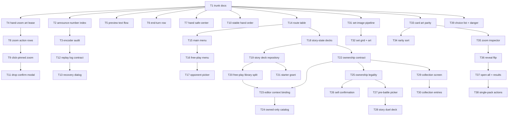

# Plan: duel round 5 + visual novel round 3

## Goal

Land `feedback-duel.md` (10 items) and `feedback-vn.md` (shop, card list, card reveal, general, collection) as one dependency-ordered ticket chain on `main`. Success = every feedback item shipped, the `ANNOUNCE_NUMBER` duel-killer and its whole encoder class fixed, duels recoverable by deterministic replay, decks owned by the story save under an ownership invariant, and the app entering through a story-styled main menu with an explicit Free Play mode.

## Scope

- **In:** duel field fixes 1-10 · engine response-encoder contract + audit · replay-based duel recovery · save-owned decks + free-play library split · card-ownership invariant · collection screen · shell main menu + free-play mode + route contexts · set-image acquisition pipeline · shop grid/art/sort · booster reveal rework + zoom inspector · story choice list + danger styling · `AGENTS.md` trunk rewrite.
- **Out:** multiplayer · deck sharing beyond existing YDK · banlist editing · a card database richer than the collection screen · opponent AI work beyond deck selection · new story content · canvas field · ADR-024 portrait work · engine vendor upgrade · ownership gating in free play.

## Assumptions

- The deck-editor round-2 work (branch `deck`, 9 commits) is already merged into `main`, and the `duel`, `vn`, `deckbuilder` worktrees are already removed. Every ticket runs in `/home/aron/projects/ascencio` on `main`.
- ADR-022 import boundaries survive untouched; only its branch/worktree topology is retired.
- Duel 1/3/7 render as recorded in the grill assumptions; no other rail or preview change rides along.
- "Maximum copies" in free play governs _ownership_ only — the pinned ruleset's per-card deck limit still applies to validation.
- The deck editor shows a context banner naming the story save or Free Play.
- `#/duel` and `#/decks` redirect to `#/free-play` and `#/free-play/decks` so old bookmarks and the PWA start URL keep working.
- Per-domain chunk budgets are re-measured and re-baselined where the restructure moves code.
- Grill record: [`GRILL_2026_08_20_duel_vn_feedback/ANSWERS.md`](GRILL_2026_08_20_duel_vn_feedback/ANSWERS.md).

## Ticket flowchart

## Ticket order

| ID  | Title                          | Depends  | Commit outcome                                                                       | File                                                                                                                          |
| --- | ------------------------------ | -------- | ------------------------------------------------------------------------------------ | ----------------------------------------------------------------------------------------------------------------------------- |
| T1  | Trunk docs and baseline        | —        | `AGENTS.md` describes single-branch trunk; ADR-045 recorded; gates green             | [`T1_trunk-docs-and-baseline.md`](PLAN_2026_08_20_duel_vn_feedback/T1_trunk-docs-and-baseline.md)                             |
| T2  | ANNOUNCE_NUMBER response index | T1       | Announce-number prompts stop killing duels                                           | [`T2_announce-number-response-index.md`](PLAN_2026_08_20_duel_vn_feedback/T2_announce-number-response-index.md)               |
| T3  | Response-encoder audit         | T2       | Every prompt kind's answer shape is pinned by a test                                 | [`T3_response-encoder-audit.md`](PLAN_2026_08_20_duel_vn_feedback/T3_response-encoder-audit.md)                               |
| T4  | Hand-zoom art lease            | T1       | Hovering a hand card shows its art, never "Image unavailable"                        | [`T4_hand-zoom-art-lease.md`](PLAN_2026_08_20_duel_vn_feedback/T4_hand-zoom-art-lease.md)                                     |
| T5  | Preview effect-text flow       | T1       | Preview effect text reads left-aligned directly under the stats row                  | [`T5_preview-effect-text-flow.md`](PLAN_2026_08_20_duel_vn_feedback/T5_preview-effect-text-flow.md)                           |
| T6  | End-turn button single row     | T1       | End turn is one line and bigger                                                      | [`T6_end-turn-button-single-row.md`](PLAN_2026_08_20_duel_vn_feedback/T6_end-turn-button-single-row.md)                       |
| T7  | Hand band safe centring        | T1       | Both hands group at the horizontal centre                                            | [`T7_hand-band-safe-center.md`](PLAN_2026_08_20_duel_vn_feedback/T7_hand-band-safe-center.md)                                 |
| T8  | Zoom action button rows        | T4       | Actions stack one per row at full zoom width above the card                          | [`T8_hand-zoom-action-button-rows.md`](PLAN_2026_08_20_duel_vn_feedback/T8_hand-zoom-action-button-rows.md)                   |
| T9  | Click-pinned hand zoom         | T8       | Clicking a hand card pins zoom + actions; only a button or a drag commits            | [`T9_click-pinned-hand-zoom.md`](PLAN_2026_08_20_duel_vn_feedback/T9_click-pinned-hand-zoom.md)                               |
| T10 | Stable local hand order        | T1       | Searched cards land rightmost and the hand stops reshuffling                         | [`T10_stable-local-hand-order.md`](PLAN_2026_08_20_duel_vn_feedback/T10_stable-local-hand-order.md)                           |
| T11 | Drop action confirm modal      | T9       | An ambiguous drop asks activate/set/cancel instead of guessing                       | [`T11_drop-action-confirm-modal.md`](PLAN_2026_08_20_duel_vn_feedback/T11_drop-action-confirm-modal.md)                       |
| T12 | Replay log contract            | T3       | The worker can rebuild a duel from its own recorded responses                        | [`T12_duel-replay-log-contract.md`](PLAN_2026_08_20_duel_vn_feedback/T12_duel-replay-log-contract.md)                         |
| T13 | Duel error recovery dialog     | T12      | A failed duel offers download + restore to the last decision you owned               | [`T13_duel-error-recovery-dialog.md`](PLAN_2026_08_20_duel_vn_feedback/T13_duel-error-recovery-dialog.md)                     |
| T14 | Route table                    | T1       | Free-play and story-scoped routes parse, format and redirect                         | [`T14_route-table-contexts.md`](PLAN_2026_08_20_duel_vn_feedback/T14_route-table-contexts.md)                                 |
| T15 | Shell main menu                | T14      | The app opens on a story-styled main menu with Free Play last                        | [`T15_shell-main-menu-screen.md`](PLAN_2026_08_20_duel_vn_feedback/T15_shell-main-menu-screen.md)                             |
| T16 | Free-play menu                 | T15      | Free Play offers Start a match, Deck builder, Return                                 | [`T16_free-play-menu-screen.md`](PLAN_2026_08_20_duel_vn_feedback/T16_free-play-menu-screen.md)                               |
| T17 | Free-play opponent picker      | T16      | Free play chooses both decks and remembers the pairing                               | [`T17_free-play-opponent-picker.md`](PLAN_2026_08_20_duel_vn_feedback/T17_free-play-opponent-picker.md)                       |
| T18 | Story-state decks + save v3    | T14      | A story save carries its own decks and survives a schema migration                   | [`T18_story-state-decks-and-save-migration.md`](PLAN_2026_08_20_duel_vn_feedback/T18_story-state-decks-and-save-migration.md) |
| T19 | Story deck repository          | T18      | The editor can read and write a save's decks through the normal repository interface | [`T19_story-deck-repository-adapter.md`](PLAN_2026_08_20_duel_vn_feedback/T19_story-deck-repository-adapter.md)               |
| T20 | Free-play library split        | T19      | The existing deck database becomes the free-play library                             | [`T20_free-play-deck-library-split.md`](PLAN_2026_08_20_duel_vn_feedback/T20_free-play-deck-library-split.md)                 |
| T21 | New-save starter grant         | T19      | A new save starts with a legal starter deck it owns                                  | [`T21_new-save-starter-grant.md`](PLAN_2026_08_20_duel_vn_feedback/T21_new-save-starter-grant.md)                             |
| T22 | Card ownership contract        | T18      | One function answers "how many copies may this context use"                          | [`T22_card-ownership-contract.md`](PLAN_2026_08_20_duel_vn_feedback/T22_card-ownership-contract.md)                           |
| T23 | Editor context binding         | T20, T22 | The editor knows which save (or free play) it is editing, and says so                | [`T23_deck-editor-context-binding.md`](PLAN_2026_08_20_duel_vn_feedback/T23_deck-editor-context-binding.md)                   |
| T24 | Owned-only story catalog       | T23      | In a story save the catalog offers only cards you own                                | [`T24_owned-only-story-catalog.md`](PLAN_2026_08_20_duel_vn_feedback/T24_owned-only-story-catalog.md)                         |
| T25 | Ownership legality             | T22      | A deck using cards you no longer own is reported illegal                             | [`T25_ownership-deck-legality.md`](PLAN_2026_08_20_duel_vn_feedback/T25_ownership-deck-legality.md)                           |
| T26 | Sell confirmation              | T25      | A sale that breaks decks names them before it commits                                | [`T26_sell-breaks-decks-confirmation.md`](PLAN_2026_08_20_duel_vn_feedback/T26_sell-breaks-decks-confirmation.md)             |
| T27 | Pre-battle deck picker         | T25      | Encounters pick from the save's decks and refuse illegal ones                        | [`T27_pre-battle-deck-picker-legality.md`](PLAN_2026_08_20_duel_vn_feedback/T27_pre-battle-deck-picker-legality.md)           |
| T28 | Story duel plays the save deck | T27      | The encounter duel is fought with the deck you chose                                 | [`T28_story-duel-uses-save-deck.md`](PLAN_2026_08_20_duel_vn_feedback/T28_story-duel-uses-save-deck.md)                       |
| T29 | Collection screen              | T22      | A browsable collection with rarity grouping and a show-all checkbox                  | [`T29_collection-screen.md`](PLAN_2026_08_20_duel_vn_feedback/T29_collection-screen.md)                                       |
| T30 | Collection entry points        | T29      | Both deck menus open the collection                                                  | [`T30_collection-entry-points.md`](PLAN_2026_08_20_duel_vn_feedback/T30_collection-entry-points.md)                           |
| T31 | Set-image pipeline             | T1       | Set art is downloaded, hashed and verified reproducibly                              | [`T31_set-image-acquisition-pipeline.md`](PLAN_2026_08_20_duel_vn_feedback/T31_set-image-acquisition-pipeline.md)             |
| T32 | Set grid and art               | T31      | Four illustrated set tiles per row, latest four first                                | [`T32_shop-set-grid-and-art.md`](PLAN_2026_08_20_duel_vn_feedback/T32_shop-set-grid-and-art.md)                               |
| T33 | Card art parity                | T1       | Shop cards render whole art like the deck editor                                     | [`T33_shop-card-art-parity.md`](PLAN_2026_08_20_duel_vn_feedback/T33_shop-card-art-parity.md)                                 |
| T34 | Rarity sort                    | T33      | The set list groups by rarity through a tri-state toggle                             | [`T34_set-list-rarity-sort.md`](PLAN_2026_08_20_duel_vn_feedback/T34_set-list-rarity-sort.md)                                 |
| T35 | Card zoom inspector            | T33      | A reusable zoom-with-text card inspector exists                                      | [`T35_card-zoom-inspector-component.md`](PLAN_2026_08_20_duel_vn_feedback/T35_card-zoom-inspector-component.md)               |
| T36 | Booster reveal flip            | T35      | Packs reveal face-down cards you flip, with rarity halos and auto-flip               | [`T36_booster-reveal-flip.md`](PLAN_2026_08_20_duel_vn_feedback/T36_booster-reveal-flip.md)                                   |
| T37 | Open-all and results           | T36      | Boosters open one at a time or all at once into a quantity list                      | [`T37_booster-open-all-and-results.md`](PLAN_2026_08_20_duel_vn_feedback/T37_booster-open-all-and-results.md)                 |
| T38 | Single-pack reveal actions     | T37      | One pack shows only Back, and the collection is credited at open                     | [`T38_single-pack-reveal-actions.md`](PLAN_2026_08_20_duel_vn_feedback/T38_single-pack-reveal-actions.md)                     |
| T39 | Choice list and danger styling | T1       | Every story choice uses one centred component; cancels are red                       | [`T39_story-choice-list-and-danger.md`](PLAN_2026_08_20_duel_vn_feedback/T39_story-choice-list-and-danger.md)                 |

## Tickets

- [T1: Trunk docs and baseline](PLAN_2026_08_20_duel_vn_feedback/T1_trunk-docs-and-baseline.md) — depends: none
- [T2: ANNOUNCE_NUMBER response index](PLAN_2026_08_20_duel_vn_feedback/T2_announce-number-response-index.md) — depends: T1
- [T3: Response-encoder audit](PLAN_2026_08_20_duel_vn_feedback/T3_response-encoder-audit.md) — depends: T2
- [T4: Hand-zoom art lease](PLAN_2026_08_20_duel_vn_feedback/T4_hand-zoom-art-lease.md) — depends: T1
- [T5: Preview effect-text flow](PLAN_2026_08_20_duel_vn_feedback/T5_preview-effect-text-flow.md) — depends: T1
- [T6: End-turn button single row](PLAN_2026_08_20_duel_vn_feedback/T6_end-turn-button-single-row.md) — depends: T1
- [T7: Hand band safe centring](PLAN_2026_08_20_duel_vn_feedback/T7_hand-band-safe-center.md) — depends: T1
- [T8: Zoom action button rows](PLAN_2026_08_20_duel_vn_feedback/T8_hand-zoom-action-button-rows.md) — depends: T4
- [T9: Click-pinned hand zoom](PLAN_2026_08_20_duel_vn_feedback/T9_click-pinned-hand-zoom.md) — depends: T8
- [T10: Stable local hand order](PLAN_2026_08_20_duel_vn_feedback/T10_stable-local-hand-order.md) — depends: T1
- [T11: Drop action confirm modal](PLAN_2026_08_20_duel_vn_feedback/T11_drop-action-confirm-modal.md) — depends: T9
- [T12: Replay log contract](PLAN_2026_08_20_duel_vn_feedback/T12_duel-replay-log-contract.md) — depends: T3
- [T13: Duel error recovery dialog](PLAN_2026_08_20_duel_vn_feedback/T13_duel-error-recovery-dialog.md) — depends: T12
- [T14: Route table](PLAN_2026_08_20_duel_vn_feedback/T14_route-table-contexts.md) — depends: T1
- [T15: Shell main menu](PLAN_2026_08_20_duel_vn_feedback/T15_shell-main-menu-screen.md) — depends: T14
- [T16: Free-play menu](PLAN_2026_08_20_duel_vn_feedback/T16_free-play-menu-screen.md) — depends: T15
- [T17: Free-play opponent picker](PLAN_2026_08_20_duel_vn_feedback/T17_free-play-opponent-picker.md) — depends: T16
- [T18: Story-state decks + save v3](PLAN_2026_08_20_duel_vn_feedback/T18_story-state-decks-and-save-migration.md) — depends: T14
- [T19: Story deck repository](PLAN_2026_08_20_duel_vn_feedback/T19_story-deck-repository-adapter.md) — depends: T18
- [T20: Free-play library split](PLAN_2026_08_20_duel_vn_feedback/T20_free-play-deck-library-split.md) — depends: T19
- [T21: New-save starter grant](PLAN_2026_08_20_duel_vn_feedback/T21_new-save-starter-grant.md) — depends: T19
- [T22: Card ownership contract](PLAN_2026_08_20_duel_vn_feedback/T22_card-ownership-contract.md) — depends: T18
- [T23: Editor context binding](PLAN_2026_08_20_duel_vn_feedback/T23_deck-editor-context-binding.md) — depends: T20, T22
- [T24: Owned-only story catalog](PLAN_2026_08_20_duel_vn_feedback/T24_owned-only-story-catalog.md) — depends: T23
- [T25: Ownership legality](PLAN_2026_08_20_duel_vn_feedback/T25_ownership-deck-legality.md) — depends: T22
- [T26: Sell confirmation](PLAN_2026_08_20_duel_vn_feedback/T26_sell-breaks-decks-confirmation.md) — depends: T25
- [T27: Pre-battle deck picker](PLAN_2026_08_20_duel_vn_feedback/T27_pre-battle-deck-picker-legality.md) — depends: T25
- [T28: Story duel plays the save deck](PLAN_2026_08_20_duel_vn_feedback/T28_story-duel-uses-save-deck.md) — depends: T27
- [T29: Collection screen](PLAN_2026_08_20_duel_vn_feedback/T29_collection-screen.md) — depends: T22
- [T30: Collection entry points](PLAN_2026_08_20_duel_vn_feedback/T30_collection-entry-points.md) — depends: T29
- [T31: Set-image pipeline](PLAN_2026_08_20_duel_vn_feedback/T31_set-image-acquisition-pipeline.md) — depends: T1
- [T32: Set grid and art](PLAN_2026_08_20_duel_vn_feedback/T32_shop-set-grid-and-art.md) — depends: T31
- [T33: Card art parity](PLAN_2026_08_20_duel_vn_feedback/T33_shop-card-art-parity.md) — depends: T1
- [T34: Rarity sort](PLAN_2026_08_20_duel_vn_feedback/T34_set-list-rarity-sort.md) — depends: T33
- [T35: Card zoom inspector](PLAN_2026_08_20_duel_vn_feedback/T35_card-zoom-inspector-component.md) — depends: T33
- [T36: Booster reveal flip](PLAN_2026_08_20_duel_vn_feedback/T36_booster-reveal-flip.md) — depends: T35
- [T37: Open-all and results](PLAN_2026_08_20_duel_vn_feedback/T37_booster-open-all-and-results.md) — depends: T36
- [T38: Single-pack reveal actions](PLAN_2026_08_20_duel_vn_feedback/T38_single-pack-reveal-actions.md) — depends: T37
- [T39: Choice list and danger styling](PLAN_2026_08_20_duel_vn_feedback/T39_story-choice-list-and-danger.md) — depends: T1
