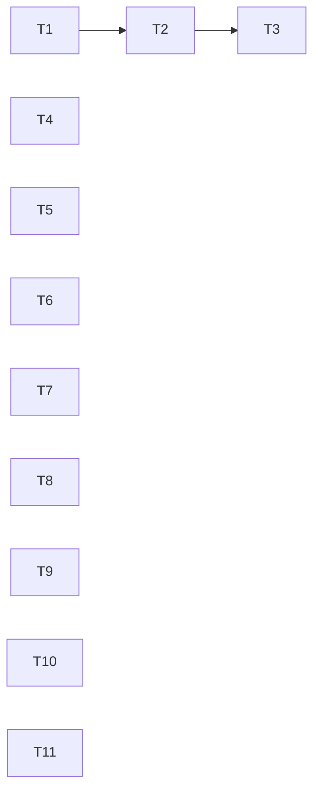

# PLAN 2026-08-27 — audit findings F16–F25

Source: audit run `2026_08_26_ascencio_6922f846dbe2`, findings F16–F25 (GitHub issues #16–#25).
Specs and validation reports live in `.tmp/MAKE_AUDIT_2026_08_26_ascencio_6922f846dbe2/`.

## Goal

Implement the remaining ten validated audit findings, each as its own commit on `main`, each with the
validation its spec demands. F1–F15 already shipped (c2e4f7e … 6e74836).

## Scope

In:

- F16 (#16) unbounded image download bodies + no tracked pin — split into T1 (byte cap) and T2 (tracked pin)
- F17 (#17) field view-model rebuilt per Worker message
- F18 (#18) admin reset reports success for a blocked delete
- F19 (#19) unreachable `supportedCodes` gate widening the frozen battle API
- F20 (#20) acceptance scenario list written twice
- F21 (#21) tracked `playwright-report/index.html`
- F22 (#22) `assets:images:verify` orphan script
- F23 (#23) stale free-play-menu steps in the manual test checklist
- F24 (#24) four dev-only npm advisories
- F25 (#25) zone-list face-up entry drawn as card back

Out:

- F26 (stale legal-halo acceptance expectation) — discovered during the audit, never validated, no issue.
- Catalogue-wide shop pack-price invariant (deferred to owner on issue #4).
- Any behaviour change beyond a finding's stated fix scope.
- `docs/developer-guide/style.css` format-glob gap (residual risk logged under F9).

## Assumptions

- A1. Commits land on `main` (repo has one long-lived branch, ADR-045; F1–F15 landed there).
- A2. Push and GitHub issue comments are **held** until the owner authorises them — both are outward-facing
  and this session carries no standing authorisation. Commits stay local until then.
- A3. F19 takes the removal option (drop the dead gate) unless the worker proves the branch reachable at
  HEAD; the ticket states the fallback.
- A4. F16's tracked pin covers the shipped surface only (120 preset codes + 50 set images), per val_C25.

## Ticket order

| ID | Finding | Depends | File |
| --- | --- | --- | --- |
| T1 | F16a image download byte cap | none | `PLAN_2026_08_27_audit_f16_f25/T1_image_byte_cap.md` |
| T2 | F16b tracked image pin + verify wiring | T1 | `PLAN_2026_08_27_audit_f16_f25/T2_tracked_image_pin.md` |
| T3 | F22 chain `assets:images:verify` into `assets:verify` | T2 | `PLAN_2026_08_27_audit_f16_f25/T3_image_verify_wiring.md` |
| T4 | F17 memo board on snapshot identity | none | `PLAN_2026_08_27_audit_f16_f25/T4_board_memo.md` |
| T5 | F18 admin reset blocked result | none | `PLAN_2026_08_27_audit_f16_f25/T5_admin_reset_blocked.md` |
| T6 | F19 dead `supportedCodes` gate | none | `PLAN_2026_08_27_audit_f16_f25/T6_dead_gate.md` |
| T7 | F20 single acceptance scenario list | none | `PLAN_2026_08_27_audit_f16_f25/T7_scenario_list.md` |
| T8 | F21 untrack `playwright-report/index.html` | none | `PLAN_2026_08_27_audit_f16_f25/T8_playwright_report.md` |
| T9 | F23 annotate stale checklist steps | none | `PLAN_2026_08_27_audit_f16_f25/T9_checklist_stale.md` |
| T10 | F24 `npm audit fix` | none | `PLAN_2026_08_27_audit_f16_f25/T10_npm_audit.md` |
| T11 | F25 zone-list placeholder fallback | none | `PLAN_2026_08_27_audit_f16_f25/T11_zonelist_fallback.md` |

## Definition of done

- Each ticket: fix shipped, its spec's validation command run and green, `npm run check:headless` green,
  one commit on `main`.
- `artifacts/manual_test_checklist.md` current for every ticket that changes observable behaviour.
- Plan files removed at run end; commits are the durable record.
