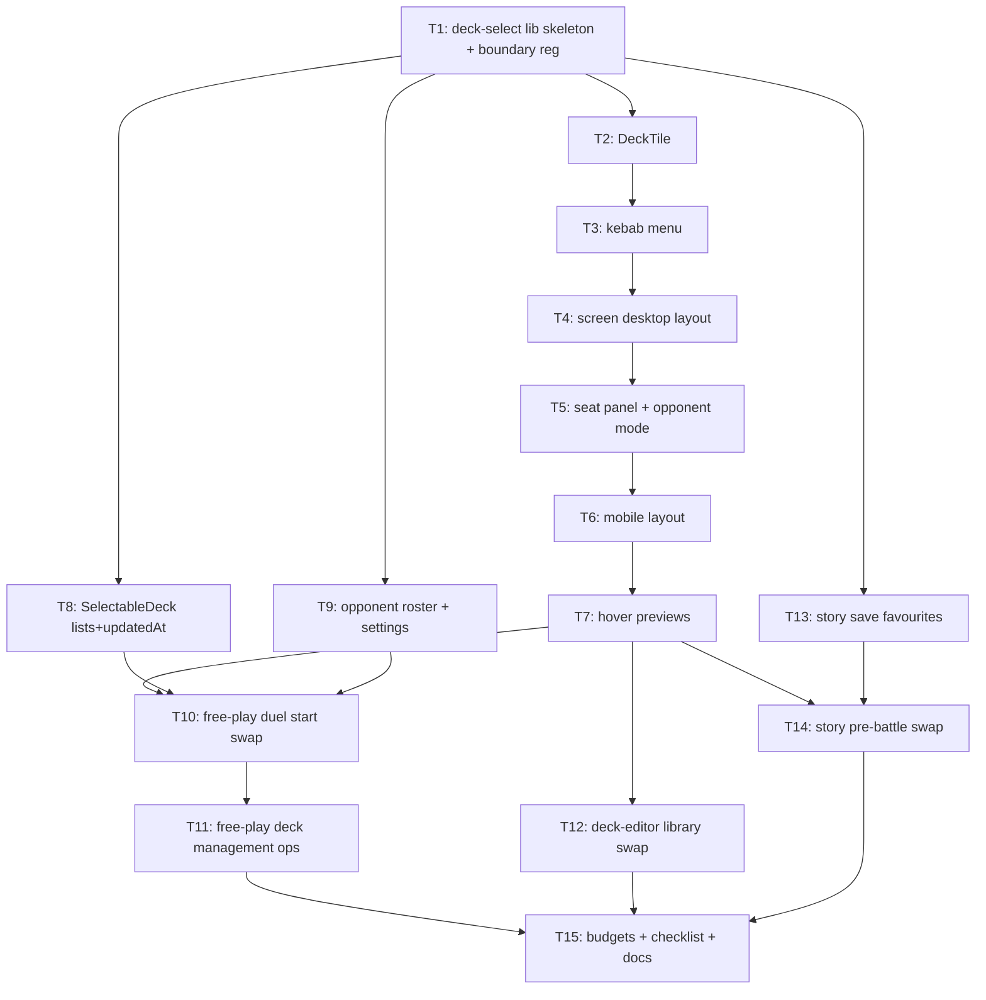

# Plan: deck selection screen

## Goal

Implement validated deck-selection design (`docs/deck-selection-screen-design.md`, prototype `git show 7c34d05:artifacts/PROTOTYPE_duel_start_deck_selection.html`) as real Svelte. One shared screen replaces 4 screens: `src/shell/screens/FreePlayMatchSetup.svelte`, `src/shell/screens/FreePlayDeckSeat.svelte`, `src/story/screens/PreBattleScreen.svelte`, `src/deck-editor/components/DeckLibrary.svelte`. Success = free play + story + library all run on new screen, `npm run check:headless` + `npm run build:verify` green, e2e updated.

## Scope

- In: shared presentational lib `src/deck-select/` (new public entry), deck tile + kebab menu + screen layouts (desktop/mobile) + hover previews, free-play AI opponent roster (3 personas), `SelectableDeck` widening (lists/updatedAt), story save favourites field, rename-by-id store op, swap of all 4 screens, tests/e2e/docs/budgets.
- Out: real deck-builder editor changes beyond `renameDeck`, card art pipeline changes, colour-blind/contrast pass (known debt, PRODUCT.md), multiplayer, story content changes, canvas decoration.

## Assumptions

- Handoff file `handoff_ascencio_deck_selection_prototype_20260826-210748.md` gone (`/tmp` wiped). Substance = committed design docs `2ece24b`/`ec6c518` + prototype `7c34d05`. Plan built from those.
- Persona→deck mapping (design names only personas): Practice Bot→`mvp-opponent`, Blaze Circuit→`burning-abyss`, Vault Warden→`shaddoll`. Default persona = Vault Warden (keeps `DEFAULT_OPPONENT_DECK_ID = "shaddoll"` behavior).
- Favourites: local decks → existing `DeckRepository.setFavourite` (shared with editor). Preset decks → new shell-settings field `freePlayPresetFavouriteIds`. Story → new save field `favouriteDeckIds` (T13).
- Free-play default deck badge = `DeckRepository.getDefaultDeck()` (local only; presets never default). Story default = save `defaultDeckId`.
- Portraits = inline SVG placeholders per `src/story/assets/PROVENANCE.md` discipline. No real card art beyond snapshot `imageUrl`.
- Mobile = narrow Chromium viewport (product = Chromium PWA family); acceptance via Playwright viewports, no device lab.
- `orderDeckLibrary` in `src/decks/` untouched (D2); new rank fn `orderDeckTiles` lives in `src/deck-select/`.
- Domain byte budgets in `scripts/verify-browser-build.ts` may need measured raise in T15 — thresholds are code, raised deliberately with measurement quoted.

## Ticket flowchart

## Ticket order

| ID  | Title | Depends | Commit outcome | File |
| --- | ----- | ------- | -------------- | ---- |
| T1  | deck-select lib skeleton + boundary registration | — | New public entry compiles, rank fn tested, boundaries green | `PLAN_2026_08_27_deck_selection_screen/T1_lib_skeleton.md` |
| T2  | DeckTile component | T1 | Tile renders art/badges/halos, component-tested | `PLAN_2026_08_27_deck_selection_screen/T2_deck_tile.md` |
| T3  | DeckTileMenu kebab action sheet | T2 | Kebab opens/dismisses, delete-guard, tested | `PLAN_2026_08_27_deck_selection_screen/T3_kebab_menu.md` |
| T4  | DeckSelectScreen desktop layout | T3 | Header/tools/grid/footer + keyboard + dblclick, tested | `PLAN_2026_08_27_deck_selection_screen/T4_screen_desktop.md` |
| T5  | Seat panel + opponent picking mode | T4 | Right column, halos, picker overlay, Yours badge, tested | `PLAN_2026_08_27_deck_selection_screen/T5_seat_panel.md` |
| T6  | Mobile layout | T5 | Single column, pinned selected, sticky footer, tested | `PLAN_2026_08_27_deck_selection_screen/T6_mobile_layout.md` |
| T7  | Desktop hover previews | T6 | Floating decklist + docked preview + art float, tested | `PLAN_2026_08_27_deck_selection_screen/T7_hover_previews.md` |
| T8  | SelectableDeck lists + updatedAt | T1 | Battle entry carries lists/updatedAt, presets parsed, tested | `PLAN_2026_08_27_deck_selection_screen/T8_selectable_deck.md` |
| T9  | Opponent roster + settings persistence | T1 | 3 personas, remembered opponent, tested | `PLAN_2026_08_27_deck_selection_screen/T9_opponent_roster.md` |
| T10 | Free-play duel start swap | T7,T8,T9 | `#/free-play` runs new screen, start works, e2e green | `PLAN_2026_08_27_deck_selection_screen/T10_free_play_swap.md` |
| T11 | Free-play deck management ops | T10 | Rename/duplicate/delete/open from duel start, tested | `PLAN_2026_08_27_deck_selection_screen/T11_free_play_manage.md` |
| T12 | Deck-editor library swap | T7 | Library route runs shared grid, renameDeck, e2e green | `PLAN_2026_08_27_deck_selection_screen/T12_library_swap.md` |
| T13 | Story save favourites | T1 | Save schema + reducer carry favourites, tested | `PLAN_2026_08_27_deck_selection_screen/T13_story_favourites.md` |
| T14 | Story pre-battle swap | T7,T13 | Story briefing runs shared screen, e2e green | `PLAN_2026_08_27_deck_selection_screen/T14_story_swap.md` |
| T15 | Budgets + checklist + glossary + docs | T11,T12,T14 | build:verify green, checklist/glossary/architecture current | `PLAN_2026_08_27_deck_selection_screen/T15_budgets_docs.md` |

## Tickets

- [T1: deck-select lib skeleton + boundary registration](PLAN_2026_08_27_deck_selection_screen/T1_lib_skeleton.md) — depends: none
- [T2: DeckTile component](PLAN_2026_08_27_deck_selection_screen/T2_deck_tile.md) — depends: T1
- [T3: DeckTileMenu kebab action sheet](PLAN_2026_08_27_deck_selection_screen/T3_kebab_menu.md) — depends: T2
- [T4: DeckSelectScreen desktop layout](PLAN_2026_08_27_deck_selection_screen/T4_screen_desktop.md) — depends: T3
- [T5: Seat panel + opponent picking mode](PLAN_2026_08_27_deck_selection_screen/T5_seat_panel.md) — depends: T4
- [T6: Mobile layout](PLAN_2026_08_27_deck_selection_screen/T6_mobile_layout.md) — depends: T5
- [T7: Desktop hover previews](PLAN_2026_08_27_deck_selection_screen/T7_hover_previews.md) — depends: T6
- [T8: SelectableDeck lists + updatedAt](PLAN_2026_08_27_deck_selection_screen/T8_selectable_deck.md) — depends: T1
- [T9: Opponent roster + settings persistence](PLAN_2026_08_27_deck_selection_screen/T9_opponent_roster.md) — depends: T1
- [T10: Free-play duel start swap](PLAN_2026_08_27_deck_selection_screen/T10_free_play_swap.md) — depends: T7, T8, T9
- [T11: Free-play deck management ops](PLAN_2026_08_27_deck_selection_screen/T11_free_play_manage.md) — depends: T10
- [T12: Deck-editor library swap](PLAN_2026_08_27_deck_selection_screen/T12_library_swap.md) — depends: T7
- [T13: Story save favourites](PLAN_2026_08_27_deck_selection_screen/T13_story_favourites.md) — depends: T1
- [T14: Story pre-battle swap](PLAN_2026_08_27_deck_selection_screen/T14_story_swap.md) — depends: T7, T13
- [T15: Budgets + checklist + glossary + docs](PLAN_2026_08_27_deck_selection_screen/T15_budgets_docs.md) — depends: T11, T12, T14
