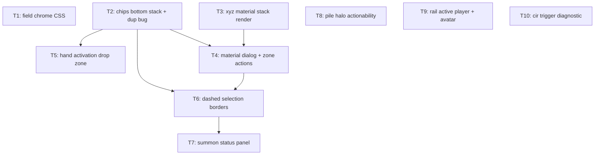

# Plan: duel_field_right_pane_feedback

## Goal

Implement all 14 feedback items from `feedback.md` (2026-08-27 round): 12 duel-field items, 2 right-pane items. Success = each item observable in Chromium duel, `npm run check:headless` green after every ticket, `artifacts/manual_test_checklist.md` updated.

## Scope

- In: duel-field UI (`src/battle/app/`, `src/battle/field/`, `src/styles/app.css`), right pane (`DuelRail.svelte`), one worker-side diagnostic (item 11). Tests per ticket.
- Out: engine/vendor changes (frozen), deck editor, story domain, shell routing, opponent AI, `feedback.md` itself (owner-authored, byte-identical).

## Assumptions

- A1. No grill run. Feedback items = owner directives, concrete enough; ambiguities resolved to safest in-scope defaults below, all logged. Plan reviewable before implementation.
- A2. Right Pane item 3 = empty in feedback.md → skipped, no ticket.
- A3. Item 9 "border around the duel field" = outer `.duel-field` border (`app.css:1173-1189`). Inner `.duel-field-board` mat border stays (reads as play mat, not frame).
- A4. Item 12 + RP1 "orange" = `--selected` / accent-orange token family; halo stays legality-gated (`spec.stackChoices`), only `topCardCode` suppression removed.
- A5. Item 4 cancel scope = broad (red-team D1): every drag-drop resolving to a single `activate` choice opens `DropConfirmDialog` (Activate / Cancel) — including a spell dropped on an S/T zone that today commits instantly. Cancel returns card to hand, no dispatch.
- A6. Item 4 "remove the button" = `activate` chips removed from pointer hover surfaces (card hover chips + HandZoomOverlay); kept in the pinned (clicked) menu so keyboard users can still reach activate on multi-action hand cards (ADR-032 in-band flow). Activation drop zone gated on `activate` choice existence, never on zone occupancy. Field-zone drop paths (summon/set/activate-in-S/T-zone) unchanged.
- A7. Item 11 wording ambiguous ("even thought the trigger condition is valid"). Trigger propositions are pure engine passthrough (`PromptRegistry.ts:369-390`, no app-side filter) → ticket is diagnostic: deterministic repro + verdict, `TODO(user)` on interpretation.
- A8. Item 6 must handle both `selectSum` (level-sum data present) and plain `selectCard` (only min/max) — which message Xyz material picks use is engine-decided, not source-visible.
- A9. RP2 avatar cap raised `0.26` → `0.32` of `--stage-h`; fit on short viewports verified manually.
- A10. Item 5 selection semantics apply to the `cardSelection` interaction family (`selectCard`, `selectSum`, `selectUnselect`, `selectTribute`) only, via a selection-specific class derived from `interactionKind` — `cardAction` prompts keep green ring + chips. "Select button" = the Select chip; the invisible full-cover `duel-field-card__target` toggle button stays (sole click/keyboard surface, `aria-pressed` carrier).
- A11. `check:headless` excludes component/e2e suites → every UI ticket's validation additionally requires `npm run test:component` green; T2/T5/T6 update `e2e/duel-smoke.spec.ts` chip/drag flows.
- A12. Orange (`--selected`) gains three meanings after this round (selected card, actionable pile, active player) — owner-directed; the green/orange invariant comment in `app.css` gets updated in T8.
- A13. Red-team D2: item 9 stays outer `.duel-field` frame only (A3); inner mat border untouched, owner reviews result.

### Folded ticket-writer findings (contracts as written)

- A14. T2 correction: the duplicate-chip leak is **not** `.is-pinned` (pointer hand-pin never sets it — that class comes from `session.menuTarget`, the keyboard route). Real leak is `:focus-within` after the click. T2 wires a new `is-zoom-served` class from `DuelField.handZoom` → `FieldBoard`/`HandBand` (`zoomServedTarget`) → `CardControl` (`zoomServed`); a pure CSS fix would have killed the keyboard chip route (ADR-032 §4). HandZoomOverlay stack anchored bottom-up too.
- A15. T3 puts material markup in a new `MaterialCard.svelte` (per-material image lease), offset 12% card width per step via `--material-index`, `aria-hidden`, sorted by `sequence`.
- A16. T4 adds `PromptCard.overlay?: true` (worker marks the OVERLAY bit `PromptRegistry` already masks) + `InteractionChoice.cardAddress.overlay?: true`, `LocalCardAction` in `src/battle/app/presentation/local-card-action.ts`, `CardActionChips.localActions`, `FieldBoard.localActionsFor`, `ZoneListState | { mode: "materials"; hostId }`. Detach reuses the existing off-field target pipeline rather than a new dialog mode. Verification-first: an integration test cloned from `xyz-overlay-progression.test.ts` gates the detach half; browse half ships regardless.
- A17. T5 single filter site = new `src/battle/app/prompts/hand-activation-choices.ts` (`activateChoices`, `handChipChoices(choices, pinned)`); `dropConfirm` widened with `source: "zone" | "handActivation"` so activation confirms never arm `onplacementintent`.
- A18. T6 real kind name is `selectUnselectCard` (not `selectUnselect`); class derives from the existing `interactionKind` prop; `ZoneListDialog` target-list Select chips stay (they are the off-field answering surface).
- A19. T7 formatter `formatSelectionStatus(prompt, selectedChoiceIds): string | null` in `src/battle/app/presentation/format-selection-status.ts`, computed once in `DuelField` and passed as a plain string to `FieldActionBar` and `ZoneListDialog` (additive `selectionStatus` prop on both).
- A20. T8 halo assertions extend the existing `tests/component/DuelField.test.ts` stack-halo suite (no new `StackControl.test.ts`); one existing test asserting no-halo-without-top-card gets inverted.
- A22. Coherence-review arbitration: T4 owns the final `CardControl` chips gate; T6 bends to T4's post-state and gains `Depends: T2, T4`. T6 suppresses prompt choices at the `choices` prop (`actionable && interactionKind !== "cardSelection" ? choices : []`), never at the gate — so a selection candidate shows no Select chip but keeps T4's Materials chip. Decision: local action chips stay visible during selection prompts (inspect affordance, not the Select button the owner asked to remove; detach selection needs it).
- A23. Re-review arbitration: `CardActionChips` has no empty guard on `main`, so T6's suppressed-`choices` approach would leave an empty hover pill and fail its own tests. T4 (component owner) adds the guard — renders nothing when `choices` and `localActions` are both empty, plus a committed test T6 checks for. T4 also adds card-root class `has-local-actions` + two reveal rules, because every existing reveal rule requires `.is-actionable` and a prompt-free xyz host never carries it — without that the Materials chip would mount and stay `display: none` (jsdom ignores stylesheets, so no component test catches it).
- A21. T10 verdict expectation: Cir `57143342` registers a bare `EVENT_TO_GRAVE` trigger with no origin condition, Dante `83531441` mills via `Duel.DiscardDeck(tp,op,REASON_COST)` → engine-correct is the expected verdict; repro is a programmed-mode deterministic integration test, with an engine-bug branch specified.

## Ticket flowchart

## Ticket order

| ID  | Title | Depends | Commit outcome | File |
| --- | ----- | ------- | -------------- | ---- |
| T1  | Field chrome CSS: hover, zone borders, field border, rail divider (items 7,8,9,10) | — | Open-card hover scale gone; card-slot border gone; zone border solid; outer field border gone; straight rail divider added | `PLAN_2026_08_27_duel_field_right_pane_feedback/T1_field_chrome_css.md` |
| T2  | Card action chips: bottom-anchored upward stack, kill duplicate row (items 2,3) | — | One vertical chip stack per card, anchored bottom growing up; pinned hand card no longer shows second horizontal set | `PLAN_2026_08_27_duel_field_right_pane_feedback/T2_action_chips_bottom_stack.md` |
| T3  | Xyz material stack rendered behind host card (item 1a) | — | Materials visible offset right behind xyz monster, Duel Links style | `PLAN_2026_08_27_duel_field_right_pane_feedback/T3_xyz_material_stack_render.md` |
| T4  | Materials as browsable zone: dialog + action button + detach lists (item 1b) | T2, T3 | "Materials" action opens ZoneListDialog; detach prompts list materials like any zone | `PLAN_2026_08_27_duel_field_right_pane_feedback/T4_xyz_material_dialog.md` |
| T5  | Hand activation drop zone with cancel (item 4) | T2 | Dragging activatable hand card shows dashed centered zone left of hand; drop → confirm/cancel dialog; hand activate chips removed | `PLAN_2026_08_27_duel_field_right_pane_feedback/T5_hand_activation_drop_zone.md` |
| T6  | Selection prompts: dashed green candidates, orange selected, no green fill / select button (item 5) | T2, T4 | Valid targets dashed green border; click toggles dashed orange; green art-fill + select chip gone for selection prompts | `PLAN_2026_08_27_duel_field_right_pane_feedback/T6_selection_dashed_borders.md` |
| T7  | Persistent summon/selection status panel (item 6) | T6 | Live "N of M selected" + level-sum "X of Y" panel during every selection prompt | `PLAN_2026_08_27_duel_field_right_pane_feedback/T7_summon_status_panel.md` |
| T8  | Pile halo: orange, actionability-gated for deck/extra/grave/banish (item 12) | — | Extra deck (and all piles) halo orange exactly when current prompt offers a choice there, top card shown or not | `PLAN_2026_08_27_duel_field_right_pane_feedback/T8_pile_halo_actionability.md` |
| T9  | Right pane: orange active-player avatar+LP borders, bigger avatar (RP1,RP2) | — | Identity-block active border gone; avatar img + LP border orange when active, grey otherwise; avatar bigger on full HD | `PLAN_2026_08_27_duel_field_right_pane_feedback/T9_rail_active_player_avatar.md` |
| T10 | Cir/Dante trigger proposition diagnostic (item 11) | — | Deterministic headless repro + engine-passthrough verdict recorded in `.dev/bugs.md` | `PLAN_2026_08_27_duel_field_right_pane_feedback/T10_cir_trigger_diagnostic.md` |

## Tickets

- [T1: Field chrome CSS](PLAN_2026_08_27_duel_field_right_pane_feedback/T1_field_chrome_css.md) — depends: none
- [T2: Action chips bottom stack](PLAN_2026_08_27_duel_field_right_pane_feedback/T2_action_chips_bottom_stack.md) — depends: none
- [T3: Xyz material stack render](PLAN_2026_08_27_duel_field_right_pane_feedback/T3_xyz_material_stack_render.md) — depends: none
- [T4: Xyz material dialog](PLAN_2026_08_27_duel_field_right_pane_feedback/T4_xyz_material_dialog.md) — depends: T2, T3
- [T5: Hand activation drop zone](PLAN_2026_08_27_duel_field_right_pane_feedback/T5_hand_activation_drop_zone.md) — depends: T2
- [T6: Selection dashed borders](PLAN_2026_08_27_duel_field_right_pane_feedback/T6_selection_dashed_borders.md) — depends: T2, T4
- [T7: Summon status panel](PLAN_2026_08_27_duel_field_right_pane_feedback/T7_summon_status_panel.md) — depends: T6
- [T8: Pile halo actionability](PLAN_2026_08_27_duel_field_right_pane_feedback/T8_pile_halo_actionability.md) — depends: none
- [T9: Rail active player avatar](PLAN_2026_08_27_duel_field_right_pane_feedback/T9_rail_active_player_avatar.md) — depends: none
- [T10: Cir trigger diagnostic](PLAN_2026_08_27_duel_field_right_pane_feedback/T10_cir_trigger_diagnostic.md) — depends: none
