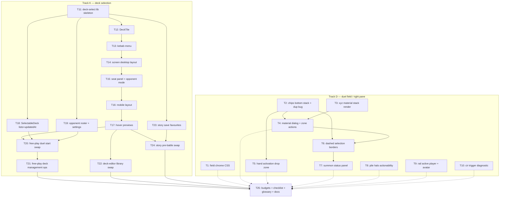

# Plan: deck select screen + duel field / right pane feedback

Two file-disjoint tracks in one plan: rebuild deck picking as one shared `src/deck-select/` screen across free play, story and the deck editor (T11–T25), and land the 2026-08-27 owner feedback round on the duel field and right pane (T1–T10).

Supersedes `PLAN_2026_08_27_deck_selection_screen.md` and `PLAN_2026_08_27_duel_field_right_pane_feedback.md` (both retired into this file; ticket bodies moved unchanged except renumbering — deck-selection T1–T15 became T11–T25).

## Goal

- **Track D — duel field / right pane (T1–T10).** Implement all 14 feedback items from `feedback.md` (2026-08-27 round): 12 duel-field, 2 right-pane. Success = each item observable in a Chromium duel, `npm run check:headless` + `npm run test:component` green after every ticket.
- **Track K — deck selection (T11–T25).** Implement the validated deck-selection design (`docs/deck-selection-screen-design.md`, prototype `git show 7c34d05:artifacts/PROTOTYPE_duel_start_deck_selection.html`) as real Svelte. One shared screen replaces 4: `src/shell/screens/FreePlayMatchSetup.svelte`, `src/shell/screens/FreePlayDeckSeat.svelte`, `src/story/screens/PreBattleScreen.svelte`, `src/deck-editor/components/DeckLibrary.svelte`. Success = free play + story + library all run on it.
- **Round close (T25).** Single gate for both tracks: `npm run check:headless`, `npm run test:component`, `npm run build:verify` (budgets re-measured against both tracks' bytes), `npm run test:e2e`, plus checklist/glossary/architecture/design-status current.

## Scope

### In

- Track D: duel-field UI (`src/battle/app/`, `src/battle/field/`, `src/styles/app.css`), right pane (`DuelRail.svelte`), one worker-side diagnostic (item 11).
- Track K: shared presentational lib `src/deck-select/` (new public entry), deck tile + kebab menu + screen layouts (desktop/mobile) + hover previews, free-play AI opponent roster (3 personas), `SelectableDeck` widening (lists/updatedAt), story save favourites field, rename-by-id store op, swap of all 4 screens.
- Tests per ticket; e2e, budgets and docs at the close.

### Out

- Engine/vendor changes (frozen). `feedback.md` itself (owner-authored, byte-identical).
- Real deck-builder editor changes beyond `renameDeck`; card art pipeline changes.
- Colour-blind / contrast pass (known debt, PRODUCT.md), multiplayer, story content changes, canvas decoration, opponent AI behavior.

## Implementation flow

Tracks D and K touch disjoint files — verified: no Track K ticket names `src/styles/app.css`, `src/battle/app/`, `src/battle/field/` or `DuelRail`; no Track D ticket writes `src/shell/`, `src/deck-editor/`, `src/decks/` or `src/story/` (T1 and T10 mention them only to fence them out). They can be worked in parallel by separate agents/worktrees, or interleaved on `main` in any order.

Two seams, both handled:

- **`artifacts/manual_test_checklist.md`** — appended by Track D tickets (T1, T4, T5, T9) and rewritten in sections by T25. Append to distinct sections; T25 reconciles rather than rewrites the duel-field half.
- **Byte budgets in `scripts/verify-browser-build.ts`** — both tracks add bytes. Only T25 raises a ceiling, once, with both tracks landed and the measurement quoted. No other ticket touches that file.

Waves, assuming maximum parallelism (a wave starts when every ticket it depends on is merged):

| Wave | Track D | Track K | Notes |
| ---- | ------- | ------- | ----- |
| 1 | T1, T2, T3, T8, T9, T10 | T11 | 7 tickets, zero deps between them |
| 2 | T4 (T2,T3), T5 (T2) | T12, T18, T19 | |
| 3 | T6 (T2,T4) | T13, T23 | |
| 4 | T7 (T6) | T14 | Track D finishes here |
| 5 | — | T15 | |
| 6 | — | T16 | |
| 7 | — | T17 | unblocks T20/T22/T24 |
| 8 | — | T20, T22 | |
| 9 | — | T21, T24 | T24 also needs T23 (wave 3, done) |
| 10 | — | T25 | global close, needs both tracks |

Critical path = Track K's component chain: T11 → T12 → T13 → T14 → T15 → T16 → T17 → T20 → T21 → T25 (10 deep). Track D's longest path is 4 deep (T2/T3 → T4 → T6 → T7), so the whole duel-field round fits inside the deck-select build-up at no schedule cost. Track D's T1, T8, T9, T10 are leaves — cheap filler for any idle slot.

## Tickets Flow

Dotted edges = gate-only: T25 needs the duel-field track merged so the budgets and checklist it closes cover both rounds. No Track K ticket reads Track D code.

## Index

| Ticket ID | Goal | Track | Depends | State | Link |
| --------- | ---- | ----- | ------- | ----- | ---- |
| T1 | Field chrome: hover, zone borders, field border, rail divider (items 7,8,9,10) | D | — | NOT STARTED | [T1_field_chrome_css](PLAN_2026_08_28_deck_select_and_duel_field/T1_field_chrome_css.md) |
| T2 | Card action chips: bottom-anchored upward stack, kill duplicate row (items 2,3) | D | — | NOT STARTED | [T2_action_chips_bottom_stack](PLAN_2026_08_28_deck_select_and_duel_field/T2_action_chips_bottom_stack.md) |
| T3 | Xyz material stack rendered behind host card (item 1a) | D | — | NOT STARTED | [T3_xyz_material_stack_render](PLAN_2026_08_28_deck_select_and_duel_field/T3_xyz_material_stack_render.md) |
| T4 | Materials as browsable zone: dialog + action button + detach lists (item 1b) | D | T2, T3 | NOT STARTED | [T4_xyz_material_dialog](PLAN_2026_08_28_deck_select_and_duel_field/T4_xyz_material_dialog.md) |
| T5 | Hand activation drop zone with cancel (item 4) | D | T2 | NOT STARTED | [T5_hand_activation_drop_zone](PLAN_2026_08_28_deck_select_and_duel_field/T5_hand_activation_drop_zone.md) |
| T6 | Selection prompts: dashed green candidates, orange selected, no select button (item 5) | D | T2, T4 | NOT STARTED | [T6_selection_dashed_borders](PLAN_2026_08_28_deck_select_and_duel_field/T6_selection_dashed_borders.md) |
| T7 | Persistent summon/selection status panel (item 6) | D | T6 | NOT STARTED | [T7_summon_status_panel](PLAN_2026_08_28_deck_select_and_duel_field/T7_summon_status_panel.md) |
| T8 | Pile halo: orange, actionability-gated for deck/extra/grave/banish (item 12) | D | — | NOT STARTED | [T8_pile_halo_actionability](PLAN_2026_08_28_deck_select_and_duel_field/T8_pile_halo_actionability.md) |
| T9 | Right pane: orange active-player avatar + LP borders, bigger avatar (RP1, RP2) | D | — | NOT STARTED | [T9_rail_active_player_avatar](PLAN_2026_08_28_deck_select_and_duel_field/T9_rail_active_player_avatar.md) |
| T10 | Cir/Dante trigger proposition diagnostic (item 11) | D | — | NOT STARTED | [T10_cir_trigger_diagnostic](PLAN_2026_08_28_deck_select_and_duel_field/T10_cir_trigger_diagnostic.md) |
| T11 | deck-select lib skeleton + boundary registration | K | — | NOT STARTED | [T11_lib_skeleton](PLAN_2026_08_28_deck_select_and_duel_field/T11_lib_skeleton.md) |
| T12 | DeckTile component | K | T11 | NOT STARTED | [T12_deck_tile](PLAN_2026_08_28_deck_select_and_duel_field/T12_deck_tile.md) |
| T13 | DeckTileMenu kebab action sheet | K | T12 | NOT STARTED | [T13_kebab_menu](PLAN_2026_08_28_deck_select_and_duel_field/T13_kebab_menu.md) |
| T14 | DeckSelectScreen desktop layout | K | T13 | NOT STARTED | [T14_screen_desktop](PLAN_2026_08_28_deck_select_and_duel_field/T14_screen_desktop.md) |
| T15 | Seat panel + opponent picking mode | K | T14 | NOT STARTED | [T15_seat_panel](PLAN_2026_08_28_deck_select_and_duel_field/T15_seat_panel.md) |
| T16 | Mobile layout | K | T15 | NOT STARTED | [T16_mobile_layout](PLAN_2026_08_28_deck_select_and_duel_field/T16_mobile_layout.md) |
| T17 | Desktop hover previews | K | T16 | NOT STARTED | [T17_hover_previews](PLAN_2026_08_28_deck_select_and_duel_field/T17_hover_previews.md) |
| T18 | SelectableDeck lists + updatedAt | K | T11 | NOT STARTED | [T18_selectable_deck](PLAN_2026_08_28_deck_select_and_duel_field/T18_selectable_deck.md) |
| T19 | Opponent roster + settings persistence | K | T11 | NOT STARTED | [T19_opponent_roster](PLAN_2026_08_28_deck_select_and_duel_field/T19_opponent_roster.md) |
| T20 | Free-play duel start swap | K | T17, T18, T19 | NOT STARTED | [T20_free_play_swap](PLAN_2026_08_28_deck_select_and_duel_field/T20_free_play_swap.md) |
| T21 | Free-play deck management ops | K | T20 | NOT STARTED | [T21_free_play_manage](PLAN_2026_08_28_deck_select_and_duel_field/T21_free_play_manage.md) |
| T22 | Deck-editor library swap | K | T17 | NOT STARTED | [T22_library_swap](PLAN_2026_08_28_deck_select_and_duel_field/T22_library_swap.md) |
| T23 | Story save favourites | K | T11 | NOT STARTED | [T23_story_favourites](PLAN_2026_08_28_deck_select_and_duel_field/T23_story_favourites.md) |
| T24 | Story pre-battle swap | K | T17, T23 | NOT STARTED | [T24_story_swap](PLAN_2026_08_28_deck_select_and_duel_field/T24_story_swap.md) |
| T25 | Budgets + checklist + glossary + docs — closes both tracks | — | T21, T22, T24 + all of T1–T10 | NOT STARTED | [T25_budgets_docs](PLAN_2026_08_28_deck_select_and_duel_field/T25_budgets_docs.md) |

## Assumptions

Ids preserved from the source plans — Track D ticket bodies cite `A3`, `A11`, `A22` etc. verbatim, so those labels must not be renumbered. Track K's assumptions carried no ids and get `K1`–`K8` here.

### Track D (duel field / right pane)

- A1. No grill run. Feedback items = owner directives, concrete enough; ambiguities resolved to safest in-scope defaults below, all logged.
- A2. Right Pane item 3 = empty in `feedback.md` → skipped, no ticket.
- A3. Item 9 "border around the duel field" = outer `.duel-field` border (`app.css:1173-1189`). Inner `.duel-field-board` mat border stays (reads as play mat, not frame).
- A4. Item 12 + RP1 "orange" = `--selected` / accent-orange token family; halo stays legality-gated (`spec.stackChoices`), only `topCardCode` suppression removed.
- A5. Item 4 cancel scope = broad (red-team D1): every drag-drop resolving to a single `activate` choice opens `DropConfirmDialog` (Activate / Cancel) — including a spell dropped on an S/T zone that today commits instantly. Cancel returns card to hand, no dispatch.
- A6. Item 4 "remove the button" = `activate` chips removed from pointer hover surfaces (card hover chips + HandZoomOverlay); kept in the pinned (clicked) menu so keyboard users can still reach activate on multi-action hand cards (ADR-032 in-band flow). Activation drop zone gated on `activate` choice existence, never on zone occupancy. Field-zone drop paths unchanged.
- A7. Item 11 wording ambiguous ("even thought the trigger condition is valid"). Trigger propositions are pure engine passthrough (`PromptRegistry.ts:369-390`, no app-side filter) → ticket is diagnostic: deterministic repro + verdict, `TODO(user)` on interpretation.
- A8. Item 6 must handle both `selectSum` (level-sum data present) and plain `selectCard` (only min/max) — which message Xyz material picks use is engine-decided, not source-visible.
- A9. RP2 avatar cap raised `0.26` → `0.32` of `--stage-h`; fit on short viewports verified manually.
- A10. Item 5 selection semantics apply to the `cardSelection` interaction family (`selectCard`, `selectSum`, `selectUnselect`, `selectTribute`) only, via a selection-specific class derived from `interactionKind` — `cardAction` prompts keep green ring + chips. "Select button" = the Select chip; the invisible full-cover `duel-field-card__target` toggle button stays (sole click/keyboard surface, `aria-pressed` carrier).
- A11. `check:headless` excludes component/e2e suites → every UI ticket's validation additionally requires `npm run test:component` green; T2/T5/T6 update `e2e/duel-smoke.spec.ts` chip/drag flows.
- A12. Orange (`--selected`) gains three meanings after this round (selected card, actionable pile, active player) — owner-directed; the green/orange invariant comment in `app.css` gets updated in T8.
- A13. Red-team D2: item 9 stays outer `.duel-field` frame only (A3); inner mat border untouched, owner reviews result.
- A14. T2 correction: the duplicate-chip leak is **not** `.is-pinned` (pointer hand-pin never sets it — that class comes from `session.menuTarget`, the keyboard route). Real leak is `:focus-within` after the click. T2 wires a new `is-zoom-served` class from `DuelField.handZoom` → `FieldBoard`/`HandBand` (`zoomServedTarget`) → `CardControl` (`zoomServed`); a pure CSS fix would have killed the keyboard chip route (ADR-032 §4). HandZoomOverlay stack anchored bottom-up too.
- A15. T3 puts material markup in a new `MaterialCard.svelte` (per-material image lease), offset 12% card width per step via `--material-index`, `aria-hidden`, sorted by `sequence`.
- A16. T4 adds `PromptCard.overlay?: true` (worker marks the OVERLAY bit `PromptRegistry` already masks) + `InteractionChoice.cardAddress.overlay?: true`, `LocalCardAction` in `src/battle/app/presentation/local-card-action.ts`, `CardActionChips.localActions`, `FieldBoard.localActionsFor`, `ZoneListState | { mode: "materials"; hostId }`. Detach reuses the existing off-field target pipeline rather than a new dialog mode. Verification-first: an integration test cloned from `xyz-overlay-progression.test.ts` gates the detach half; browse half ships regardless.
- A17. T5 single filter site = new `src/battle/app/prompts/hand-activation-choices.ts` (`activateChoices`, `handChipChoices(choices, pinned)`); `dropConfirm` widened with `source: "zone" | "handActivation"` so activation confirms never arm `onplacementintent`.
- A18. T6 real kind name is `selectUnselectCard` (not `selectUnselect`); class derives from the existing `interactionKind` prop; `ZoneListDialog` target-list Select chips stay (they are the off-field answering surface).
- A19. T7 formatter `formatSelectionStatus(prompt, selectedChoiceIds): string | null` in `src/battle/app/presentation/format-selection-status.ts`, computed once in `DuelField` and passed as a plain string to `FieldActionBar` and `ZoneListDialog` (additive `selectionStatus` prop on both).
- A20. T8 halo assertions extend the existing `tests/component/DuelField.test.ts` stack-halo suite (no new `StackControl.test.ts`); one existing test asserting no-halo-without-top-card gets inverted.
- A21. T10 verdict expectation: Cir `57143342` registers a bare `EVENT_TO_GRAVE` trigger with no origin condition, Dante `83531441` mills via `Duel.DiscardDeck(tp,op,REASON_COST)` → engine-correct is the expected verdict; repro is a programmed-mode deterministic integration test, with an engine-bug branch specified.
- A22. Coherence-review arbitration: T4 owns the final `CardControl` chips gate; T6 bends to T4's post-state and gains `Depends: T2, T4`. T6 suppresses prompt choices at the `choices` prop (`actionable && interactionKind !== "cardSelection" ? choices : []`), never at the gate — so a selection candidate shows no Select chip but keeps T4's Materials chip. Local action chips stay visible during selection prompts (inspect affordance, not the Select button the owner asked to remove; detach selection needs it).
- A23. Re-review arbitration: `CardActionChips` has no empty guard on `main`, so T6's suppressed-`choices` approach would leave an empty hover pill and fail its own tests. T4 (component owner) adds the guard — renders nothing when `choices` and `localActions` are both empty, plus a committed test T6 checks for. T4 also adds card-root class `has-local-actions` + two reveal rules, because every existing reveal rule requires `.is-actionable` and a prompt-free xyz host never carries it.

### Track K (deck selection)

- K1. Handoff file `handoff_ascencio_deck_selection_prototype_20260826-210748.md` gone (`/tmp` wiped). Substance = committed design docs `2ece24b`/`ec6c518` + prototype `7c34d05`. Plan built from those.
- K2. Persona→deck mapping (design names only personas): Practice Bot→`mvp-opponent`, Blaze Circuit→`burning-abyss`, Vault Warden→`shaddoll`. Default persona = Vault Warden (keeps `DEFAULT_OPPONENT_DECK_ID = "shaddoll"` behavior).
- K3. Favourites: local decks → existing `DeckRepository.setFavourite` (shared with editor). Preset decks → new shell-settings field `freePlayPresetFavouriteIds`. Story → new save field `favouriteDeckIds` (T23).
- K4. Free-play default deck badge = `DeckRepository.getDefaultDeck()` (local only; presets never default). Story default = save `defaultDeckId`.
- K5. Portraits = inline SVG placeholders per `src/story/assets/PROVENANCE.md` discipline. No real card art beyond snapshot `imageUrl`.
- K6. Mobile = narrow Chromium viewport (product = Chromium PWA family); acceptance via Playwright viewports, no device lab.
- K7. `orderDeckLibrary` in `src/decks/` untouched (D2); new rank fn `orderDeckTiles` lives in `src/deck-select/`.
- K8. Domain byte budgets in `scripts/verify-browser-build.ts` may need a measured raise in T25 — thresholds are code, raised deliberately with the measurement quoted.

### Merge

- M1. Ticket bodies were moved, not rewritten. Track D keeps ids T1–T10; Track K's T1–T15 became T11–T25 with every in-body cross-reference shifted. Two literals were protected from the shift: the `T11 2026-08-20` / `T21 2026-08-15` budget comments in `scripts/verify-browser-build.ts` (earlier rounds), and an ISO timestamp `2026-08-01T00:00:00.000Z`.
- M2. Both source plans were already red-teamed and coherence-reviewed individually (arbitrations recorded in A22/A23 and in the Track K ticket contracts). Merging changed no ticket contract, so no fresh red-team was run; the only new analysis is the cross-track seam above, and the only content edit is T25 becoming the global close.
- M4. Id collision to read carefully: Track D bodies cite a **`T16`** that is an earlier round's ticket id recorded in shipped code, not this plan's T16 (mobile layout). Three sites — `T4_xyz_material_dialog.md:271` (the auto-open at `DuelField` :959-962), `T6_selection_dashed_borders.md:11` (`ZoneListDialog` off-field answering surface), `T7_summon_status_panel.md:88` and `:172` (the `fieldActionBarRequired` off-field suppression branch and its comment in `src/battle/app/prompts/interaction-spec.ts`). Bodies left byte-identical (D2); read those four mentions as "the prior round's T16".
- M3. ADRs for both rounds already exist and are durable: `docs/ADR/055_ADR_shared_deck_select_domain.md`, `056_ADR_favourite_and_default_deck_ownership.md`, `057_ADR_hand_activation_drop_zone.md`, `058_ADR_duel_field_colour_semantics.md`, `059_ADR_xyz_materials_as_a_zone.md`. None links this plan file (H6 holds).
