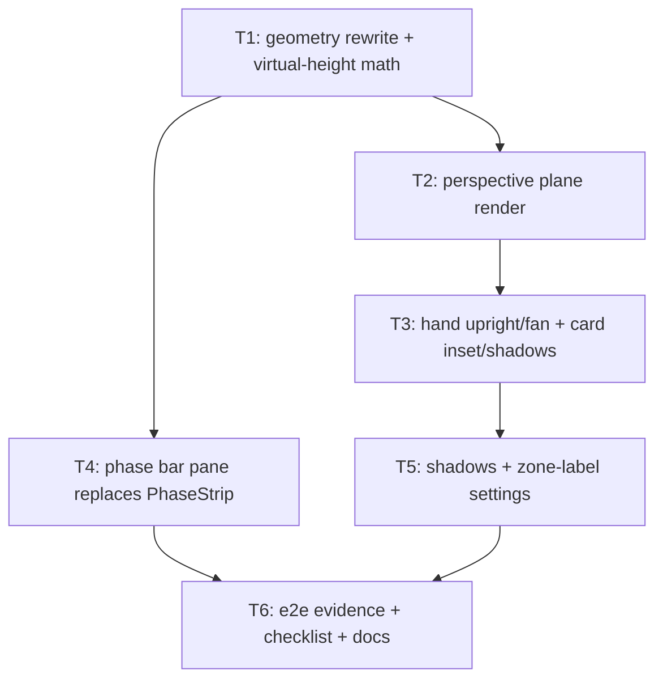

# Perspective duel field + phase bar pane

Render the duel field on one CSS-3D tilted plane (Tag Force look, locked: tilt 20°, camera 600px, hands upright, 5° fan), compact the board geometry, move the phase menu into a standalone right-hand pane, and make card shadows + zone labels player-toggleable.

Validated prototype: `artifacts/prototype_field_perspective.html` (commit this plan before retiring the round; the SHA becomes the durable anchor).

## Locked numbers

| Constant                       | Value                                                                        |
| ------------------------------ | ---------------------------------------------------------------------------- |
| Plane tilt                     | `20deg` (`rotateX`)                                                          |
| Camera distance                | `perspective(600px)`                                                         |
| Hand cards stood upright       | `rotateX(-20deg)` counter-tilt, hands only                                   |
| Hand fan                       | 5° max, linear from middle card, outer cards droop                           |
| `MIDDLE_BAND` (EMZ row height) | `0.78 * pitch`                                                               |
| `BAND` (no-EMZ middle gap)     | `0.12 * pitch`                                                               |
| `CARD_INSET`                   | `0.86` (card inside zone)                                                    |
| EMZ columns                    | monster columns 1 and 3 (`columnX[2]`, `columnX[4]`)                         |
| Upright-only zone width        | `cardWidth + SLOT_PAD (6px)`, gaps uniform `ZONE_GAP (5px)`                  |
| Virtual height                 | `Hv = Hb·d / (d·cosθ − Hb·sinθ)` closed form                                 |
| Phase bar                      | separate pane right of field: opponent red top half, player blue bottom half |

## Tickets Flow

## Index

| Ticket ID | Goal                                                                      | State       | Link                                                                              |
| --------- | ------------------------------------------------------------------------- | ----------- | --------------------------------------------------------------------------------- |
| T1        | Compact flat geometry + closed-form perspective virtual height, pure math | NOT STARTED | [[PLAN_2026_08_29_perspective_field_and_phase_bar/T1_geometry-rewrite]]           |
| T2        | One tilted plane inside the board; overlays and hit-testing survive it    | NOT STARTED | [[PLAN_2026_08_29_perspective_field_and_phase_bar/T2_perspective-plane]]          |
| T3        | Hands stand upright with 5° fan; field cards inset with depth shadows     | NOT STARTED | [[PLAN_2026_08_29_perspective_field_and_phase_bar/T3_hand-and-card-presentation]] |
| T4        | Vertical phase bar pane (red/blue halves) replaces the centre strip       | NOT STARTED | [[PLAN_2026_08_29_perspective_field_and_phase_bar/T4_phase-bar-pane]]             |
| T5        | `showCardShadows` + `showZoneLabels` settings, persisted + dialog rows    | NOT STARTED | [[PLAN_2026_08_29_perspective_field_and_phase_bar/T5_display-settings]]           |
| T6        | Chromium evidence, budgets, manual checklist, glossary/docs               | NOT STARTED | [[PLAN_2026_08_29_perspective_field_and_phase_bar/T6_integration-evidence]]       |

## Assumptions

- A1. Phase bar sits between `duel-field-slot` and `DuelRail` in `.duel-shell` (field's immediate right). DuelRail stays outermost.
- A2. LP display stays in DuelRail untouched; "labels" toggle covers zone name text only.
- A3. Opponent hand cards also stand upright (validated in prototype — their backs lean away).
- A4. Portrait-phone quarter-turn stage (`stage-frame.ts`) composes with the plane transform: hit-testing is native, and all `getBoundingClientRect` consumers read projected screen-space rects, which is what they need. Verified by T2/T6 evidence, not assumed silently.
