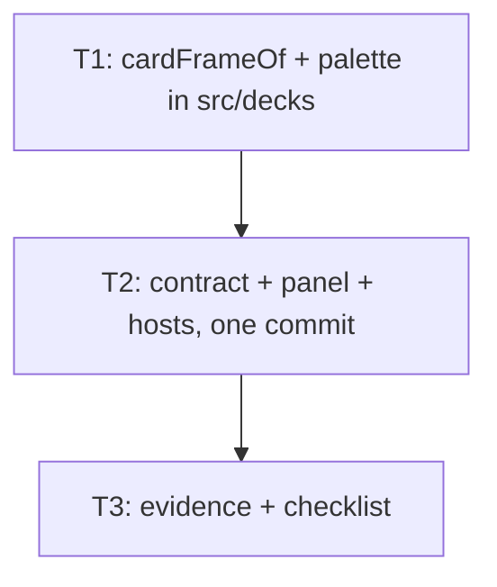

# Decklist row art + frame color

Upgrade every `DecklistPanel` row (float + docked, all three hosts) from plain name to approved Variant A art-strip row with frame-color border and 2L1 left copy cell, per `artifacts/PROTOTYPE_SPEC_decklist_rows.md`.

## Tickets Flow

## Index

| Ticket ID | Goal | State | Link |
| --------- | ---- | ----- | ---- |
| T1 | Pure `cardFrameOf` classifier + `CARD_FRAME_COLORS` palette | NOT STARTED | [[PLAN_2026_09_02_decklist_row_art/T1_card-frame-classifier]] |
| T2 | `DecklistRow` gains `frame`/`artUrl`; panel renders approved row; three hosts wired — one commit | NOT STARTED | [[PLAN_2026_09_02_decklist_row_art/T2_panel-and-hosts]] |
| T3 | Chromium evidence, build gates, manual test checklist | NOT STARTED | [[PLAN_2026_09_02_decklist_row_art/T3_evidence-and-checklist]] |

## Assumptions

- No user-frontload needed: no new packages, accounts, or keys (frontload rule satisfied vacuously).
- `src/decks/` deep imports are legal for every domain **including deck-select**: `tests/unit/domain-boundaries.test.ts:109` (`if (target === "decks") return true;`) and the deck-select ESLint zone (`eslint.config.js:180`) lists no decks group. Panel imports `CardFrame` + `CARD_FRAME_COLORS` directly — no union or palette duplication.
- No frozen-list widening: hosts get `CardFrame` by inference from `cardFrameOf`; `src/deck-select/index.ts` exports stay unchanged.
- Cropped-art URL derivation reuses `croppedCardImageUrl` (`src/decks/deck-cover.ts:20`) — no new image pipeline.
- Contract change and host wiring are one commit (T2): `frame`/`artUrl` are required fields, so a T2-only commit would leave three hosts failing `tsc` (coherence review F1).
- PDDR Decision 1 "deck-builder right panel" = the library docked column of `DeckSelectScreen` — same `DecklistPanel`, not the deck editor workspace zones (spec §1 keeps those out of scope).

## Coherence review

Reviewer findings F1–F11 arbitrated 2026-09-02: F1 merge T2+T3 (typecheck gap), F2/F3/F5 deck-select imports `src/decks/card-frame.ts` (kills union + palette duplication and the frozen-list widening), F4 `position:relative` on `.row`, F6 e2e must add navigation (no existing spec touches a decklist), F7–F11 exact-fact fixes folded into tickets.
