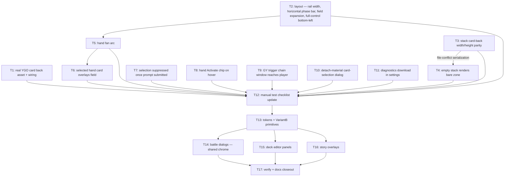

# Duel Field Feedback + Basilica Residual UI Round — 2026-09-02

Two merged workstreams: (1) fix all 14 owner feedback items from `feedback.md` (§ Duel Field) — layout rework (rail/phase bar/field size), card visual parity (card back, stacks, fanning, selected overflow), 3 interaction bugs (stale halo, missing hand Activate, swallowed GY triggers), detach-material dialog, diagnostics download (T1–T12); (2) apply owner-chosen Basilica Slate VariantB "Chamfered Plaques" to residual surfaces — dialogs, deck editor panels, story overlays (T13–T17; PDDR `docs/feature/PDDR-basilica_residual_ui.md`, ADR-065). Duel HUD, deck select, `--field-*` mat, legality colors excluded from the brand pass.

## Assumptions

- A1. `graphify` CLI absent from PATH → facts gathered by scout fanout + direct reads instead.
- A2. No user-owned setup needed (no accounts/keys); only external step = one-time online fetch of real YGO card back image, scripted like existing asset pipeline (T1 frontloads it).
- A3. Item 10 root = `handChipChoices` deliberately filters `activate` from hover chips (`src/battle/app/prompts/hand-activation-choices.ts:10-18`); feedback overrides that design.
- A4. Item 11 root = `ownEffectChainPassResponse` (`src/battle/app/prompts/auto-response.ts:83-97`) auto-passes chain prompts without checking activatable choices.
- A5. Item 9 root = `selectedChoiceIds` kept while `session.status === "submitting"` and prompt held during `responsePending` (`duel-store.ts:187`, `interaction-session.ts:206-208`).
- A6. Item 2 "purple zone" = `--stack-accent`/`--stack-surface` gradient on `.duel-field-stack` (`app.css:2235`, `tokens.css:90-91`); "card cover" = card-back img on deck/extra. Empty = count 0.
- A7. Card back image licensing mirrors card art: fetched at build/dev time, `redistributionApproved: false`, not committed to repo — served from `generated/`-style ignored path or fetched into `public/` locally. Owner call if it should be committed.
- A8. Item 12 applies to any cost/target selection over overlay materials (`selectCard`/`selectTribute` with `overlay: true` choices), not only detach-specific messages. Acceptance centers on the detach case the owner reported.
- A9 (red-team D1). Card back image NOT committed: fetch script + ignored `generated/` path, `redistributionApproved: false`, SVG fallback kept for offline/no-fetch. Owner may override to commit.
- A10 (red-team D2). Item 11 fix = narrow guard on the empty-chain/actor-heuristic branch of `ownEffectChainPassResponse` only (option a). Blanket guard would neuter the fn and re-prompt when chaining onto own effects.
- A11 (red-team). Owner's causal guess "10 caused by 9" disproven: item 10 root is the deliberate `activate` filter, independent of session lifecycle. T7 and T8 parallel.
- A12 (red-team). Horizontal phase bar costs height instead of width; if the height constraint binds in `computeFieldGeometry`, field would shrink. T2 measures first (Chromium evidence) and keeps the bar thin / accounts its height in the slot formula.
- B1 (basilica). VariantB + params locked by owner 2026-09-02: chamfer `6px`, glass `0.02` (strong `0.036`), gold-line `0.6`, display letterspacing `0.16em`, selection amber `#ffd580` unchanged. Param retune is brand-wide via `src/styles/tokens.css` — main menu inherits; if menu reads wrong after T13, values move to surface-scoped vars, not reverted.
- B2 (basilica). `prototype approved` phrase never sent; VariantB + exact params + plan invocation treated as decision approval (PDDR Decision 5). Prototype not frozen; PDDR is the durable record.
- B3 (basilica). Shared dialog chrome (`app.css` `.dialog-panel`/`.dialog-backdrop`) also serves `DropConfirmDialog` (duel-field) and `ShellSettingsDialog` (shell). Ruling: dialogs, not HUD — they inherit VariantB (T14). Owner HUD exclusion covers HUD chrome only.
- B4 (basilica). Dialogs opaque (`--surface-panel` + gold line, `.ui-dialog-panel`), matching approved prototype; only non-dialog panels/overlay cards are translucent glass. Coherence reviewer caught the prototype/ticket divergence.
- B5 (basilica, coherence review 2026-09-02): 5 AMENDs accepted — T13 `.ui-dialog-panel` split, T14 rewritten to shared-chrome target + source-text tests, T15 +`TapTargetMenu` + source-text tests, T16 prototype-faithful scrim (blur 6px, `--bg-deep` 55%, PDDR Decision 6) + `--story-panel` bypass, T17 gate = `check:headless && check:browser`.

## Residual risks (logged, out of scope)

- R1. `src/story/shop/SellImpactDialog.svelte:39` + `src/story/screens/LoadScreen.svelte:152` carry local `.dialog-backdrop` copies — after T14 they are the only old-chrome dialogs left. Owner call whether to fold in later.
- R2. Raw-literal guard (`tests/unit/global-styles.test.ts`) does not cover `src/battle/` component files; T14 discipline is manual there.
- R3. Brand-wide retune repaints `.main-menu__entries button` and every `--glass` consumer; gated only by T13 manual check.

## Execution policy

Serial, ascending ticket id (T1…T17), one writer on trunk (G4, ADR-045). Reason: `app.css`, `global-styles.test.ts`, `App.svelte`, `DuelField.svelte`, `DuelField.test.ts`, `duel-smoke.spec.ts` each have 3+ writer tickets; parallel worktrees would conflict. Basilica pass (T13–T17) runs after the feedback round: T2 (layout) and T14 (dialog chrome) both edit `app.css`; T11 edits `SettingsDialog.svelte` markup that T14 then classes; T12 and T17 both extend the manual checklist. Ascending order resolves every collision. The mermaid edges below are the semantic/handoff dependencies only.

## Tickets Flow

## Index

| Ticket ID | Goal | Feedback items | State | Link |
| --- | --- | --- | --- | --- |
| T1 | Fetch real YGO card back, replace SVG placeholders everywhere | 3 | NOT STARTED | [[PLAN_2026_09_02_duel_field_feedback/T1_card_back_asset]] |
| T2 | Narrow right rail, phase bar horizontal above field (opponent right / player left), field fills freed width, Full Control bottom-left | 5,6,7,13 | NOT STARTED | [[PLAN_2026_09_02_duel_field_feedback/T2_layout_rework]] |
| T3 | Stack card backs same width/height as hand/field cards | 4 | NOT STARTED | [[PLAN_2026_09_02_duel_field_feedback/T3_stack_width_parity]] |
| T4 | Empty stack (count 0) shows bare zone + name + count, no gradient/cover | 2 | NOT STARTED | [[PLAN_2026_09_02_duel_field_feedback/T4_empty_stack_render]] |
| T5 | Hand fanning forms real arc (both hands) | 8 | NOT STARTED | [[PLAN_2026_09_02_duel_field_feedback/T5_hand_fan_arc]] |
| T6 | Selected hand card escapes viewport clip like hovered card | 1 | NOT STARTED | [[PLAN_2026_09_02_duel_field_feedback/T6_selected_hand_overlay]] |
| T7 | Summon resolve clears selection + halo | 9 | NOT STARTED | [[PLAN_2026_09_02_duel_field_feedback/T7_clear_submitted_selection]] |
| T8 | Hand monsters AND spells show Activate action chip on hover | 10 | NOT STARTED | [[PLAN_2026_09_02_duel_field_feedback/T8_hand_activate_chip]] |
| T9 | GY trigger chain prompts reach the player | 11 | NOT STARTED | [[PLAN_2026_09_02_duel_field_feedback/T9_chain_autopass_guard]] |
| T10 | Detach/overlay cost selection uses visual card dialog | 12 | NOT STARTED | [[PLAN_2026_09_02_duel_field_feedback/T10_detach_material_dialog]] |
| T11 | Settings dialog gains diagnostics-download button | 14 | NOT STARTED | [[PLAN_2026_09_02_duel_field_feedback/T11_diagnostics_download]] |
| T12 | Update durable `artifacts/manual_test_checklist.md` for every shipped slice | all | NOT STARTED | [[PLAN_2026_09_02_duel_field_feedback/T12_manual_checklist]] |
| T13 | Retune brand tokens + add VariantB CSS primitives | basilica | NOT STARTED | [[PLAN_2026_09_02_duel_field_feedback/T13_tokens_variantb_primitives]] |
| T14 | Shared dialog chrome + battle dialogs adopt VariantB | basilica | NOT STARTED | [[PLAN_2026_09_02_duel_field_feedback/T14_battle_dialogs]] |
| T15 | Deck editor panels adopt VariantB | basilica | NOT STARTED | [[PLAN_2026_09_02_duel_field_feedback/T15_deck_editor_panels]] |
| T16 | Story overlays adopt VariantB | basilica | NOT STARTED | [[PLAN_2026_09_02_duel_field_feedback/T16_story_overlays]] |
| T17 | Full gate green, DESIGN.md + checklist closeout | basilica | NOT STARTED | [[PLAN_2026_09_02_duel_field_feedback/T17_verify_docs_closeout]] |

## Scope

- In: all 14 items under `feedback.md` § Duel Field; Basilica VariantB pass on dialogs (battle + shared chrome), deck editor panels, story overlays.
- Out: § Right Pane and § Deck Selection Screen (empty in feedback), duel HUD brand pass (owner-excluded), deck select brand pass (ADR-064), `--field-*` mat, legality colors, engine/vendor changes, multiplayer.
