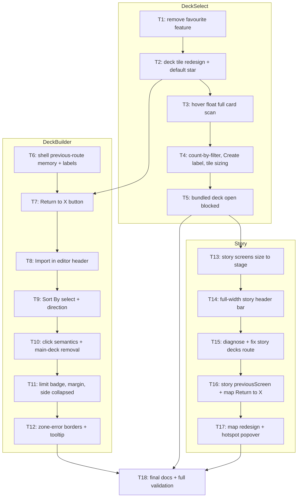

# Screen Feedback 2026-09-02

Implement every item of owner `feedback.md` (2026-09-02) across Deck Selection, Deck Builder, Visual Novel and Map screens, per grill record `artifacts/GRILL_2026_09_02_screen_feedback/ANSWERS.md`.

## Tickets Flow

## Index

| Ticket ID | Goal | State | Link |
| --- | --- | --- | --- |
| T1 | Delete favourite feature end-to-end (flag, toggle, ordering, story plumbing) | NOT STARTED | [[PLAN_2026_09_02_screen_feedback/T1_remove-favourite-feature]] |
| T2 | Deck tile: strip checkmark/date/counts, one tag line, top-right set-default star button | NOT STARTED | [[PLAN_2026_09_02_screen_feedback/T2_deck-tile-default-star]] |
| T3 | Decklist hover float shows full card scan at readable size | NOT STARTED | [[PLAN_2026_09_02_screen_feedback/T3_hover-full-card-float]] |
| T4 | Count beside filter input, "Create" label, auto-fit tile sizing capped ~420px | NOT STARTED | [[PLAN_2026_09_02_screen_feedback/T4_deck-select-layout-polish]] |
| T5 | Bundled decks: disabled kebab Open, toast on double-click | NOT STARTED | [[PLAN_2026_09_02_screen_feedback/T5_bundled-deck-open-blocked]] |
| T6 | Shell session previous-route memory + `routeLabel` map | NOT STARTED | [[PLAN_2026_09_02_screen_feedback/T6_shell-previous-route]] |
| T7 | Deck editor red "Return to X" bottom-left, Deck Library button removed | NOT STARTED | [[PLAN_2026_09_02_screen_feedback/T7_editor-return-button]] |
| T8 | Header Import: YdkImport replaces open deck lists as one undoable mutation | NOT STARTED | [[PLAN_2026_09_02_screen_feedback/T8_editor-import-header]] |
| T9 | Single "Sort By" select, 7 modes, asc/desc toggle, undoable deck mutation | NOT STARTED | [[PLAN_2026_09_02_screen_feedback/T9_sort-by-select]] |
| T10 | Double-click add/remove, single click soft-pins preview, main removal deletes | NOT STARTED | [[PLAN_2026_09_02_screen_feedback/T10_click-semantics]] |
| T11 | Hide limit badge at 3, catalog margin, side deck collapsed by default | NOT STARTED | [[PLAN_2026_09_02_screen_feedback/T11_editor-small-polish]] |
| T12 | Validation strip → red zone borders + "(!)" styled tooltip per zone | NOT STARTED | [[PLAN_2026_09_02_screen_feedback/T12_zone-error-borders]] |
| T13 | Story screens size to shell stage container, not 100svh | NOT STARTED | [[PLAN_2026_09_02_screen_feedback/T13_story-stage-sizing]] |
| T14 | StoryTopBar → full-width header bar identical across story screens | NOT STARTED | [[PLAN_2026_09_02_screen_feedback/T14_story-header-bar]] |
| T15 | Fix story deck-builder button landing on main menu | NOT STARTED | [[PLAN_2026_09_02_screen_feedback/T15_story-decks-route-fix]] |
| T16 | Story reducer `previousScreen`; map red "Return to X" bottom-left | NOT STARTED | [[PLAN_2026_09_02_screen_feedback/T16_map-return-button]] |
| T17 | Map redesign: sidebar/eyebrow/ack removed, hotspot popover, map fills space | NOT STARTED | [[PLAN_2026_09_02_screen_feedback/T17_map-redesign]] |
| T18 | Update durable manual checklist + glossary; run full headless/browser validation | NOT STARTED | [[PLAN_2026_09_02_screen_feedback/T18_docs-and-final-validation]] |

## Assumptions

- Tag line on deck tile = existing `tile.meta` minus date/counts; exact source confirmed from `DeckTileModel` mapping at ticket level.
- Non-YDK decklist formats out of scope.
- No user-setup ticket: no new packages, accounts or keys required (all changes ride existing stack).
- Bundled tiles show no set-default star: bundled presets cannot be persisted as defaults under the current repository model.
- T1 tolerates and drops legacy favourite data; orphan IndexedDB favourite key remains unread, avoiding destructive migration.
- Deck-select T1–T5 serialize: shared `DeckSelectScreen.svelte`/contracts.
- Deck-editor T7–T12 serialize: shared `DeckEditor.svelte`/`DeckWorkspace.svelte`.
- Cross-lane collisions serialized: T7 depends on T2 + T6 because T1/T2 touch editor hosts; T13 depends on T5 because T1/T5 touch story hosts.
- Story T13–T17 serialize: shared `StoryApp.svelte`/story contracts.
- Every UI ticket updates affected component tests + satisfies `tests/unit/data-cy-coverage.test.ts`; no public-entry export widening expected.

## Out of scope

- `# Duel Field / ## Right Pane` — empty in feedback.md.
- Multiplayer, engine/vendor, non-listed screens.
