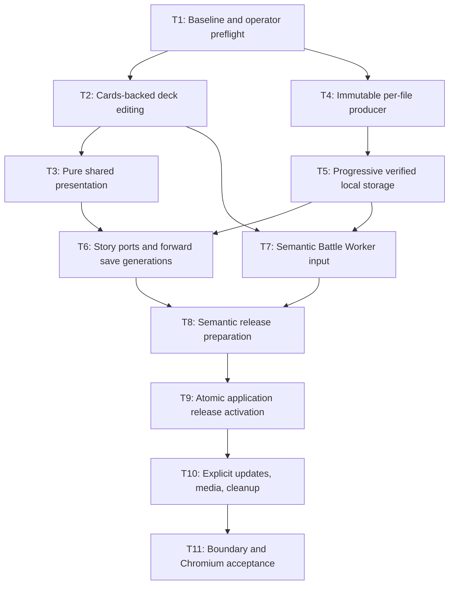

# Content/module rearchitecture

Main-target rearchitecture: canonical Cards, private Decks APIs, pure shared UI, Shell-only Content composition, progressive immutable files, forward-safe release activation.

## Tickets Flow

## Index

| Ticket ID | Goal | Depends | State | Link |
| --- | --- | --- | --- | --- |
| T1 | Reconcile intended baseline without losing dirty work; frontload human prerequisites | none | NOT STARTED | [[PLAN_2026_09_13_content_module_rearchitecture/T1_baseline-preflight]] |
| T2 | One immutable Cards owner serves Decks/Deck Editor through focused APIs | T1 | NOT STARTED | [[PLAN_2026_09_13_content_module_rearchitecture/T2_cards-deck-editing]] |
| T3 | Complete-VM preview/scrollbar, generic geometry, independent Deck Select | T2 | NOT STARTED | [[PLAN_2026_09_13_content_module_rearchitecture/T3_shared-presentation]] |
| T4 | Deterministic files→manifest→pointer publisher verified against local fake R2 only | T1 | NOT STARTED | [[PLAN_2026_09_13_content_module_rearchitecture/T4_per-file-producer]] |
| T5 | Explicit missing-file staging/resume, no optional-media acquisition or active-pointer writes | T4 | NOT STARTED | [[PLAN_2026_09_13_content_module_rearchitecture/T5_progressive-storage]] |
| T6 | Story ports/validators prepare every supported save slot in sealed new generation | T3, T5 | NOT STARTED | [[PLAN_2026_09_13_content_module_rearchitecture/T6_story-save-generations]] |
| T7 | Battle validates clone-safe runtime input; Worker alone initializes engine | T2, T5 | NOT STARTED | [[PLAN_2026_09_13_content_module_rearchitecture/T7_battle-runtime]] |
| T8 | Shell composes completed semantic validators; Content retains mechanics only | T6, T7 | NOT STARTED | [[PLAN_2026_09_13_content_module_rearchitecture/T8_semantic-preparation]] |
| T9 | Cross-tab Main-Menu CAS selects verified content plus sealed save generation | T8 | NOT STARTED | [[PLAN_2026_09_13_content_module_rearchitecture/T9_atomic-activation]] |
| T10 | Main Menu controls independent updates, optional media, explicit asset cleanup | T9 | NOT STARTED | [[PLAN_2026_09_13_content_module_rearchitecture/T10_update-media-cleanup]] |
| T11 | Aggregate existing slice gates plus offline/crash/multitab Chromium acceptance | T10 | NOT STARTED | [[PLAN_2026_09_13_content_module_rearchitecture/T11_acceptance]] |

## Supporting records

| ID | Document | Link |
| --- | --- | --- |
| S1 | Scope, decisions, assumptions, evidence | [[PLAN_2026_09_13_content_module_rearchitecture/CONTEXT]] |
| S2 | Approved interview choices | [[GRILL_2026_09_13_content_module_rearchitecture/ANSWERS]] |
| S3 | Rendered plan | [Standalone HTML](PLAN_2026_09_13_content_module_rearchitecture.html) |
| S4 | Binding contracts | [[PLAN_2026_09_13_content_module_rearchitecture/CONTRACTS]] |
| S5 | Validation/review evidence | [[PLAN_2026_09_13_content_module_rearchitecture/VALIDATION]] · [[PLAN_2026_09_13_content_module_rearchitecture/REVIEW_DISPOSITIONS]] |
