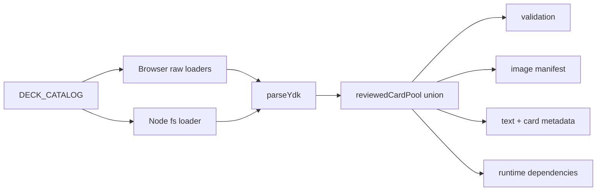

# ADR-011: Deck Registry And Derived Card Pool

> Status: accepted; planned
> Decided: 2026-08-10
> Owners: preset and asset architecture
> Commit: `5eac0b5` — T2

## Context

The preset currently names `player.ydk` and `opponent.ydk` independently in browser runtime imports, Node runtime loading, active-image packaging and active-runtime dependency resolution. `MVP_SUPPORTED_CARD_CODES` separately lists 22 reviewed codes. Adding one bundled deck without updating every list can therefore produce a valid parsed deck whose card data, script, text or art is missing at runtime.

Round 3 adds Burning Abyss, Nekroz, Shaddoll and Spellbook while retaining both starter decks. ADR-007 owns pile interaction; ADR-008 owns live deck projection/reveals. Neither owns source-deck discovery or build coverage.

## Decision

1. One pure `DECK_CATALOG` owns six stable ids, display names and `.ydk` filenames: `mvp-player`, `mvp-opponent`, `burning-abyss`, `nekroz`, `shaddoll`, `spellbook`.
2. Browser and Node loaders remain separate I/O adapters with one output contract: `ReadonlyMap<DeckId,string>`. Browser uses explicit Vite `?raw` imports; Node reads catalog filenames from disk.
3. Browser/source parity is tested. Dynamic browser directory discovery is not used.
4. `reviewedCardPool(sources)` parses every registered deck and unions main, extra and side codes.
5. `validateDeck` receives that pool. Hand-written `MVP_SUPPORTED_CARD_CODES` is removed.
6. Active image, active text/card metadata and active runtime dependency builders enumerate the catalog, not two literal paths.
7. Runtime initialization preloads the complete bundled union before deck selection. Selection cannot create a later asynchronous dependency gap.
8. Duplicate ids/filenames, missing source/card/text/image/script, or an invalid deck fail build/initialization. No partial catalog is accepted.
9. Starter player/opponent remain defaults. User import/editing and runtime filesystem discovery remain out of scope.

## Alternatives rejected

- **Keep a hand-written reviewed pool.** It drifts from deck sources.
- **Scan `.ydk` files in the browser at runtime.** Static Vite bundles have no portable directory API and need explicit imports.
- **Load only the chosen pair after selection.** Creates a post-picker async/failure seam and makes build coverage incomplete.
- **Add arbitrary import/editing now.** Expands trust, persistence and legality scope beyond bundled offline presets.

## Consequences

- Adding a bundled deck means one catalog entry, one source file and a successful full-coverage build.
- Planned six-deck union is 120 codes and roughly 17.7 MiB of art. Those values are implementation evidence, not permanent architecture limits.
- Browser payload grows, but dependency correctness becomes derived and testable.
- ADR-008 remains unchanged: source-deck union decides packaged capability; projector reveal offsets decide live public knowledge.
