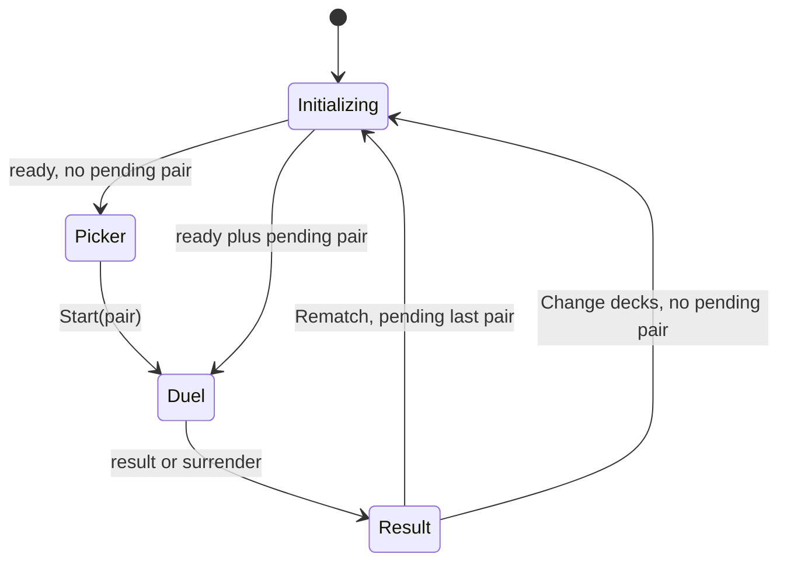

# ADR-012: Pre-Duel Bundled Deck Selection

> Status: accepted; planned
> Decided: 2026-08-10
> Owners: duel lifecycle architecture
> Plan: [`../../ai-artifacts/PLAN_2026_08_10_duel_field_feedback_round_3.md`](../../ai-artifacts/PLAN_2026_08_10_duel_field_feedback_round_3.md) — T3

## Context

Round 2 auto-starts when the Worker becomes ready. `DuelStore.start()` and `DuelWorkerClient.startDuel()` carry one fixed preset id, while Worker resources hold one preset built during initialization. Six bundled decks require both sides to be chosen before session creation without sending deck text across the trust boundary.

ADR-009 starts after a prompt exists; ADR-010 starts after projected state exists. This decision owns only ready→picker→session lifecycle.

## Decision

1. Worker initialization loads dependencies for the complete ADR-011 pool, then emits `ready`.
2. A ready app shows a two-column picker and never auto-starts, including after reload.
3. Start command carries validated player/opponent `DeckId`s plus a pair-derived duel id: `bundled-v1:<player>:vs:<opponent>`.
4. Worker builds/parses/validates exactly one selected `DuelPreset` inside `#startDuel`. Main thread sends ids, never `.ydk` content.
5. Pair-derived preset id enters existing diagnostics/trace metadata, preserving reproducibility without a trace-schema change.
6. Last started pair stays in store memory; persisted initial selection belongs to ADR-013.
7. Rematch replaces and initializes the Worker, then starts the last pair exactly once on replacement `ready`.
8. Change decks replaces and initializes the Worker, then returns to picker with no pending Start. Retained pair remains highlighted.
9. One live duel per Worker remains invariant.



## Contract

```ts
type StartDuelCommand = {
  readonly type: "startDuel";
  readonly duelId: DuelId;
  readonly playerDeckId: DeckId;
  readonly opponentDeckId: DeckId;
};

interface DuelStore {
  start(player: DeckId, opponent: DeckId): boolean;
  restart(): Promise<boolean>; // replace; start last pair on ready
  reset(): Promise<boolean>;   // replace; stay at picker on ready
}
```

`parseDuelCommand` allows only these four keys and rejects either unknown id before runtime dispatch.

## Alternatives rejected

- **Send deck text across Worker boundary.** Widens command input and duplicates ADR-011 source authority.
- **Build all 36 pair permutations at initialization.** Unnecessary objects; full dependency pool is enough.
- **Reuse a completed Worker.** Conflicts with accepted replacement lifecycle and stale session isolation.
- **Auto-start persisted pair.** Defeats pre-duel choice.
- **Keep generic `mvp-preset-v1` identity.** Diagnostics could not identify matchup.

## Consequences

- Every e2e flow explicitly presses Start.
- Result UI gains Change decks.
- Worker resources expose a preset factory instead of a fixed preset.
- Rematch/reset need a pending-start state guarded against duplicate/stale `ready` events.
- ADR-009 auto-resolution and ADR-010 controls remain session-local and reset with Worker/session generation.
