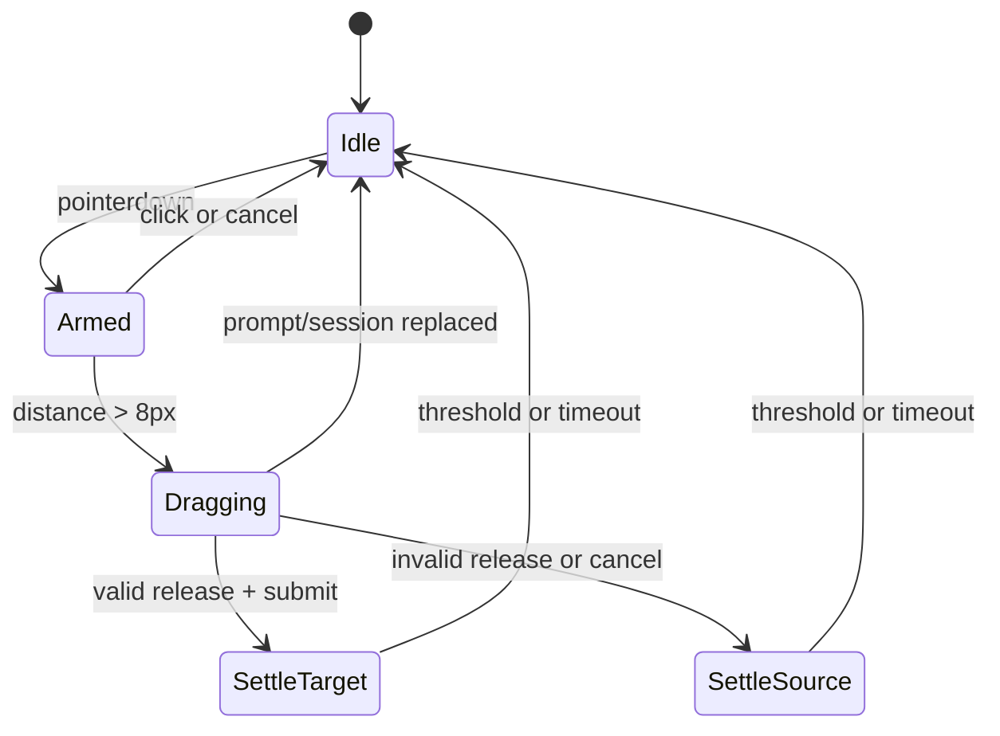

# ADR-016: Dependency-Free Drag Physics

> Status: accepted; planned
> Decided: 2026-08-10
> Owners: field interaction presentation
> Plan: [`../../ai-artifacts/PLAN_2026_08_10_duel_field_feedback_round_3.md`](../../ai-artifacts/PLAN_2026_08_10_duel_field_feedback_round_3.md) — T13

## Context

ADR-005 defines optimistic hand-card placement reconciled by the engine. Round 2 captures pointer movement and identifies candidate zones, but deliberately leaves `moveCardDrag` inert and only dims the source. Tier-2 feedback needs a cursor ghost, velocity tilt, lift and spring settle. One element/gesture does not justify an animation dependency.

## Decision

1. Preserve ADR-005 command flow. Physics never decides legality or response ids.
2. Start ghost after existing 8 px movement threshold.
3. Keep source DOM/focus in place and dim it. Render one `aria-hidden`, pointer-transparent fixed ghost above field/window layers.
4. Ghost retains pointer grab offset and consumes latest pointer sample through one coalesced `requestAnimationFrame` loop.
5. Filter velocity `0.65 previous + 0.35 instantaneous`; tilt = `velocityX * 0.012`, clamped ±10°.
6. Active lift scale = 1.08 plus shadow.
7. Valid release submits existing placement intent/choice immediately, then ghost settles to target centre. Invalid/cancel settles home and submits nothing.
8. Spring uses stiffness 180, damping 24, delta cap 32 ms. Finish at ≤0.5 px and ≤8 px/s or hard timeout 600 ms.
9. No layout reads in the frame loop; capture source on begin and target on release.
10. Prompt/session replacement, new drag, unmount or timeout cancels rAF/removes ghost.
11. Reduced-motion follows pointer with zero tilt and removes ghost immediately on release; no lift/spring.
12. Add no npm dependency.

## Alternatives rejected

- **Framer Motion/GSAP.** Dependency/upgrade cost exceeds one small deterministic controller.
- **CSS transition only.** Cannot coalesce cursor samples or derive velocity.
- **Move authoritative card node.** Risks focus, chips, board mapping and click suppression.
- **Use ghost for hit testing.** Visual feedback must not gate legal response; ghost is pointer-transparent.
- **Wait for settle before submission.** Animation timing must not change engine interaction.

## Consequences

- Pure frame functions are deterministic unit-test surface; component tests fake rAF lifecycle.
- Constants are UX tuning values, not rules. Changing them needs visual acceptance, not new architecture.
- T12 layering/palette is prerequisite; drop candidate stays presentation guess.
- Package/lock files must remain unchanged.
