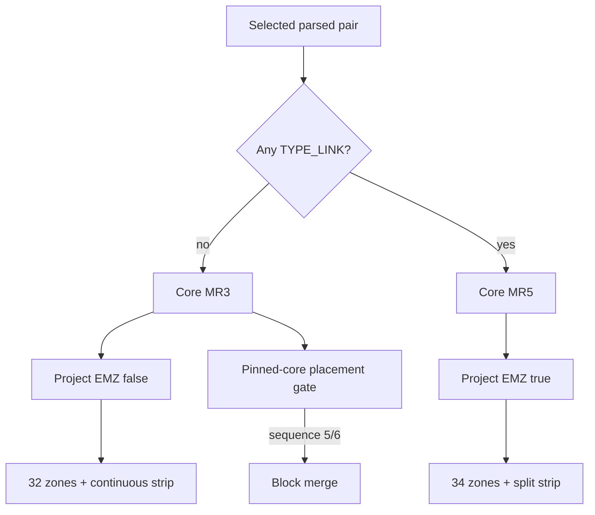

# ADR-018: Conditional Extra Monster Zones

> Status: accepted; planned with pinned-core rule gate
> Decided: 2026-08-10
> Owners: deck-selection, engine-rules, field-layout architecture
> Plan: [`../../artifacts/PLAN_2026_08_10_duel_field_feedback_round_3.md`](../../artifacts/PLAN_2026_08_10_duel_field_feedback_round_3.md) — T11

## Context

ADR-010 assumes two always-rendered shared Extra Monster Zones. Round 3 removes both when neither selected deck contains a Link monster.

Render-only removal is unsafe under current MR5: Link-free Fusion/Synchro/Xyz monsters may legally use an Extra Monster Zone. Hiding a core-offered target can leave an unanswerable placement prompt or invisible occupied card. UI must not filter engine legality.

Pinned catalog type bit `0x04000000` identifies Links. All six bundled decks are Link-free and period-appropriate for MR3. Pinned adapter exposes MR3/MR5 modes; round 2 currently hardcodes MR5.

## Decision

1. Define `TYPE_LINK = 0x04000000`. Inspect main/extra/side of both selected parsed decks against active card metadata.
2. Missing metadata fails start. Unknown is never treated as Link-free.
3. Compute one Worker-owned immutable profile before core creation:
   - no Link → MR3 (`0xd1800n`) + no Extra Monster Zones;
   - any Link → MR5 (`0x2e800n`) + both Extra Monster Zones.
4. Worker projects `layout.extraMonsterZones`; App does not recompute profile.
5. MR3 omitted mode removes both shared models, DOM targets and nav nodes. MR5 full mode keeps ADR-010 split geometry.
6. Omitted mode joins semantic phase groups visually into Draw→Standby→Main 1→Battle→Main 2→End turn.
7. Rematch retains same worker/profile. Change decks disposes worker; next Start recomputes.
8. Any omitted-profile sequence 5/6 occupancy or prompt target is `layout_profile_conflict`; never drop, hide, filter or auto-answer it.
9. Mandatory pinned-core test drives Link-free Extra Deck placement under MR3 and proves sequence 5/6 is absent. MR5 fixture covers full mode. Core contradiction blocks merge.

## Alternatives rejected

- **Render-only `display:none`/model filtering under MR5.** Can strand legal target/occupancy.
- **Silently filter EMZ choices.** UI must not change core legality.
- **Inspect current board.** Layout would shift mid-duel and too late.
- **Check empty Extra Deck.** Not requested criterion; misses main/side Link cards.
- **Treat missing metadata as non-Link.** Unsafe false omission.
- **Always show EMZs.** Contradicts confirmed product decision.

## Full-height geometry ownership (accepted 2026-08-13)

This ADR remains sole authority for EMZ presence + MR3/MR5 profile. ADR-019 maps projected profile to px rows/phase band; UI never recomputes deck/rule mode.

## Consequences

- Duel rule mode now depends on selected pair; engine legality and field geometry share one Worker profile.
- Public snapshot gains immutable layout metadata; board mapper no longer accepts an independently computed UI option.
- Existing fixtures explicitly select MR5 unless testing MR3.
- All six initial decks use MR3/no-EMZ; synthetic Link fixture uses MR5/full mode.
- ADR-010 phase semantics remain; geometry split is conditional.
