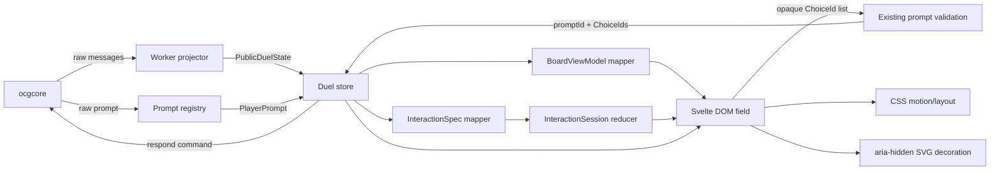
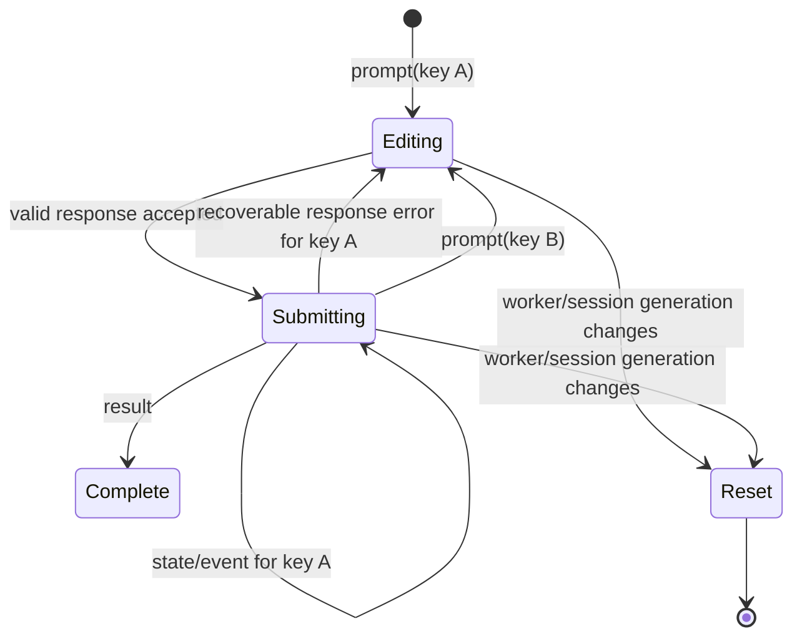

# DOM Duel-Field Architecture

> Status: implemented baseline; full-height successor accepted/planned
> Last updated: 2026-08-13
> Renderer decision: [`../../ADR/001_ADR_semantic_dom_duel_field_rendering.md`](../../ADR/001_ADR_semantic_dom_duel_field_rendering.md)
> Full-height decision: [`../../ADR/019_ADR_full_height_duel_shell_and_pixel_geometry.md`](../../ADR/019_ADR_full_height_duel_shell_and_pixel_geometry.md)
> Human-readable successor view: [`../../duel-field-architecture.html`](../../duel-field-architecture.html)

## Planned full-height successor

ADR-019 + current implementation plan replace fixed normalized production rendering with viewport-derived `FieldRenderLayout`, square 5px-gap footprints, full hands, geometry-anchored phases, right rail, bounded preview overlay scrolling. Stable IDs, projection, interaction, nav, privacy, resource lifetime, failure behavior below remain binding. Until implementation completes, fixed-layout prose below describes shipped baseline only; it cannot override ADR-019.

## Scope

This document defines the implemented Standard-format, desktop-first DOM duel field.

Completed delivery gates:

1. correct public domain projection;
2. correct physical Standard board model;
3. prompt-derived interaction core;
4. semantic desktop field;
5. rich state/HUD/feedback;
6. responsive composition;
7. renderer removal after parity/profiling.

Speed Duel, Rush Duel, Tag Duel, alternate player counts, story backgrounds, character animation, particles, and shader effects are outside this architecture. They need domain work and separate decisions. `PlayerIndex = 0 | 1` cannot represent Tag Duel.

## Ownership

| Layer                       | Owns                                                                                                                         | Must not own                                          |
| --------------------------- | ---------------------------------------------------------------------------------------------------------------------------- | ----------------------------------------------------- |
| Dedicated Worker            | `ocgcore`, raw messages, fixed-slot projection, visibility metadata, prompt binding, response encoding                       | DOM geometry, focus, animation                        |
| Duel client/store           | immutable projected snapshot, current prompt, worker/session generations, result/error, authoritative response-pending state | local menu/selection draft, visual legality invention |
| Board mapper                | physical slot identity, card/stack views, labels, navigation neighbors                                                       | mutable session state, Worker calls                   |
| Interaction-spec mapper     | prompt→target/choice relations and constraints                                                                               | selected/order/allocation draft                       |
| Interaction-session reducer | prompt-keyed local selection, allocation, order, menu anchor                                                                 | legality beyond existing prompt validator             |
| Svelte field                | semantic controls, focus, DOM layout, menus, trays, inspector, feedback                                                      | raw engine values, direct Worker access               |
| CSS/SVG                     | placement, responsive composition, non-authoritative decoration                                                              | slot/rule mapping, response creation                  |

## Data flow



No edge may bypass store validation or import Worker internals into presentation code.

## Projection model: fixed slots are not dense arrays

### Fixed-slot locations

Monster and Spell/Trap field cards retain engine `sequence` exactly. Removing sequence `0` must not rename sequence `4`, `5`, or `6`. Implement lookup/removal by sequence, reject duplicate occupancy, and never call dense `resequence()` for fixed-slot locations.

### Ordered locations

Hand, GY, banished, deck/Extra Deck collections use engine order when order is public/needed. Dense list operations may resequence these collections.

### Overlay materials

Overlay moves do not place a second card in host monster zone. Projection attaches material instance to host card and removes/detaches it by material identity/order. Material state is exactly `{ instanceId, sequence, code, identityVisible }`; placement controller comes from host, and owner is not guessed. Host `overlayCards` is authoritative for count/order/code. Detailed material query is optional visibility enrichment, with conservative fallback when unsupported. Projected state retains material code even when presentation hides it.

### Offline hidden-information policy

This product is an offline solo game, not a hostile multi-user security boundary. Hidden card identities may cross the Worker boundary and exist in clone-safe store state when that simplifies correct projection or avoids unsupported engine queries. Every identity carries explicit presentation visibility; Svelte, accessible names, image requests, screenshots, routine logs, and diagnostics must not plainly reveal identities hidden by game rules. Developer tools or process-memory inspection are outside the threat model.

Opponent policy remains restricted to legally visible information. That restriction preserves fair gameplay rather than protecting secrets from the local user.

### Reconciliation

When event-only projection cannot prove state, Worker uses existing field/location query capability. Reconciliation stays Worker-owned. DOM never repairs domain state from previous render.

## Standard physical board

Use one `PhysicalZoneId` per visible slot. Engine address and physical identity are separate concepts.

```ts
type PhysicalZoneId =
  | `p${0 | 1}:mainMonster:${0 | 1 | 2 | 3 | 4}`
  | "shared:extraMonster:left"
  | "shared:extraMonster:right"
  | `p${0 | 1}:spellTrap:${0 | 1 | 2 | 3 | 4}`
  | `p${0 | 1}:field`
  | `p${0 | 1}:deck`
  | `p${0 | 1}:extra`
  | `p${0 | 1}:graveyard`
  | `p${0 | 1}:banished`
  | `p${0 | 1}:hand`;
```

Player 0 is bottom/local perspective. Shared Extra Monster Zone mapping:

| Engine address              | Physical slot               |
| --------------------------- | --------------------------- |
| player 0 monster sequence 5 | `shared:extraMonster:left`  |
| player 0 monster sequence 6 | `shared:extraMonster:right` |
| player 1 monster sequence 5 | `shared:extraMonster:right` |
| player 1 monster sequence 6 | `shared:extraMonster:left`  |

This follows core collision relation `opponent sequence = 11 - sequence`. Shared slots render once, with controller/owner carried by occupying card. They are never duplicated under each player's zone group.

Spell/Trap sequences `0..4` are five physical slots. Pendulum use is a state/label on outer slots, not two extra slots. Field Zone is separate. Engine sequences outside supported Standard mapping fail fixture tests or remain non-renderable with a diagnostic; they must not silently alias another slot.

Reference schema: [`references/standard-field-wireframe.svg`](references/standard-field-wireframe.svg).

## Board view model

Pure mapper output is immutable and renderer-neutral:

```ts
interface BoardViewModel {
  readonly zones: readonly BoardZoneView[];
  readonly cards: readonly BoardCardView[];
  readonly stacks: readonly BoardStackView[];
  readonly nav: ReadonlyMap<BoardTargetId, SpatialNeighbors>;
}

interface BoardZoneView {
  readonly id: PhysicalZoneId;
  readonly player: PlayerIndex | "shared";
  readonly kind: BoardZoneKind;
  readonly label: string;
  readonly x: number; // logical 0..1
  readonly y: number; // logical 0..1
  readonly width: number;
  readonly height: number;
}
```

Rules:

- stable card key = public `CardInstanceId`; hidden opponent hand placeholders use stable per-snapshot placeholder IDs and never imply identity continuity;
- stable zone key = `PhysicalZoneId`;
- card view carries current physical zone, visibility, controller, owner, position, labels, counters/material summary, and image ref;
- deck/Extra/GY/banished render stack summary on board; collection contents mount only in open tray;
- logical positions remain typed data; Svelte converts them to CSS custom properties;
- labels come from public card text or privacy-safe fallback, never code-only text when name is available.

Applying same snapshot twice yields structurally equal view data and no new listener/resource ownership.

## Public presentation contract

### Required for Standard P0

- LP, turn, turn player, phase;
- deck/Extra counts, hand count;
- human hand identities; opponent hand visibility metadata plus count, with hidden identities never rendered;
- fixed-slot cards with stable sequence, position, owner/controller, face state;
- public GY/banished cards;
- per-card counters with public counter type/name/count;
- populated overlay-material collection with stable identity, required internal code, sequence, and explicit presentation visibility;
- chain links with controller, source card/instance when public, effect label/description ref, link index, resolving/negated/disabled status;
- face-up Extra Deck public cards plus human-owned Extra Deck identities when engine/deck contract can prove them;
- semantic duel log separate from bounded transient presentation queue. Log keeps up to 2,000 privacy-safe entries, then adds a visible truncation marker; no unbounded main-thread history.

### Explicitly deferred

- duel clock/turn timer: no authoritative timer exists in offline MVP;
- avatars/account identity: no player-profile domain exists;
- visible presentation of face-down opponent deck/Extra identities; internal projected identity is permitted when required for correctness;
- alternate-format metadata: separate product/domain decision.

Every new field requires structured-clone validation, presentation-visibility tests, deterministic projector fixtures, and real-WASM compatibility coverage. Internal identity may use trusted deck/message/query evidence even when hidden from presentation. Other values still require engine/parser evidence; fabricated placeholders such as guessed counters or chain sources are forbidden.

## Interaction model

### Immutable prompt-derived spec

`InteractionSpec` is rebuilt from current `PlayerPrompt`, public snapshot, and board mapping. It contains no local selection.

```ts
type InteractionSpec =
  | { readonly kind: "inactive" }
  | CardActionSpec
  | CardSelectionSpec
  | PlaceSelectionSpec
  | CounterAllocationSpec
  | OrderSpec
  | NonFieldSpec;

interface InteractionKey {
  readonly workerGeneration: number;
  readonly sessionGeneration: number;
  readonly promptId: PromptId;
}
```

Each active variant carries `key`, prompt kind, title/message, constraints, target→opaque-choice mappings, and any global actions. It reuses `promptControlFamily()` plus `validatePromptSelection()`; it does not duplicate engine response rules.

- `CardActionSpec`: one/many legal actions attached to card/stack targets; command-card activation opens anchored action/Inspect menu even with one legal action, avoiding accidental submit and preserving inspection.
- `CardSelectionSpec`: selected/unselected card targets, min/max/sum constraints, explicit confirmation.
- `PlaceSelectionSpec`: physical zone targets and exact required count.
- `CounterAllocationSpec`: card targets plus max per target and required total.
- `OrderSpec`: ordered choice draft in dock/tray.
- `NonFieldSpec`: yes/no, announce, rock-paper-scissors, or other controls completed by semantic prompt panel.

### Mutable local session

```ts
interface InteractionSession {
  readonly key: InteractionKey | null;
  readonly status: "idle" | "editing" | "submitting";
  readonly selectedChoiceIds: readonly ChoiceId[];
  readonly order: readonly ChoiceId[];
  readonly allocations: ReadonlyMap<ChoiceId, number>;
  readonly menuTarget: BoardTargetId | null;
}
```

Session reducer rules:

- new `InteractionKey` resets all draft state;
- stale target/choice actions are ignored;
- selections preserve prompt order unless `ordered` requires explicit order;
- multi-select, place, counter, and order prompts require explicit Confirm; no default auto-submit;
- cancel uses prompt-provided cancel/pass/finish semantics only;
- validation runs before store response;
- reducer remains pure; focus side effects live in Svelte action/component boundary.

## Authoritative pending lifecycle

A response accepted by store sets session/store to submitting and locks all field plus prompt controls. A state snapshot does **not** unlock input.



Only these events end pending state:

- prompt with new `InteractionKey`;
- duel result;
- recoverable `invalid_response`/`stale_prompt` associated with current runtime context;
- worker/session generation replacement, which discards session entirely;
- terminal error, which removes interaction.

Current store behavior retaining pending across `state` events is preserved and receives explicit reducer tests.

## DOM composition

Files live under `src/battle/app/components/` (`duel-field/` for the field's own parts) except `PromptControls.svelte`, which lives in `src/battle/app/prompts/`.

```text
App.svelte
├── AppMenubar.svelte              menu + settings entry points
├── DuelFieldErrorBoundary.svelte  field render error fallback
│   └── DuelField.svelte           field shell, drag and feedback owner
│       ├── FieldBoard.svelte      aspect-ratio board
│       │   ├── ZoneControl.svelte native button/labelled slot
│       │   ├── StackControl.svelte count + tray trigger
│       │   └── CardControl.svelte native button + image + label
│       │       └── CardActionChips.svelte  per-card legal actions
│       ├── FieldStatusPills.svelte priority + phase pills
│       ├── LifePointsPill.svelte  one per player
│       ├── FieldLines.svelte      pointer-events:none SVG
│       ├── FieldActionBar.svelte  confirm/cancel/order/allocate state
│       └── EndTurnButton.svelte   corner end-phase control
├── CardPreviewPanel.svelte        hovered/focused card art + text; shared,
│                                  lives in `src/shell/card-preview/` (ADR-033)
├── PromptDialog.svelte            non-field prompts
│   └── PromptControls.svelte      prompt control families
├── DuelHud.svelte                 LP, turn, phase, counts (settings-gated)
│   ├── CardTray.svelte            GY/banished/Extra contents
│   └── ChainStatus.svelte         active chain summary
├── DuelLog.svelte                 event log panel (settings-gated)
├── MenuDialog.svelte              menu + surrender
├── SettingsDialog.svelte          panel toggles + build identity
└── LoadingOverlay.svelte          startup and activation states
```

`FieldActionMenu.svelte`, `SelectionDock.svelte` and `CardInspector.svelte` were deleted by the field-first conversion: anchored target actions became `CardActionChips.svelte`, the dock became `FieldActionBar.svelte`, and card details moved to `CardPreviewPanel.svelte`.

Components consume props/callbacks only. No component imports Worker client. Prefer one component per independently testable responsibility; avoid generic catch-all components.

## DOM semantics and focus

- Field is named region/group. Do not use `role="application"`.
- Card/stack/zone actions use native `<button type="button">`.
- One roving tab stop enters spatial field. Arrow keys follow precomputed navigation graph; Home/End behavior follows documented row/collection semantics.
- Irregular shared EMZ may use APG layout-grid behavior only if Chromium a11y evidence shows named controls fail spatial context. Do not add `role="grid"` for styling. Default remains named group/buttons.
- Enter/Space invokes same action as pointer click.
- Action menu returns focus to trigger on close/submit failure; opening tray moves focus to tray heading/first item; closing returns focus to trigger.
- All focus indicators remain visible over transformed/rotated cards.
- Actionable target size remains at least 44×44 CSS px; card art may be smaller inside control.
- Use `aria-pressed`/selected state only when semantics match behavior. Do not disable inspectable cards merely because they are not legal response targets.
- Persistent live region announces prompt changes, submission, recoverable errors, turn/phase, and result without replaying every visual event.
- `prefers-reduced-motion` removes nonessential movement; state changes remain visible/textual.

## Pointer behavior

- Use browser click/pointer-up activation; no response on `pointerdown`.
- Movement beyond tolerance cancels click activation when drag-like tray gestures exist.
- Hover never reveals information unavailable by focus/click.
- Action menus anchor using target `getBoundingClientRect()` and update on resize/scroll.
- Clicking card always permits inspection when identity is public; legal actions are presented separately.

## Layout

P0 desktop board uses fixed logical aspect ratio with percent-based coordinates. HUD/inspector/menu remain normal DOM flow/overlays. Narrow layout later recomposes HUD/trays and may use contained field scrolling until portrait design passes.

CSS requirements:

- explicit layer tokens for board, zones, cards, focus, menu, modal/tray, decoration;
- no rule logic in selectors;
- container/media queries for composition, not card legality;
- text/controls remain usable at 200% browser zoom;
- hand fanning may overlap art, never focus/click target;
- stack counts remain readable without opening tray.

## Images and resource lifetime

DOM `` consumes verified URLs. Image availability never blocks legal input. Placeholder/back renders immediately; verified art swaps in when ready.

Resource rules:

- lease/create object URLs only for mounted/soon-visible images;
- deduplicate by snapshot + card code;
- revoke on final lease release, library generation change, restart, or disposal;
- opening/closing trays cannot leak object URLs;
- hidden identities never cause image requests;
- image decode/failure cannot change prompt/pending state.

Removing renderer code is insufficient unless upstream object URLs are also lifetime-bounded.

## Feedback

Feedback is bounded, cancellable, and non-authoritative:

- highlight current legal targets and selected targets;
- animate card movement only when source/target can be resolved from adjacent snapshots/events;
- show summon/set/position/LP/chain notices through CSS/DOM;
- use SVG attack/target line only when both endpoints exist;
- cancel feedback on prompt/session generation change, restart, disposal, or reduced-motion update;
- never delay Worker processing or response submission.

## Performance constraints

No permanent `requestAnimationFrame` loop. Board mounts zones plus visible cards/stacks; closed trays mount no card collection. Key by stable IDs.

Representative p50/p95 update→paint, long tasks >50 ms, dropped animation frames, heap/object-URL counts, transfer/parse size, and E2E action latency are recorded before renderer removal. Workloads/viewports live in validation reference catalog.

## Failure behavior

- Invalid/unmapped fixed slot: fail mapper test; runtime logs sanitized diagnostic and omits unsafe duplicate rather than aliasing.
- Image failure: placeholder; interaction stays enabled.
- Decoration/animation failure: final DOM state remains correct.
- Recoverable response error: retain prompt, unlock current session, announce error.
- Terminal Worker error: clear session/menus, preserve readable public state/diagnostics controls.
- Component exception: error boundary/fallback preserves semantic prompt controls until root recovery.

## Test architecture

TDD order per ticket:

1. add smallest failing pure fixture/component/E2E assertion;
2. prove failure for intended reason;
3. add minimum implementation;
4. refactor while green;
5. run affected layer plus aggregate headless gate.

Required layers:

- pure unit: sparse projection, physical mapping, board view, interaction spec/session/nav reducers;
- component: roles/names/states, pointer/keyboard equivalence, focus return, explicit confirmation, image failure;
- integration: real-WASM prompt/projection enrichment, privacy, generations/pending lifecycle;
- browser: complete keyboard duel, touch/pointer parity, restart/disposal, reduced motion, narrow viewport, screenshots;
- a11y gate: automated Chromium keyboard/role/name/state/live-region/focus/target-size (PWA-capable Chromium family); zoom 200% and reduced motion in Chromium suite;
- performance: recorded browser traces against fixtures, not universal claims.
