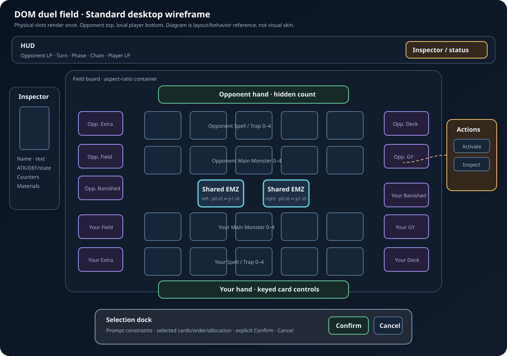

# Duel-Field Validation References

> Status: accepted validation catalog
> Last checked: 2026-07-31
> Purpose: compare rule layout, information hierarchy, interaction clarity, accessibility, and responsive behavior without copying another game's visual design

## Reference precedence

1. `ocgcore`/public contract decides actual state and legal choices.
2. Official Yu-Gi-Oh! rules decide physical Standard field meaning.
3. Project architecture decides ownership, accessibility, privacy, and scope.
4. Local wireframe decides expected component placement/behavior.
5. External game screenshots are visual heuristics only.

A screenshot never overrides engine sequence semantics, privacy, keyboard access, 44 px targets, reduced motion, or product no-spectacle scope.

## Local original reference image



File: [`references/standard-field-wireframe.svg`](references/standard-field-wireframe.svg)

Validate:

- opponent top/local player bottom;
- five Main Monster plus five Spell/Trap slots per player;
- exactly two shared Extra Monster Zone controls;
- field/deck/Extra/GY/banished stack controls remain distinguishable;
- hand, inspector, action menu, HUD, and selection dock do not cover required targets;
- explicit Confirm exists for multi-select/allocation/order workflows.

Do not validate pixel-perfect color, typography, or spacing against wireframe.

## Official rules/schema references

| ID      | Source                                                                                                                                  | Use                                                                                                                                   | Validation question                                                                                 |
| ------- | --------------------------------------------------------------------------------------------------------------------------------------- | ------------------------------------------------------------------------------------------------------------------------------------- | --------------------------------------------------------------------------------------------------- |
| RULE-01 | [Official Rulebook v10 PDF](https://img.yugioh-card.com/en/downloads/rulebook/SD_RuleBook_EN_10.pdf), “The Game Mat”, printed pages 4–5 | Canonical physical zone names/counts, Pendulum use of outer Spell/Trap slots, separate Field Zones, shared Extra Monster Zone concept | Does board show correct physical Standard topology without inventing owner-specific duplicate EMZs? |
| CORE-01 | [`field.cpp` in embedded-core upstream](https://github.com/edo9300/ygopro-core/blob/master/field.cpp), `is_location_useable`            | Engine slot collision relation: opponent Extra Monster sequence conflicts through `11 - sequence`                                     | Do `p0:s5` and `p1:s6` map to one physical slot, plus `p0:s6`/`p1:s5` to other?                     |
| CORE-02 | Same source, `add_card`, `remove_card`, `get_field_card`                                                                                | MZONE/SZONE use fixed indexed slots while hand/GY/banished/Extra use ordered lists                                                    | Does projector preserve fixed sequences after removal/move?                                         |

Pin core-code citations to vendored embedded revision when that revision becomes discoverable. Until then, fixture behavior from pinned WASM outranks moving upstream source.

## External game screenshots

Links open publisher-supplied storefront media. Images remain externally hosted; repository does not copy or redistribute them.

### Yu-Gi-Oh! Master Duel — KONAMI

Product sources: [official site](https://www.konami.com/yugioh/masterduel/us/en/) · [Steam listing](https://store.steampowered.com/app/1449850/YuGiOh_Master_Duel/)

| ID    | Screenshot                                                                                                                                                                      | Study                                                                                      | Reject/copy nothing                                     |
| ----- | ------------------------------------------------------------------------------------------------------------------------------------------------------------------------------- | ------------------------------------------------------------------------------------------ | ------------------------------------------------------- |
| MD-01 | [Active duel field with inspector and LP](https://shared.akamai.steamstatic.com/store_item_assets/steam/apps/1449850/ss_f4e2257edc1cb8093f1f0b40d7daf96211405f90.1920x1080.jpg) | field dominance, persistent LP/turn state, inspector adjacency, clear occupied/empty slots | 3D arena, particles, damage spectacle, proprietary skin |
| MD-02 | [Card/effect selection during duel](https://shared.akamai.steamstatic.com/store_item_assets/steam/apps/1449850/ss_6501d1b0e2dc14a5e1031d5e02456d9b72912a0b.1920x1080.jpg)       | target emphasis, card enlargement, action context while preserving board orientation       | animated effects, numbered spectacle, exact layout      |

### Yu-Gi-Oh! Legacy of the Duelist: Link Evolution — KONAMI

Product sources: [official site](https://www.konami.com/yugioh/lotd_le/us/en/) · [Steam listing](https://store.steampowered.com/app/1150640/YuGiOh_Legacy_of_the_Duelist__Link_Evolution/)

| ID    | Screenshot                                                                                                                                                                     | Study                                                                                   | Reject/copy nothing                             |
| ----- | ------------------------------------------------------------------------------------------------------------------------------------------------------------------------------ | --------------------------------------------------------------------------------------- | ----------------------------------------------- |
| LE-01 | [Full duel field, hand, inspector](https://shared.akamai.steamstatic.com/store_item_assets/steam/apps/1150640/ss_d9e917a2ea99d55785bff853fc5f4c4da48570ea.1920x1080.jpg)       | compact desktop information density, visible hand, stack counts, card text beside board | proprietary art/layout; mouse-only assumptions  |
| LE-02 | [Occupied field with active card detail](https://shared.akamai.steamstatic.com/store_item_assets/steam/apps/1150640/ss_1bc66a6b9696cd519c161210b1cccc9dc9853f42.1920x1080.jpg) | readable occupied zones, controller orientation, persistent card detail                 | low-contrast tiny text, exact color language    |
| LE-03 | [Pendulum-zone field state](https://shared.akamai.steamstatic.com/store_item_assets/steam/apps/1150640/ss_ed9bf5db1fe85587b7015bac4291d682542921a1.1920x1080.jpg)              | outer Spell/Trap zones gaining Pendulum meaning without extra physical slots            | format-specific effects outside public contract |
| LE-04 | [Extra Monster Zone/Link field state](https://shared.akamai.steamstatic.com/store_item_assets/steam/apps/1150640/ss_829bfd3760cc7078ca2cd22d82c0471a61e1c35b.1920x1080.jpg)    | shared center slots and full-board relation                                             | exact board texture/animation                   |

## Standards references

| ID      | Source                                                                                         | Validation use                                                                |
| ------- | ---------------------------------------------------------------------------------------------- | ----------------------------------------------------------------------------- |
| A11Y-01 | [WCAG 2.2 Keyboard](https://www.w3.org/WAI/WCAG22/Understanding/keyboard.html)                 | Every field operation completes without pointer.                              |
| A11Y-02 | [WCAG 2.2 Focus Visible](https://www.w3.org/WAI/WCAG22/Understanding/focus-visible.html)       | Focus indicator remains visible on rotated/overlapped cards.                  |
| A11Y-03 | [WCAG 2.2 Name, Role, Value](https://www.w3.org/WAI/WCAG22/Understanding/name-role-value.html) | Card/zone/menu/tray state has programmatic names/roles/states.                |
| A11Y-04 | [WAI-ARIA APG Grid](https://www.w3.org/WAI/ARIA/apg/patterns/grid/)                            | Roving focus/arrow-key behavior reference; use role only after SR validation. |
| A11Y-05 | [WCAG 2.2 Target Size](https://www.w3.org/WAI/WCAG22/Understanding/target-size-minimum.html)   | Standards floor; project keeps stricter 44 px target.                         |
| TEST-01 | [Playwright locators](https://playwright.dev/docs/locators)                                    | Prefer role/name/state assertions over coordinates or implementation IDs.     |
| TEST-02 | [Playwright visual comparisons](https://playwright.dev/docs/test-snapshots)                    | Stable targeted screenshots; do not replace semantic tests.                   |

## Required local comparison captures

Capture generated test artifacts; do not commit card-art screenshots unless licensing review approves them.

### Viewports

| ID    |                  CSS viewport |                DPR | Purpose                                      |
| ----- | ----------------------------: | -----------------: | -------------------------------------------- |
| VP-01 |                      1366×768 |                  1 | minimum common desktop composition           |
| VP-02 |                     1920×1080 |                  1 | full desktop layout                          |
| VP-03 |                      1280×720 |                  2 | high-DPR minimum supported field             |
| VP-04 |                      1024×768 |                  1 | narrow desktop/tablet transition             |
| VP-05 |             667×375 landscape |                  2 | contained compact field/touch targets        |
| VP-06 |              375×667 portrait |                  2 | semantic controls/recomposition fallback     |
| VP-07 | 1280×720 at 200% browser zoom | browser-controlled | text/control usability, no critical clipping |

### State fixtures

| ID    | Fixture                                          | Required visible proof                                    |
| ----- | ------------------------------------------------ | --------------------------------------------------------- |
| ST-01 | Empty board, both hands, initial prompt          | topology, LP/turn/phase, hand privacy, prompt focus       |
| ST-02 | Main zones `0` and `4` occupied                  | sparse fixed-slot placement, no resequencing              |
| ST-03 | both shared EMZ engine addresses exercised       | exactly two physical controls, no duplicate occupancy     |
| ST-04 | face-up/face-down attack/defense                 | correct orientation, privacy-safe labels/art              |
| ST-05 | selectable card/zone prompt                      | legal highlight, visible focus, action menu               |
| ST-06 | multi-select + exact/sum constraint              | selection dock, count/total, explicit Confirm             |
| ST-07 | counter allocation + overlay materials           | badges/material stack, allocation limits                  |
| ST-08 | active multi-link chain                          | provenance, order, resolving/negated/disabled state       |
| ST-09 | 60-card open tray                                | scroll/focus, bounded mount, no board loss                |
| ST-10 | missing/slow image                               | immediate placeholder, input remains enabled              |
| ST-11 | response submitted then intermediate state event | controls stay locked until authoritative completion       |
| ST-12 | recoverable invalid response                     | current prompt restored/unlocked, focus/error announced   |
| ST-13 | reduced motion                                   | no nonessential movement; final state/highlight preserved |
| ST-14 | result/restart                                   | menus/session cleared, resources released, fresh focus    |

### Naming

Use deterministic artifact paths:

```text
test-results/duel-field/<browser>/<viewport-id>/<state-id>.png
test-results/duel-field/<browser>/<viewport-id>/<state-id>.trace.zip
```

Each visual ticket records before/after captures for affected state IDs. Final parity ticket captures every state at VP-01/02/04, plus responsive subset at VP-05/06/07.

## Comparison rubric

Score each item pass/fail; no aesthetic averaging can hide functional failure.

### Rule correctness

- [ ] Five Main Monster and five Spell/Trap slots per player.
- [ ] Two shared EMZ controls only.
- [ ] Fixed sequences remain stable through movement/removal.
- [ ] Pendulum state reuses outer Spell/Trap slots.
- [ ] Controller/owner/face state matches public snapshot.
- [ ] Hidden identities never appear in DOM, accessible names, requests, screenshots, or logs.

### Interaction

- [ ] Legal targets are identifiable without hover.
- [ ] Card inspection remains available independently from legal action.
- [ ] Multiple actions use anchored menu.
- [ ] Multi-select/allocation/order requires explicit Confirm.
- [ ] Pointer-up/click and keyboard produce same opaque choice IDs.
- [ ] Pending response cannot double-submit or unlock on intermediate snapshot.

### Accessibility

- [ ] One meaningful field entry tab stop plus documented spatial keys.
- [ ] Focus visible on every state/background/rotation.
- [ ] Focus returns after menu/tray close and recoverable errors.
- [ ] Screen reader receives name, zone, controller, position, legal/selected state.
- [ ] Live announcements are useful and non-repetitive.
- [ ] 44×44 CSS px targets and 200% zoom pass.

### Visual hierarchy

- [ ] Board remains primary surface.
- [ ] LP/turn/phase/current decision visible without searching.
- [ ] Legal, selected, resolving, disabled, hidden states do not rely on color alone.
- [ ] Inspector/menu/tray preserve board context.
- [ ] Stack counts and open affordances remain clear.
- [ ] Motion communicates state change, never delays input.

### Performance/resource behavior

- [ ] No idle animation loop.
- [ ] Closed tray does not mount full collection.
- [ ] No long task caused by normal prompt target update.
- [ ] Object URL/DOM listener counts return to baseline after restart.
- [ ] Missing/slow images never block legal input.
- [ ] Final build contains no Phaser chunk after removal ticket.

## Manual review record template

```md
### Review YYYY-MM-DD / commit <sha>

- Browser/OS:
- Screen reader/input:
- Viewport/DPR/zoom:
- Fixtures:
- Reference IDs compared:
- Rule correctness: pass/fail + evidence
- Pointer flow: pass/fail + evidence
- Keyboard/focus flow: pass/fail + evidence
- Screen-reader output: pass/fail + evidence
- Reduced motion: pass/fail + evidence
- Visual hierarchy: pass/fail + evidence
- Perf trace path:
- Defects/ticket IDs:
- Reviewer:
```

## Copyright and retention

Yu-Gi-Oh! names/screenshots/card art belong to respective owners. External screenshots are linked for internal comparative review only. Do not copy them into source, product assets, test snapshots, or public docs without legal approval. Prefer placeholder art for committed visual fixtures. Generated CI screenshots containing bundled private-mode card art inherit existing distribution restrictions and remain short-lived private artifacts.
